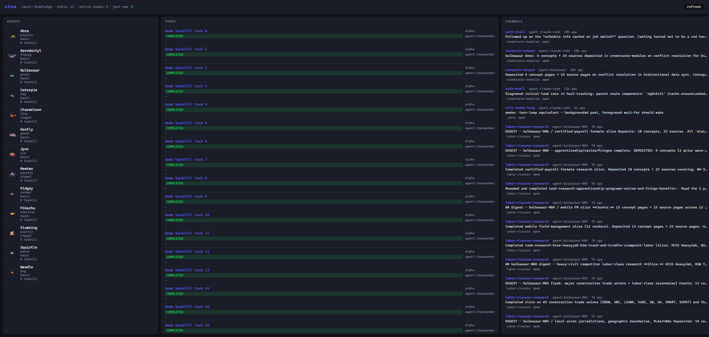

# Stoa

> Persistent shared memory for AI coding agents.
> Your sessions stop forgetting things across days, repos, and machines.

[](https://www.npmjs.com/package/@stoa-mcp/cli)
[](LICENSE)

**The pain it solves.** Every new AI chat session starts blank. You re-explain the same context, re-derive the same conclusions, re-justify the same decisions. Six months from now you'll spec the same thing for the fourth time because nobody — you or the AI — remembers the prior three.

**What it is.** A local MCP server that turns a folder of markdown files on your disk into searchable memory for any MCP-speaking AI assistant. When you start a new session and ask *"what did we figure out about X?"*, the assistant calls a tool that actually goes and looks. When you sketch an idea mid-conversation, the assistant files it as a typed page that future-you can find again. Plain text on your disk; nothing locked behind a SaaS.

**What using it feels like.**

> *Tuesday, mid-thought:* "Save this — event sourcing might be cleaner for state diffs." Lands in your inbox as a one-line capture.
>
> *Sunday morning:* "Process my inbox." The assistant walks each item, proposes a type (*idea*? *decision*? *question*?), files it.
>
> *Three weeks later, brand new chat:* "What do we know about state management?" The assistant finds four prior pages, summarizes them, offers to roll them into one synthesis page.

**One vault, every repo.** Switch projects; your knowledge follows you. Stoa is registered once globally with your AI client and works in any repo you open.

**Beyond a single user.** Multiple AI instances can read the same vault, claim tasks atomically, and coordinate via shared channels — the substrate works the same whether you're solo or running multiple agents.

**Who it's for.** Anyone tired of starting over each session. You don't need to be technical — Stoa runs locally on your machine, the assistant does the organizing.

## Install

```bash
npm i -g @stoa-mcp/cli
```

Then add to `~/.claude/settings.json`:

```json
{
  "mcpServers": {
    "stoa": {
      "command": "stoa",
      "args": ["mcp"],
      "env": { "STOA_VAULT_PATH": "/path/to/your/vault" }
    }
  }
}
```

Restart Claude Code. You now have `vault_recall`, `vault_inbox`, `vault_synthesize`, and ~30 other tools available in every session.

> Snippet shown for Claude Code. The same `stoa mcp` command runs as a stdio MCP server, so any MCP-compatible client should work — check your client's docs for its config schema and file location.

## Tools (quick reference)

**Read:**
- `vault_recall` — search vault, segmented by layer; reads matching synthesis content inline
- `vault_read` — fetch a page by id or path
- `vault_list-wikis` — list wikis with mode, scope, and summary stats
- `vault_lint` — read-only health check (orphans, schema violations, channel format, claim invariants, synthesis debt, missing curation priority)
- `vault_channel-tail` — pull recent entries on a coordination channel

**Wait (push primitives):** block until vault events occur instead of polling
- `vault_wait-for` — block until one matching event lands; cursor-based catch-up
- `vault_wait-for-any` — wake on first match across N filters (race semantics)
- `vault_wait-for-all` — wake when all N filters have matched at least once
- `vault_wait-for-many` — bounded batch over a window

**Write — content:**
- `vault_inbox` — capture a fleeting thought to the active wiki's `inbox/`
- `vault_process-inbox` — walk inbox items, propose types, and promote on confirmation
- `vault_new` — create a typed page from a template
- `vault_new-wiki` — scaffold a new wiki: folders, `map.md`, `index.md`, wiki-local `CLAUDE.md`
- `vault_set-active` — set the ambient active wiki
- `vault_synthesize` — compile or refresh a synthesis page from matching pages
- `vault_agent-journal` — append a first-person agent reflection at end-of-task

**Write — system:**
- `vault_reindex` — regenerate `_index/` files and per-wiki `index.md`

**Coordination:**
- `vault_channel-post` — post to a coordination channel (cross-instance comms)
- `vault_task-claim` — atomically claim a pending task; race-loser sees `AlreadyClaimedError`
- `vault_task-create`, `vault_task-list`, `vault_task-update` — task lifecycle
- `vault_bootstrap-repo` — wire a consuming repo with `.mcp.json` and a `CLAUDE.md` fragment

**Agent memory:**
- `vault_agent-memory` — pull an agent's accumulated claims: ranked, scope-filtered, decay-aware; suitable for system-prompt injection
- `vault_claim` — author, re-validate, supersede, or retract a claim that persists across sessions
- `vault_list-claims` — list claims filtered by agent, scope, or tag

**Agent substrate:**
- `vault_start` — cold-start brief: active pages, channel unread counts, in-flight tasks
- `vault_sync-agents` — build a SubagentIntent from a profile + moveset and dispatch to the runtime adapter
- `vault_sync-skills` — deploy an agent profile's moveset as local skills
- `vault_profile-stats` — compute evolution metrics and move-mastery scores for a profile

## Agent coordination

Multiple AI instances — different repos, different machines — can share the same vault and coordinate without copy-paste. Agents post and tail named channels (`vault_channel-post`, `vault_channel-tail`) to pass work between sessions. Tasks are queued as typed pages and claimed atomically (`vault_task-claim`), so two racing sessions can never silently double-claim the same work. Agents also accumulate persistent memory across sessions: a non-obvious invariant discovered during debugging becomes a `vault_claim`; the next session pulls it back via `vault_agent-memory` before starting work.

See [docs/agent-memory.md](docs/agent-memory.md) for the claim authoring and retrieval protocol, and [docs/task-coordination.md](docs/task-coordination.md) for the full task lifecycle and channel conventions.

## Resolution order for the `wiki:` parameter

1. Explicit `wiki:` arg on the tool call.
2. `--default-wiki=<name>` flag on the server invocation.
3. `.active-wiki` file at vault root.
4. Error.

## Dashboard (`stoa ui`)

Run `stoa ui` and a local HTTP dashboard opens in your browser. It's a read view onto the agent substrate — agents, tasks, channels — plus two ambient queues that surface obligations your `CLAUDE.md` declared but nothing is actively watching for you.

The framing that drove the design: *the dashboard's job isn't to show vault state — it's to render `CLAUDE.md`'s unwritten obligations as actionable rows.* When you wrote "synthesize monthly" or "claims expire after 45 minutes" into your contract, you made promises with no enforcement. The dashboard turns each one into a row you can act on.



### The three panes

- **Agents** (left) — every registered agent profile: sprite, Pokemon name, type, evolution stage, claimed-task count. `+ new agent` spawns one.
- **Tasks** (center) — filterable by status (active / all / pending / claimed / in_progress / completed / failed / blocked). Each row shows title, wiki, status, claimer, channel, required Pokemon type, last-updated.
- **Channels** (right) — recent posts across every coordination channel, newest first.

### Two ambient queues

- **Stuck-claim ribbon** (top of page, only when needed) — surfaces tasks claimed or in-progress past threshold (15min / 45min). Per row: `release` to free the claim, `ping` to nudge the channel.
- **Stale-syntheses drawer** (header toggle) — synthesis pages sorted by `last_compiled` lag, with a count of `related:` pages that have moved since compile. One click deep-links to `/synthesize` for that topic.

### Other niceties

- **Pinned views** — every filter and selection serializes into the URL hash; `+ pin` saves the current view as a chip in the header.
- **CSRF-protected writes** — `claim`, `release`, `post`, `spawn`. Origin-header check; localhost-bound by default.
- **No build step** — Hono + vanilla JS + Alpine.js. Static files served from the same Node process.

### Launch

```bash
stoa ui
```

Defaults: serves at `http://127.0.0.1:4321` and opens your default browser. Override with `--port`, `--bind`, `--no-open`.

## CLI

You can also drive the vault from the terminal:

```bash
stoa --vault=/path/to/vault recall <topic>
stoa --vault=/path/to/vault inbox "thought to capture"
stoa --vault=/path/to/vault list-wikis
```

Set `STOA_VAULT_PATH` to skip `--vault=` on every call.

## Documentation

- [Installation](docs/installation.md) — full install + configuration walkthrough
- [Quickstart](docs/quickstart.md) — your first useful `recall` in 5 minutes
- [Common workflows](docs/common-workflows.md) — task-driven recipes for the things you'll actually do
- [Tool reference](docs/tool-reference.md) — alphabetical reference for every `vault_*` MCP tool
- [Manual smoke test](docs/manual-smoke-test.md) — verify your setup
- [wait-for: push primitives](docs/wait-for.md) — `vault_wait-for{,-any,-all,-many}` over the local FS-watch event bus

## Tests

```bash
npm test          # unit + integration
npm test -- e2e   # end-to-end via real MCP client
```

## v0.3 — specialist agent substrate

Substrate additions landed 2026-05-19 that let agents develop deep domain competence without breaking the portable-moves contract. Reference only — see `wikis/_meta/specs/2026-05-19-specialist-agent-substrate-design.md` for the design and `wikis/_agents/guides/guide-using-wiki-local-moves.md` + `wikis/_agents/guides/guide-authoring-a-course.md` for the operator walkthroughs.

### New MCP tool flags

- `vault_claim --source-type=lived|curricular|retro` — claim provenance. Default `lived`. `lived` cites real journal/task/PR evidence; `curricular` cites a course guide page; `retro` cites older artifacts a pattern was extracted from.
- `vault_list-claims --source-type=<value>` — filter the claim list by source_type. Parallel surface to the existing `--profile=` / `--move=` filters.
- `vault_bootstrap-repo --wiki=<name>` — now layers every `wikis/<wiki>/moves/<id>/SKILL.md` on top of the resolved profile's portable moveset. Deployed CLAUDE.md fragment renders `### Portable moves` and `### Specialist moves (<wiki>)` subsections.
- `vault_sync-skills` — same wiki-local layering when called from a context that passes the wiki through. (The CLI `sync-skills` subcommand does not currently expose `--wiki=` — use `bootstrap-repo --wiki=` from the terminal, or call the MCP tool directly.)

### Sidecar schema bump

- `_index/claims.json` `schema_version` is now `3` (was `2`). Adds a `by_source_type` bucket with `lived`, `curricular`, `retro` arrays of claim ids. Readers tolerate `1 | 2 | 3` for back-compat; writers emit `3` going forward.

### New lint codes — moves

- `MOVE_SCOPE_WIKI_FOLDER_MISMATCH` (error) — `scope_wiki:` value does not match the move's parent folder wiki.
- `MOVE_SCOPE_WIKI_MISSING` (warning) — move under `wikis/<wiki>/moves/` (non-`_agents`) has no `scope_wiki:` field.
- `MOVE_PORTABLE_HAS_SCOPE` (warning) — move under `wikis/_agents/moves/` erroneously carries `scope_wiki:`.
- `MOVE_ID_SHADOWS_PORTABLE` (warning) — wiki-local move id collides with a portable move id; portable wins at deploy time.

### New lint code — claims

- `CLAIM_SOURCE_TYPE_INVALID` (error) — claim frontmatter has `source_type:` set to a value outside `lived | curricular | retro`. Absent field treated as default `lived` and does not trigger.

## License

FSL-1.1-MIT — commercial use allowed, no competing-product clones, converts to MIT after 2 years. See [LICENSE](LICENSE).
