```mermaid
flowchart TD
    task-add-deps["task-add-deps: add jose dep<br/>files: package.json +1 more"]
    task-auth-types["task-auth-types: Principal/ToolScope/TokenVerifier<br/>files: src/auth/types.ts"]
    task-scope-match["task-scope-match: scope-glob matcher<br/>files: src/auth/scope-match.ts"]
    task-jwt-verifier["task-jwt-verifier: HMAC JWT verifier<br/>files: src/auth/jwt-verifier.ts"]
    task-stdio-identity["task-stdio-identity: env/OS/file principal<br/>files: src/auth/stdio-identity.ts"]
    task-auth-dispatcher["task-auth-dispatcher: authorize() three-gate<br/>files: src/auth/dispatcher.ts"]
    task-stale-lock["task-stale-lock: stale-lock detection<br/>files: src/core/index-locking.ts"]
    task-config-loader["task-config-loader: .stoa/config.json<br/>files: src/config.ts"]
    task-http-auth-mw["task-http-auth-mw: Hono bearer middleware<br/>files: src/transport/http-auth-middleware.ts"]
    task-task-claim-lock["task-task-claim-lock: lock-wrap claimTask<br/>files: src/core/tasks.ts"]
    task-mint-token-cli["task-mint-token-cli: stoa mint-token<br/>files: src/cli/commands/mint-token.ts"]
    task-init-y["task-init-y: stoa init -y flag<br/>files: src/cli/commands/init.ts"]
    task-tools-write["task-tools-write: write tools sweep<br/>files: src/tools/channel-post.ts +6 more"]
    task-tools-read["task-tools-read: read tools sweep<br/>files: src/tools/recall.ts +13 more"]
    task-tools-admin["task-tools-admin: admin/forbidden flags<br/>files: src/tools/reindex.ts +8 more"]
    task-tools-stadium["task-tools-stadium: stadium tool flags<br/>files: src/tools/trainer-init.ts +11 more"]
    task-tools-wait["task-tools-wait: wait-for tool scopes<br/>files: src/tools/wait-for.ts +3 more"]
    task-tools-creators["task-tools-creators: creator tool axes<br/>files: src/tools/new.ts +7 more"]
    task-stdio-stamp["task-stdio-stamp: stamp principal stdio<br/>files: src/transport/stdio.ts"]
    task-http-transport["task-http-transport: Hono+MCP server<br/>files: src/transport/http.ts"]
    task-serve-cli["task-serve-cli: stoa serve<br/>files: src/cli/commands/serve.ts"]
    task-agent-id-lint["task-agent-id-lint: AGENT_ID_INPUT_LEAK<br/>files: src/core/lint/rules/agent-id-leak.ts"]
    task-dockerfile["task-dockerfile: Dockerfile + dockerignore<br/>files: Dockerfile +1 more"]
    task-health-endpoint["task-health-endpoint: GET /health<br/>files: src/transport/health.ts"]
    task-docs-server-mode["task-docs-server-mode: deployment guide<br/>files: docs/server-mode.md"]
    task-docs-task-coord["task-docs-task-coord: update concurrency<br/>files: docs/task-coordination.md"]
    task-e2e-test["task-e2e-test: construction-GC flow<br/>files: tests/e2e/server-mode.test.ts"]
    task-readme-changelog["task-readme-changelog: v0.4 migration note<br/>files: README.md +1 more"]

    task-add-deps --> task-jwt-verifier
    task-add-deps --> task-mint-token-cli
    task-auth-types --> task-scope-match
    task-auth-types --> task-jwt-verifier
    task-auth-types --> task-stdio-identity
    task-auth-types --> task-auth-dispatcher
    task-auth-types --> task-http-auth-mw
    task-auth-types --> task-mint-token-cli
    task-auth-types --> task-tools-write
    task-auth-types --> task-tools-read
    task-auth-types --> task-tools-admin
    task-auth-types --> task-tools-stadium
    task-auth-types --> task-tools-wait
    task-auth-types --> task-tools-creators
    task-scope-match --> task-auth-dispatcher
    task-jwt-verifier --> task-http-auth-mw
    task-jwt-verifier --> task-http-transport
    task-stdio-identity --> task-stdio-stamp
    task-auth-dispatcher --> task-stdio-stamp
    task-auth-dispatcher --> task-http-transport
    task-stale-lock --> task-task-claim-lock
    task-config-loader --> task-stdio-stamp
    task-config-loader --> task-http-transport
    task-http-auth-mw --> task-http-transport
    task-stdio-stamp --> task-http-transport
    task-health-endpoint --> task-http-transport
    task-http-transport --> task-serve-cli
    task-tools-write --> task-agent-id-lint
    task-serve-cli --> task-dockerfile
    task-serve-cli --> task-docs-server-mode
    task-init-y --> task-docs-server-mode
    task-dockerfile --> task-docs-server-mode
    task-task-claim-lock --> task-docs-task-coord
    task-serve-cli --> task-e2e-test
    task-mint-token-cli --> task-e2e-test
    task-tools-write --> task-e2e-test
    task-tools-read --> task-e2e-test
    task-health-endpoint --> task-e2e-test
    task-serve-cli --> task-readme-changelog

    classDef done fill:#90ee90,stroke:#333
    classDef ready fill:#fffacd,stroke:#333
    classDef running fill:#87ceeb,stroke:#333
    classDef failed fill:#ffb6c1,stroke:#333
    classDef skipped fill:#d3d3d3,stroke:#333,stroke-dasharray: 5 5
```

## Context

This plan implements `docs/superpowers/specs/2026-05-21-stoa-server-mode-design.md` (v0.4). The spec adds HTTP server transport with JWT-based bearer auth, hybrid tool-prefix + axis-glob capability scoping, lock-extended task-claim concurrency, and a hard-break removal of self-asserted `agent_id` from tool input schemas.

Critical path: `task-auth-types → task-jwt-verifier → task-http-auth-mw → task-http-transport → task-serve-cli → task-dockerfile` (6 deep). Wide parallelism in the middle: at peak, ~10 implementers can run concurrently (six tool-sweep tasks plus the four leaf auth modules).

Pokemon routing: backend modules to Charmeleon (fire, stage1, backend specialist); CLI surfaces to Squirtle (water, basic, CLI ergonomics); tests + lint to Gastly (ghost, basic, QA); docs to Pidgey (engineer-facing); operations (Dockerfile) to generic `dag-implementer`.

Model sizing: Opus for heuristic integration (dispatcher, HTTP transport, E2E test). Standard (Sonnet) for typed/schema/CLI work. Cheap (Haiku) for mechanical sweeps (Dockerfile, mostly-admin tool flags, init -y flag).

## Tasks

## Task: add jose dep

```yaml
id: task-add-deps
depends_on: []
files:
  - package.json
  - package-lock.json
status: pending
is_wiring_task: true
model_hint: cheap
```

Add `jose` (JWT signing/verification) to dependencies. Modern, well-audited, zero-extra-dep JWT library. Used by `task-jwt-verifier` and `task-mint-token-cli`.

## Acceptance criteria

- `package.json` declares `jose` in `dependencies` at a current major version.
- `package-lock.json` reflects the install.
- `npm ci` runs clean from a fresh checkout.

Test file: not applicable — verified by `npm ci` in the integration test.

## Task: Principal / ToolScope / TokenVerifier contracts

```yaml
id: task-auth-types
depends_on: []
files:
  - src/auth/types.ts
status: pending
implementer: profile-charmeleon
model_hint: standard
```

Define the pure-interface contracts every downstream auth module consumes. No logic, no IO. Mirrors spec §4.3.

## Implementation

```typescript
// src/auth/types.ts
export interface Principal {
  agent_id: string;
  scopes: string[];
  exp?: number;
  source: "stdio" | "http";
}

export interface ToolScope {
  axis: (input: unknown) => string;
  adminOnly?: (input: unknown) => boolean;
  httpForbidden?: boolean;
}

export interface TokenVerifier {
  verify(token: string): Promise<Principal>;
}

export class ScopeDeniedError extends Error {
  constructor(public tool: string, public reason: "admin" | "http_forbidden" | string) {
    super(`scope denied for ${tool}: ${reason}`);
    this.name = "ScopeDeniedError";
  }
}

export class HttpForbiddenError extends Error {
  constructor(public tool: string) {
    super(`tool ${tool} is forbidden over HTTP`);
    this.name = "HttpForbiddenError";
  }
}
```

```typescript
// src/auth/types.test.ts
import { describe, it, expect } from "vitest";
import { ScopeDeniedError, HttpForbiddenError } from "./types.js";

describe("auth types", () => {
  it("ScopeDeniedError carries tool + reason", () => {
    const e = new ScopeDeniedError("vault_new", "wikis/foo/concepts/x");
    expect(e.tool).toBe("vault_new");
    expect(e.reason).toBe("wikis/foo/concepts/x");
    expect(e.name).toBe("ScopeDeniedError");
  });
});
```

## Acceptance criteria

- Module exports `Principal`, `ToolScope`, `TokenVerifier`, `ScopeMatcher` types.
- Module exports `ScopeDeniedError` and `HttpForbiddenError` error classes with discriminator fields.
- No runtime IO; no side effects on import.

Test file: `src/auth/types.test.ts`.

## Task: scope-glob matcher

```yaml
id: task-scope-match
depends_on: [task-auth-types]
files:
  - src/auth/scope-match.ts
status: pending
implementer: profile-charmeleon
model_hint: standard
```

Pure scope-grammar matcher. Parses `<tool_name>:<glob>` and matches against `(tool_name, axis)`. Used by the dispatcher; never imported by tools. Mirrors spec §7.3.

## Implementation

```typescript
// src/auth/scope-match.ts
import picomatch from "picomatch";

export function matches(scopes: string[], tool: string, axis: string): boolean {
  for (const s of scopes) {
    const [prefix, glob = "*"] = s.split(":", 2);
    if (prefix === "*") return true;
    if (prefix === "admin" && picomatch.isMatch(tool, glob)) return true;
    if (prefix !== tool) continue;
    if (picomatch.isMatch(axis, glob)) return true;
  }
  return false;
}

export function hasAdminScope(scopes: string[], tool: string): boolean {
  for (const s of scopes) {
    const [prefix, glob = "*"] = s.split(":", 2);
    if (prefix === "*") return true;
    if (prefix === "admin" && picomatch.isMatch(tool, glob)) return true;
  }
  return false;
}
```

```typescript
// src/auth/scope-match.test.ts
import { describe, it, expect } from "vitest";
import { matches, hasAdminScope } from "./scope-match.js";

describe("scope-match", () => {
  it("matches exact axis under tool prefix", () => {
    expect(matches(["vault_new:wikis/foo/**"], "vault_new", "wikis/foo/concepts/x.md")).toBe(true);
  });
  it("rejects axis under wrong tool prefix", () => {
    expect(matches(["vault_new:**"], "vault_task-claim", "tasks/abc")).toBe(false);
  });
  it("admin:* subsumes any tool", () => {
    expect(matches(["admin:*"], "vault_reindex", "wikis/foo")).toBe(true);
    expect(hasAdminScope(["admin:*"], "vault_reindex")).toBe(true);
  });
  it("wildcard *:* passes everything", () => {
    expect(matches(["*:*"], "vault_new", "anywhere")).toBe(true);
  });
});
```

## Acceptance criteria

- `matches(scopes, tool, axis)` returns `true` iff some scope grants the tool+axis pair per the §7.3 grammar.
- `hasAdminScope(scopes, tool)` returns `true` iff an `admin:*` or `admin:<glob>` scope covers the tool.
- Wildcard `*:*` matches everything. `admin:*` subsumes any tool's axis check.
- Pure function: no IO, no side effects, deterministic.

Test file: `src/auth/scope-match.test.ts`.

## Task: HMAC JWT verifier

```yaml
id: task-jwt-verifier
depends_on: [task-add-deps, task-auth-types]
files:
  - src/auth/jwt-verifier.ts
status: pending
implementer: profile-charmeleon
model_hint: standard
```

HS256 JWT verification implementing `TokenVerifier`. Reads the shared signing secret from env, verifies signature + `exp`, projects claims into `Principal`. Mirrors spec §6.1, §6.2.

## Implementation

```typescript
// src/auth/jwt-verifier.ts
import { jwtVerify } from "jose";
import type { Principal, TokenVerifier } from "./types.js";

export class JwtVerifier implements TokenVerifier {
  private readonly key: Uint8Array;
  constructor(secret: string) {
    if (!secret) throw new Error("JwtVerifier: signing secret is required");
    this.key = new TextEncoder().encode(secret);
  }

  async verify(token: string): Promise<Principal> {
    const { payload } = await jwtVerify(token, this.key, { algorithms: ["HS256"] });
    if (typeof payload.sub !== "string") throw new Error("JWT missing 'sub' claim");
    if (!Array.isArray(payload.scopes)) throw new Error("JWT missing 'scopes' claim");
    return {
      agent_id: payload.sub,
      scopes: payload.scopes as string[],
      exp: payload.exp,
      source: "http",
    };
  }
}
```

```typescript
// src/auth/jwt-verifier.test.ts
import { describe, it, expect } from "vitest";
import { SignJWT } from "jose";
import { JwtVerifier } from "./jwt-verifier.js";

const secret = "test-secret-32-bytes-minimum-please-yes";
const key = new TextEncoder().encode(secret);

async function mint(claims: Record<string, unknown>): Promise<string> {
  return new SignJWT(claims)
    .setProtectedHeader({ alg: "HS256" })
    .setIssuedAt()
    .setExpirationTime("1h")
    .setSubject("worker-abc")
    .sign(key);
}

describe("JwtVerifier", () => {
  it("verifies a valid token and projects to Principal", async () => {
    const v = new JwtVerifier(secret);
    const token = await mint({ scopes: ["vault_recall:*"] });
    const p = await v.verify(token);
    expect(p.agent_id).toBe("worker-abc");
    expect(p.scopes).toEqual(["vault_recall:*"]);
    expect(p.source).toBe("http");
  });
  it("rejects wrong-signature tokens", async () => {
    const v = new JwtVerifier("a-different-secret-also-32-bytes-long");
    const token = await mint({ scopes: [] });
    await expect(v.verify(token)).rejects.toThrow();
  });
});
```

## Acceptance criteria

- Verifies HS256 signature against an in-memory secret.
- Rejects expired tokens (jose enforces `exp` automatically).
- Rejects tokens missing `sub` or `scopes` claims.
- Projects `{ sub, scopes, exp }` into a `Principal` with `source: "http"`.
- Throws on construction if secret is empty.

Test file: `src/auth/jwt-verifier.test.ts`.

## Task: stdio principal resolver

```yaml
id: task-stdio-identity
depends_on: [task-auth-types]
files:
  - src/auth/stdio-identity.ts
status: pending
implementer: profile-charmeleon
model_hint: standard
```

Resolves the local `Principal` for stdio mode. Order: `--agent-id=` flag → `STOA_AGENT_ID` env → vault-baked `.stoa/identity` JSON → OS username → `"stoa-local"` fallback. Stdio principals carry `scopes: ["*:*"]` (full local trust). Mirrors spec §5.1.

## Implementation

```typescript
// src/auth/stdio-identity.ts
import { existsSync, readFileSync } from "node:fs";
import { join } from "node:path";
import { userInfo } from "node:os";
import type { Principal } from "./types.js";

export interface StdioIdentityOptions {
  vaultPath: string;
  cliAgentId?: string;
}

export function resolveStdioIdentity(opts: StdioIdentityOptions): Principal {
  const agent_id =
    opts.cliAgentId ??
    process.env.STOA_AGENT_ID ??
    readVaultIdentity(opts.vaultPath) ??
    sanitize(userInfo().username) ??
    "stoa-local";
  return { agent_id, scopes: ["*:*"], source: "stdio" };
}

function readVaultIdentity(vaultPath: string): string | undefined {
  const path = join(vaultPath, ".stoa", "identity");
  if (!existsSync(path)) return undefined;
  try {
    const raw = JSON.parse(readFileSync(path, "utf8"));
    return typeof raw.default_agent_id === "string" ? raw.default_agent_id : undefined;
  } catch {
    return undefined;
  }
}

function sanitize(s: string | undefined): string | undefined {
  if (!s) return undefined;
  const clean = s.toLowerCase().replace(/[^a-z0-9-]/g, "-").replace(/^-+|-+$/g, "");
  return clean || undefined;
}
```

```typescript
// src/auth/stdio-identity.test.ts
import { describe, it, expect, beforeEach, afterEach } from "vitest";
import { mkdtempSync, writeFileSync, mkdirSync, rmSync } from "node:fs";
import { tmpdir } from "node:os";
import { join } from "node:path";
import { resolveStdioIdentity } from "./stdio-identity.js";

describe("resolveStdioIdentity", () => {
  let vault: string;
  beforeEach(() => { vault = mkdtempSync(join(tmpdir(), "stoa-")); delete process.env.STOA_AGENT_ID; });
  afterEach(() => { rmSync(vault, { recursive: true, force: true }); });

  it("prefers --agent-id flag over env", () => {
    process.env.STOA_AGENT_ID = "from-env";
    const p = resolveStdioIdentity({ vaultPath: vault, cliAgentId: "from-flag" });
    expect(p.agent_id).toBe("from-flag");
    expect(p.scopes).toEqual(["*:*"]);
    expect(p.source).toBe("stdio");
  });
  it("falls back to vault identity file when env unset", () => {
    mkdirSync(join(vault, ".stoa"));
    writeFileSync(join(vault, ".stoa", "identity"), JSON.stringify({ default_agent_id: "from-vault" }));
    const p = resolveStdioIdentity({ vaultPath: vault });
    expect(p.agent_id).toBe("from-vault");
  });
});
```

## Acceptance criteria

- Resolution order: flag → env → vault file → OS user → literal `"stoa-local"`.
- Always returns `scopes: ["*:*"]` and `source: "stdio"`.
- OS username is sanitized (lowercased, non-alphanumeric→`-`).
- Silently ignores malformed vault identity files.

Test file: `src/auth/stdio-identity.test.ts`.

## Task: authorize() three-gate dispatcher helper

```yaml
id: task-auth-dispatcher
depends_on: [task-auth-types, task-scope-match]
files:
  - src/auth/dispatcher.ts
status: pending
implementer: profile-charmeleon
model_hint: opus
```

Pure helper that applies the three gates (HTTP-forbidden → admin → axis) against a tool's `ToolScope` metadata and the request principal. Used identically by stdio and HTTP dispatchers — the DRY chokepoint. Mirrors spec §7.3.

## Implementation

```typescript
// src/auth/dispatcher.ts
import type { Principal, ToolScope } from "./types.js";
import { HttpForbiddenError, ScopeDeniedError } from "./types.js";
import { matches, hasAdminScope } from "./scope-match.js";

export interface ToolWithScope {
  name: string;
  scope?: ToolScope;
}

export function authorize(tool: ToolWithScope, input: unknown, principal: Principal): void {
  if (!tool.scope) {
    throw new ScopeDeniedError(tool.name, "tool missing scope metadata");
  }
  if (principal.source === "http" && tool.scope.httpForbidden) {
    throw new HttpForbiddenError(tool.name);
  }
  const adminRequired = tool.scope.adminOnly?.(input) ?? false;
  if (adminRequired) {
    if (!hasAdminScope(principal.scopes, tool.name)) {
      throw new ScopeDeniedError(tool.name, "admin");
    }
    return;
  }
  const axis = tool.scope.axis(input);
  if (!matches(principal.scopes, tool.name, axis)) {
    throw new ScopeDeniedError(tool.name, axis);
  }
}
```

```typescript
// src/auth/dispatcher.test.ts
import { describe, it, expect } from "vitest";
import { authorize } from "./dispatcher.js";
import { HttpForbiddenError, ScopeDeniedError } from "./types.js";

const stdio = { agent_id: "me", scopes: ["*:*"], source: "stdio" as const };
const httpNarrow = { agent_id: "w", scopes: ["vault_new:wikis/foo/**"], source: "http" as const };

describe("authorize", () => {
  it("passes stdio principals on any tool with scope", () => {
    const tool = { name: "vault_new", scope: { axis: () => "wikis/foo/concepts/x.md" } };
    expect(() => authorize(tool, {}, stdio)).not.toThrow();
  });
  it("blocks http on httpForbidden tools", () => {
    const tool = { name: "vault_sync-skills", scope: { axis: () => "*", httpForbidden: true } };
    expect(() => authorize(tool, {}, httpNarrow)).toThrow(HttpForbiddenError);
  });
  it("denies http when axis scope doesn't match", () => {
    const tool = { name: "vault_new", scope: { axis: () => "wikis/bar/concepts/x.md" } };
    expect(() => authorize(tool, {}, httpNarrow)).toThrow(ScopeDeniedError);
  });
});
```

## Acceptance criteria

- Gate order: httpForbidden → admin → axis. Each gate throws the appropriate typed error on denial.
- Tools missing `scope` metadata raise `ScopeDeniedError` (fail-closed).
- Stdio principals with `*:*` pass every non-`httpForbidden` tool.
- Admin-required invocations bypass the axis check on success.

Test file: `src/auth/dispatcher.test.ts`.

## Task: stale-lock detection on EEXIST

```yaml
id: task-stale-lock
depends_on: []
files:
  - src/core/index-locking.ts
status: pending
implementer: profile-charmeleon
model_hint: standard
```

Extend `withSerializedIndexWrite` so that on `EEXIST` it `stat()`s the lock and unlinks if `mtimeMs` older than 60s. Unlocks the documented stale-lockfile failure mode without altering the success path. Mirrors spec §8.3.

## Implementation

```typescript
// src/core/index-locking.ts (extension — pseudocode showing the new branch)
const STALE_LOCK_THRESHOLD_MS = 60_000;

// inside the retry loop, after catching e.code === "EEXIST":
try {
  const stat = statSync(lockPath);
  if (Date.now() - stat.mtimeMs > STALE_LOCK_THRESHOLD_MS) {
    try { unlinkSync(lockPath); } catch { /* race-safe */ }
    continue; // immediate retry on next loop iteration
  }
} catch {
  // stat failed (e.g. lock vanished between EEXIST and stat) — let normal backoff handle
}
```

```typescript
// src/core/index-locking.test.ts (new test, alongside existing suite)
import { describe, it, expect } from "vitest";
import { writeFileSync, mkdirSync, utimesSync, existsSync } from "node:fs";
import { mkdtempSync, rmSync } from "node:fs";
import { tmpdir } from "node:os";
import { join } from "node:path";
import { withSerializedIndexWrite } from "./index-locking.js";

it("unlinks a stale lock older than threshold and proceeds", async () => {
  const vault = mkdtempSync(join(tmpdir(), "stoa-lock-"));
  const locksDir = join(vault, "_index", ".locks");
  mkdirSync(locksDir, { recursive: true });
  const lockPath = join(locksDir, "pages.json.lock");
  writeFileSync(lockPath, "");
  const oldTime = (Date.now() - 120_000) / 1000;
  utimesSync(lockPath, oldTime, oldTime);

  await withSerializedIndexWrite(vault, ["pages.json"], async () => {
    expect(existsSync(lockPath)).toBe(true);
  });
  rmSync(vault, { recursive: true, force: true });
});
```

## Acceptance criteria

- On `EEXIST` during acquire, stat the lock; if `mtimeMs` older than 60_000ms, unlink and immediately retry.
- Unlink-of-missing is handled silently (race-safe).
- Existing success path unchanged: locks released via try/finally.
- Threshold constant `STALE_LOCK_THRESHOLD_MS = 60_000` exported for testing.

Test file: `src/core/index-locking.test.ts` (extends existing).

## Task: .stoa/config.json loader

```yaml
id: task-config-loader
depends_on: []
files:
  - src/config.ts
status: pending
implementer: profile-charmeleon
model_hint: standard
```

Extend the existing config module to read `.stoa/config.json` from the vault root. Merges declared keys (`theme`, `identity`, `auth`, `bind`) over defaults. Missing file → all defaults. Mirrors spec §9.

## Implementation

```typescript
// src/config.ts (extension — new exported function + VaultConfig fields)
export interface VaultStoaConfig {
  theme: "pokemon" | "plain";
  identity: { default_agent_id?: string };
  auth: { signing_secret_env: string; issuer_hint?: string };
  bind: string;
}

const DEFAULT_CONFIG: VaultStoaConfig = {
  theme: "pokemon",
  identity: {},
  auth: { signing_secret_env: "STOA_TOKEN_SIGNING_SECRET" },
  bind: "127.0.0.1:8443",
};

export function loadVaultStoaConfig(vaultPath: string): VaultStoaConfig {
  const path = join(vaultPath, ".stoa", "config.json");
  if (!existsSync(path)) return DEFAULT_CONFIG;
  try {
    const file = JSON.parse(readFileSync(path, "utf8"));
    return {
      theme: file.theme ?? DEFAULT_CONFIG.theme,
      identity: { ...DEFAULT_CONFIG.identity, ...file.identity },
      auth: { ...DEFAULT_CONFIG.auth, ...file.auth },
      bind: file.bind ?? DEFAULT_CONFIG.bind,
    };
  } catch {
    return DEFAULT_CONFIG;
  }
}
```

```typescript
// src/config.test.ts (new test alongside existing)
import { describe, it, expect } from "vitest";
import { mkdirSync, writeFileSync, mkdtempSync, rmSync } from "node:fs";
import { tmpdir } from "node:os";
import { join } from "node:path";
import { loadVaultStoaConfig } from "./config.js";

it("loads partial config and merges over defaults", () => {
  const vault = mkdtempSync(join(tmpdir(), "stoa-cfg-"));
  mkdirSync(join(vault, ".stoa"));
  writeFileSync(join(vault, ".stoa", "config.json"), JSON.stringify({ theme: "plain" }));
  const cfg = loadVaultStoaConfig(vault);
  expect(cfg.theme).toBe("plain");
  expect(cfg.bind).toBe("127.0.0.1:8443");
  rmSync(vault, { recursive: true, force: true });
});
```

## Acceptance criteria

- Missing config file → returns full defaults; no throw.
- Malformed JSON → returns full defaults; no throw.
- Partial config merges over defaults at the key level.
- Default `theme` is `"pokemon"` (back-compat) and default `bind` is `"127.0.0.1:8443"`.

Test file: `src/config.test.ts`.

## Task: Hono bearer middleware

```yaml
id: task-http-auth-mw
depends_on: [task-auth-types, task-jwt-verifier]
files:
  - src/transport/http-auth-middleware.ts
status: pending
implementer: profile-charmeleon
model_hint: standard
```

Hono middleware: extract `Authorization: Bearer`, call injected verifier, attach principal to context. Verifier is injected (not constructed here) so test fakes don't need a real signing secret. Mirrors spec §6.4.

## Implementation

```typescript
// src/transport/http-auth-middleware.ts
import type { MiddlewareHandler } from "hono";
import type { TokenVerifier } from "../auth/types.js";

export function httpAuthMiddleware(opts: { verifier: TokenVerifier }): MiddlewareHandler {
  return async (c, next) => {
    const auth = c.req.header("authorization");
    if (!auth || !auth.toLowerCase().startsWith("bearer ")) {
      return c.json(
        { error: "missing_bearer" },
        401,
        { "WWW-Authenticate": 'Bearer error="invalid_request"' },
      );
    }
    const token = auth.slice(7).trim();
    try {
      const principal = await opts.verifier.verify(token);
      c.set("principal", principal);
      await next();
    } catch {
      return c.json(
        { error: "invalid_token" },
        401,
        { "WWW-Authenticate": 'Bearer error="invalid_token"' },
      );
    }
  };
}
```

```typescript
// src/transport/http-auth-middleware.test.ts
import { describe, it, expect } from "vitest";
import { Hono } from "hono";
import { httpAuthMiddleware } from "./http-auth-middleware.js";

const fakeVerifier = {
  async verify(token: string) {
    if (token !== "good") throw new Error("bad");
    return { agent_id: "tester", scopes: ["vault_recall:*"], source: "http" as const };
  },
};

describe("httpAuthMiddleware", () => {
  it("attaches principal when token verifies", async () => {
    const app = new Hono();
    app.use("/x", httpAuthMiddleware({ verifier: fakeVerifier }));
    app.get("/x", (c) => c.json(c.get("principal")));
    const res = await app.request("/x", { headers: { Authorization: "Bearer good" } });
    expect(res.status).toBe(200);
    expect(await res.json()).toMatchObject({ agent_id: "tester" });
  });
  it("returns 401 with WWW-Authenticate on missing bearer", async () => {
    const app = new Hono();
    app.use("/x", httpAuthMiddleware({ verifier: fakeVerifier }));
    app.get("/x", (c) => c.text("ok"));
    const res = await app.request("/x");
    expect(res.status).toBe(401);
    expect(res.headers.get("www-authenticate")).toMatch(/Bearer/);
  });
});
```

## Acceptance criteria

- 401 + `WWW-Authenticate: Bearer error="invalid_request"` when header missing or non-Bearer scheme.
- 401 + `WWW-Authenticate: Bearer error="invalid_token"` when verifier throws.
- 200 + downstream handler runs with `c.get("principal")` populated on success.
- Verifier injected (not constructed) — testable with fakes.

Test file: `src/transport/http-auth-middleware.test.ts`.

## Task: lock-wrap claimTask

```yaml
id: task-task-claim-lock
depends_on: [task-stale-lock]
files:
  - src/core/tasks.ts
status: pending
implementer: profile-charmeleon
model_hint: standard
```

Wrap the entire read-check-write sequence in `claimTask` with a per-task lock key (`task-<id>`). The lock provides mutual exclusion; the existing frontmatter-date OCC stays as a staleness guard. Closes the documented same-day race. Mirrors spec §8.2.

## Implementation

```typescript
// src/core/tasks.ts (modify existing claimTask)
import { withSerializedIndexWrite } from "./index-locking.js";

export async function claimTask(vaultPath: string, input: ClaimInput): Promise<ClaimResult> {
  return withSerializedIndexWrite(vaultPath, [`task-${input.task_id}`], async () => {
    const wiki = input.wiki ?? "alpha";
    const page = readPage(vaultPath, input.task_id, wiki);
    // ... existing body unchanged: type check, readiness, claimed_by, writePage
    return { /* existing return */ };
  });
}
```

```typescript
// src/core/tasks.test.ts (new test alongside existing)
import { describe, it, expect } from "vitest";
import { claimTask } from "./tasks.js";

it("two concurrent same-day claimants — exactly one succeeds", async () => {
  // setup: create a task page, two callers race claimTask with identical expected_updated
  const [a, b] = await Promise.allSettled([
    claimTask(vaultPath, { task_id, agent_id: "alice", expected_updated: today, wiki }),
    claimTask(vaultPath, { task_id, agent_id: "bob", expected_updated: today, wiki }),
  ]);
  const fulfilled = [a, b].filter((r) => r.status === "fulfilled");
  const rejected = [a, b].filter((r) => r.status === "rejected");
  expect(fulfilled).toHaveLength(1);
  expect(rejected).toHaveLength(1);
});
```

## Acceptance criteria

- `claimTask` is async; wraps the read-check-write inside `withSerializedIndexWrite([task-<id>], ...)`.
- Two concurrent same-day claimants on the same task: exactly one fulfills, the other rejects with `AlreadyClaimedError`.
- Existing type-check, readiness-gate, and frontmatter-date OCC paths unchanged.
- Callers updated to `await` the result (existing call sites already handle the promise).

Test file: `src/core/tasks.test.ts` (extends existing).

## Task: stoa mint-token CLI

```yaml
id: task-mint-token-cli
depends_on: [task-add-deps, task-auth-types]
files:
  - src/cli/commands/mint-token.ts
status: pending
implementer: profile-squirtle
model_hint: standard
```

Convenience CLI: `stoa mint-token --agent-id=<id> --scope=<s>[,<s>...] --ttl=<duration>`. Reads `STOA_TOKEN_SIGNING_SECRET` from env, signs an HS256 JWT, emits to stdout. Mirrors spec §6.3.

## Implementation

```typescript
// src/cli/commands/mint-token.ts
import { SignJWT } from "jose";
import { randomUUID } from "node:crypto";
import { Command } from "commander";

interface MintOpts {
  agentId: string;
  scope: string;
  ttl: string;
}

export function registerMintTokenCommand(program: Command): void {
  program
    .command("mint-token")
    .requiredOption("--agent-id <id>", "principal subject")
    .requiredOption("--scope <list>", "comma-separated scope strings")
    .option("--ttl <duration>", "e.g. 30m, 24h, 30d", "30m")
    .action(async (opts: MintOpts) => {
      const secret = process.env.STOA_TOKEN_SIGNING_SECRET;
      if (!secret) {
        process.stderr.write("error: STOA_TOKEN_SIGNING_SECRET env var is required\n");
        process.exit(2);
      }
      const key = new TextEncoder().encode(secret);
      const jwt = await new SignJWT({ scopes: opts.scope.split(",").map((s) => s.trim()) })
        .setProtectedHeader({ alg: "HS256" })
        .setIssuedAt()
        .setExpirationTime(opts.ttl)
        .setSubject(opts.agentId)
        .setJti(randomUUID())
        .sign(key);
      process.stdout.write(jwt + "\n");
    });
}
```

```typescript
// src/cli/commands/mint-token.test.ts
import { describe, it, expect } from "vitest";
import { Command } from "commander";
import { jwtVerify } from "jose";
import { registerMintTokenCommand } from "./mint-token.js";

it("emits a verifiable JWT with sub + scopes + exp", async () => {
  process.env.STOA_TOKEN_SIGNING_SECRET = "test-secret-32-bytes-please-please-yes";
  const program = new Command();
  registerMintTokenCommand(program);
  // capture stdout; parse; verify the JWT roundtrips
  // (full test omitted — implementer expands)
  expect(true).toBe(true);
});
```

## Acceptance criteria

- `stoa mint-token --agent-id=X --scope=Y,Z --ttl=30m` writes a JWT to stdout.
- Exits 2 with message on missing `STOA_TOKEN_SIGNING_SECRET`.
- Token verifies under the same secret; carries `sub`, `scopes`, `exp`, `iat`, `jti` claims.
- Default `--ttl` is `30m`.

Test file: `src/cli/commands/mint-token.test.ts`.

## Task: stoa init -y flag

```yaml
id: task-init-y
depends_on: []
files:
  - src/cli/commands/init.ts
status: pending
implementer: profile-squirtle
model_hint: cheap
```

Add `-y` / `--yes` flag to `stoa init` so it runs non-interactively in Docker. Reads `STOA_VAULT_PATH`, `STOA_THEME`, `STOA_DEFAULT_WIKI` from env as defaults. Mirrors spec §12.

## Implementation

```typescript
// src/cli/commands/init.ts (extension — add -y handling)
program
  .command("init")
  .option("-y, --yes", "accept defaults / use env vars without prompting")
  .action(async (opts) => {
    if (opts.yes) {
      return runNonInteractive({
        vaultPath: process.env.STOA_VAULT_PATH ?? process.cwd(),
        theme: (process.env.STOA_THEME as "pokemon" | "plain") ?? "pokemon",
        defaultWiki: process.env.STOA_DEFAULT_WIKI,
      });
    }
    return runInteractive(/* existing prompt flow */);
  });
```

```typescript
// src/cli/commands/init.test.ts
it("non-interactive mode with -y consumes env vars", async () => {
  process.env.STOA_VAULT_PATH = "/tmp/test-vault";
  process.env.STOA_THEME = "plain";
  // run init with -y, assert no prompts fired, vault structure exists
  expect(true).toBe(true);
});
```

## Acceptance criteria

- `stoa init -y` runs without any TTY prompts.
- Reads `STOA_VAULT_PATH`, `STOA_THEME`, `STOA_DEFAULT_WIKI` as defaults.
- Existing interactive `stoa init` flow unchanged when `-y` absent.
- Idempotent: re-running on an existing vault is a no-op (existing behavior).

Test file: `src/cli/commands/init.test.ts`.

## Task: write tools — agent_id removal + scope axis

```yaml
id: task-tools-write
depends_on: [task-auth-types]
files:
  - src/tools/channel-post.ts
  - src/tools/agent-journal.ts
  - src/tools/task-claim.ts
  - src/tools/task-update.ts
  - src/tools/task-create.ts
  - src/tools/claim.ts
  - src/tools/agent-memory.ts
status: pending
implementer: profile-charmeleon
model_hint: standard
```

Hard break per spec §6.5: drop `agent_id` (and `authored_by` on claim) from input schemas; declare `scope.axis` per tool. Handlers consume `ctx.principal.agent_id` instead. Mirrors spec §7.2.

## Implementation

```typescript
// src/tools/channel-post.ts (sketch after the change)
import { z } from "zod";
import type { ToolScope } from "../auth/types.js";

const Input = z.object({
  channel: z.string().regex(/^[a-z0-9]+(-[a-z0-9]+)*$/),
  content: z.string().min(1),
  wiki: z.string().optional(),
  session_id: z.string().optional(),
});

const scope: ToolScope = {
  axis: (input: any) => `channels/${input.channel}`,
};

export const channelPostTool = {
  name: "vault_channel-post",
  description: "...",
  inputSchema: Input,
  scope,
  handler: async (input, ctx) => {
    return postToChannel(ctx.vaultPath, {
      ...input,
      wiki: resolveWiki(input.wiki, ctx.defaultWiki, ctx.vaultPath),
      agent_id: ctx.principal.agent_id,
    });
  },
};
```

```typescript
// src/tools/channel-post.test.ts (or shared agent-id-removal test)
import { describe, it, expect } from "vitest";
import { channelPostTool } from "./channel-post.js";

it("rejects agent_id in input (Zod parse error)", () => {
  expect(() => channelPostTool.inputSchema.parse({
    channel: "test",
    content: "hi",
    agent_id: "spoofed",
  })).toThrow();
});
```

## Acceptance criteria

- `agent_id` removed from `inputSchema` on every listed tool. Inputs passing `agent_id` fail Zod parse.
- `authored_by` removed from `claim`'s input; retract-authorization compares `ctx.principal.agent_id` against the original principal id.
- Each tool declares a `scope: ToolScope` object with the axis function per spec §7.2.
- Handlers stamp `ctx.principal.agent_id` onto writes (page frontmatter `author:` / `claimed_by:` / `authored_by:`).
- No tool reads `agent_id` from input anywhere — verified by grep across changed files.

Test file: `src/tools/<each>.test.ts` (per-tool tests; co-located).

## Task: read tools — declare scope axis

```yaml
id: task-tools-read
depends_on: [task-auth-types]
files:
  - src/tools/recall.ts
  - src/tools/read.ts
  - src/tools/list-wikis.ts
  - src/tools/list-claims.ts
  - src/tools/list-platform-profiles.ts
  - src/tools/list-invites.ts
  - src/tools/channel-tail.ts
  - src/tools/task-list.ts
  - src/tools/merge-queue.ts
  - src/tools/profile-stats.ts
  - src/tools/orient.ts
  - src/tools/start.ts
  - src/tools/refresh-profile-memory.ts
  - src/tools/suggest-pokemon.ts
status: pending
implementer: profile-charmeleon
model_hint: cheap
```

Mechanical sweep: declare `scope: ToolScope` on each read tool with an appropriate axis. No handler changes; no schema removals. Mirrors spec §7.2.

## Implementation

```typescript
// src/tools/recall.ts (sketch after the change)
import type { ToolScope } from "../auth/types.js";

const scope: ToolScope = {
  axis: (input: any) => input.wiki ? `wikis/${input.wiki}` : "*",
};

export const recallTool = {
  name: "vault_recall",
  // ... existing ...
  scope,
};
```

```typescript
// src/tools/recall.test.ts (representative)
import { recallTool } from "./recall.js";
it("declares scope.axis derived from wiki input", () => {
  expect(recallTool.scope!.axis({ topic: "x", wiki: "foo" })).toBe("wikis/foo");
  expect(recallTool.scope!.axis({ topic: "x" })).toBe("*");
});
```

## Acceptance criteria

- Each listed tool exports a `scope: ToolScope` field on its tool object.
- Axis derivations follow spec §7.2 (path-shaped: `wikis/<wiki>`, `tasks/<id>`, `channels/<channel>`, `trainers/<id>`, etc.).
- No `inputSchema` or `handler` changes.
- All 14 tools covered.

Test file: per-tool co-located, plus a registry-level test in `src/tools/index.test.ts` asserting every read tool has `scope`.

## Task: admin / http-forbidden tool flags

```yaml
id: task-tools-admin
depends_on: [task-auth-types]
files:
  - src/tools/reindex.ts
  - src/tools/sync-agents.ts
  - src/tools/sync-skills.ts
  - src/tools/bootstrap-repo.ts
  - src/tools/seed-substrate.ts
  - src/tools/evolve-profile.ts
  - src/tools/lint.ts
  - src/tools/set-active.ts
  - src/tools/new-wiki.ts
status: pending
implementer: profile-charmeleon
model_hint: standard
```

Declare `scope.adminOnly` or `scope.httpForbidden` per the spec §7.4 table. Reindex / set-active / evolve-profile / new-wiki are admin-only over HTTP; sync-agents / sync-skills / bootstrap-repo / seed-substrate are HTTP-forbidden entirely.

## Implementation

```typescript
// src/tools/reindex.ts (sketch)
import type { ToolScope } from "../auth/types.js";

const scope: ToolScope = {
  axis: (input: any) => input.wiki ? `wikis/${input.wiki}` : "*",
  adminOnly: () => true,
};

export const reindexTool = { /* ... */ scope, /* ... */ };
```

```typescript
// src/tools/sync-agents.ts (sketch)
const scope: ToolScope = {
  axis: () => "*",
  httpForbidden: true,
};
```

```typescript
// src/tools/admin-flags.test.ts (registry-level)
import { allTools } from "./index.js";
it("admin tools carry adminOnly or httpForbidden", () => {
  const expectedAdmin = ["vault_reindex", "vault_evolve-profile", "vault_set-active", "vault_new-wiki"];
  const expectedForbidden = ["vault_sync-agents", "vault_sync-skills", "vault_bootstrap-repo", "vault_seed-substrate"];
  for (const name of expectedAdmin) {
    expect(allTools.find(t => t.name === name)?.scope?.adminOnly?.({})).toBe(true);
  }
  for (const name of expectedForbidden) {
    expect(allTools.find(t => t.name === name)?.scope?.httpForbidden).toBe(true);
  }
});
```

## Acceptance criteria

- Admin-shaped tools (reindex, set-active, new-wiki, evolve-profile) carry `adminOnly: () => true` plus a sensible axis.
- HTTP-forbidden tools (sync-agents, sync-skills, bootstrap-repo, seed-substrate) carry `httpForbidden: true`.
- `lint` carries `adminOnly: (i) => i.scope === "full"` so per-wiki lint is non-admin.
- Stdio principals continue to call all of these (admin scope on stdio passes).

Test file: `src/tools/admin-flags.test.ts`.

## Task: stadium tool scope declarations

```yaml
id: task-tools-stadium
depends_on: [task-auth-types]
files:
  - src/tools/trainer-init.ts
  - src/tools/profile-register.ts
  - src/tools/real-skill-register.ts
  - src/tools/real-skill-refresh.ts
  - src/tools/move-fuse.ts
  - src/tools/telemetry-push.ts
  - src/tools/trainer-queue-match.ts
  - src/tools/trainer-accept-match.ts
  - src/tools/trainer-get-state.ts
  - src/tools/trainer-submit-draft.ts
  - src/tools/trainer-submit-move.ts
  - src/tools/match-watch.ts
status: pending
implementer: profile-charmeleon
model_hint: cheap
```

Mechanical sweep: stadium tools mostly carry `adminOnly: () => true` (registration, fusion, refresh). Match-flow tools (queue, accept, submit, watch) carry axis-based scopes over `trainers/<id>` or `matches/<id>`. Mirrors spec §7.2 and the implied stadium routing.

## Implementation

```typescript
// src/tools/trainer-init.ts (sketch)
const scope: ToolScope = { axis: () => "stadium", adminOnly: () => true };
```

```typescript
// src/tools/trainer-submit-move.ts (sketch)
const scope: ToolScope = { axis: (input: any) => `matches/${input.match_id}` };
```

```typescript
// src/tools/stadium-scopes.test.ts
it("registration tools are adminOnly", () => {
  for (const name of ["vault_trainer-init", "vault_profile-register", "vault_real-skill-register", "vault_move-fuse"]) {
    expect(allTools.find(t => t.name === name)?.scope?.adminOnly?.({})).toBe(true);
  }
});
```

## Acceptance criteria

- Registration / fusion / refresh tools carry `adminOnly: () => true`.
- Match-flow tools carry an axis over `matches/<id>` or `trainers/<id>`.
- All 12 stadium tools have `scope` declared.

Test file: `src/tools/stadium-scopes.test.ts`.

## Task: wait-for tool scopes

```yaml
id: task-tools-wait
depends_on: [task-auth-types]
files:
  - src/tools/wait-for.ts
  - src/tools/wait-for-any.ts
  - src/tools/wait-for-all.ts
  - src/tools/wait-for-many.ts
status: pending
implementer: profile-charmeleon
model_hint: cheap
```

Declare `scope.axis` per wait-for tool. Axis matches the event-filter shape — typically a glob over a path filter the caller passes in. Read-shaped, no destructive writes.

## Implementation

```typescript
// src/tools/wait-for.ts (sketch)
const scope: ToolScope = {
  axis: (input: any) => input.path ?? input.event_type ?? "*",
};
```

```typescript
it("wait-for axis derives from path filter", () => {
  expect(waitForTool.scope!.axis({ path: "wikis/foo/**" })).toBe("wikis/foo/**");
});
```

## Acceptance criteria

- Each wait-for tool declares a `scope` whose axis reflects the event filter (path, event type, or wildcard).
- No handler changes.

Test file: `src/tools/wait-for-scopes.test.ts`.

## Task: creator / upserter tool axes

```yaml
id: task-tools-creators
depends_on: [task-auth-types]
files:
  - src/tools/new.ts
  - src/tools/inbox.ts
  - src/tools/process-inbox.ts
  - src/tools/synthesize.ts
  - src/tools/new-profile.ts
  - src/tools/new-move.ts
  - src/tools/rewrite-links.ts
  - src/tools/merge-record.ts
status: pending
implementer: profile-charmeleon
model_hint: standard
```

Declare `scope.axis` over the destination path; `vault_new` adds `adminOnly: (i) => i.type === "map"` so map writes require admin scope per spec §7.4. `new-profile`, `new-move`, `rewrite-links` are admin-only over HTTP (substrate scaffolding).

## Implementation

```typescript
// src/tools/new.ts (sketch)
const scope: ToolScope = {
  axis: (input: any) => `wikis/${input.wiki}/${input.type}/${input.id}`,
  adminOnly: (input: any) => input.type === "map",
};
```

```typescript
it("vault_new requires admin for type=map", () => {
  expect(newTool.scope!.adminOnly!({ type: "map", wiki: "foo" })).toBe(true);
  expect(newTool.scope!.adminOnly!({ type: "concept", wiki: "foo" })).toBe(false);
});
```

## Acceptance criteria

- Each tool declares a path-axis over the destination.
- `vault_new` flags map writes as adminOnly.
- `new-profile`, `new-move`, `rewrite-links` carry `adminOnly: () => true`.
- All 8 tools covered.

Test file: `src/tools/creator-scopes.test.ts`.

## Task: stamp principal in stdio dispatch

```yaml
id: task-stdio-stamp
depends_on: [task-auth-types, task-stdio-identity, task-auth-dispatcher, task-config-loader]
files:
  - src/transport/stdio.ts
status: pending
implementer: profile-charmeleon
model_hint: standard
```

Extend `DispatchCtx` with `principal: Principal`. At startup, `resolveStdioIdentity` produces the principal; `buildCtx` stamps it. The dispatch handler calls `authorize(tool, input, principal)` before invoking each tool. Mirrors spec §5.1.

## Implementation

```typescript
// src/transport/stdio.ts (sketch — add Principal to DispatchCtx, stamp in buildCtx)
import type { Principal } from "../auth/types.js";
import { resolveStdioIdentity } from "../auth/stdio-identity.js";
import { authorize } from "../auth/dispatcher.js";

export interface DispatchCtx {
  // ...existing fields...
  principal: Principal;
}

export function buildCtx(config: VaultConfig, eventBundle?: EventBundle, principal?: Principal): DispatchCtx {
  return {
    // ...existing...
    principal: principal ?? resolveStdioIdentity({ vaultPath: config.vaultPath, cliAgentId: config.agentId }),
    ...(eventBundle ?? {}),
  };
}

// In CallToolRequestSchema handler:
server.setRequestHandler(CallToolRequestSchema, async (req) => {
  const tool = allTools.find(t => t.name === req.params.name);
  if (!tool) throw new Error(`unknown tool: ${req.params.name}`);
  const parsed = tool.inputSchema.parse(req.params.arguments ?? {});
  const ctx = buildCtx(config, eventBundle);
  authorize(tool as any, parsed, ctx.principal);
  const result = await tool.handler(parsed as any, ctx as any);
  return { content: [{ type: "text", text: JSON.stringify(result, null, 2) }] };
});
```

```typescript
// src/transport/stdio.test.ts
it("buildCtx stamps a stdio principal with *:* scopes", () => {
  const ctx = buildCtx({ vaultPath: "/tmp/x" } as any);
  expect(ctx.principal.source).toBe("stdio");
  expect(ctx.principal.scopes).toEqual(["*:*"]);
});
```

## Acceptance criteria

- `DispatchCtx` exports `principal: Principal`.
- `buildCtx` constructs principal via `resolveStdioIdentity` when not explicitly passed.
- Tool dispatch calls `authorize` before `tool.handler` — admin/forbidden gates fire for any local config that strips `*:*` (defense in depth).
- Existing stdio behavior unchanged for users without a custom config.

Test file: `src/transport/stdio.test.ts`.

## Task: Hono + Streamable HTTP transport

```yaml
id: task-http-transport
depends_on: [task-auth-types, task-jwt-verifier, task-auth-dispatcher, task-config-loader, task-http-auth-mw, task-stdio-stamp, task-health-endpoint]
files:
  - src/transport/http.ts
status: pending
implementer: profile-charmeleon
model_hint: opus
```

Replace the stub with a real HTTP server: Hono app, MCP `StreamableHTTPServerTransport` in stateful mode, bearer middleware mounted at `/mcp`, health handler from `task-health-endpoint` mounted at `/health`. Principal stamped from `c.get("principal")` per request. Mirrors spec §5.2.

## Implementation

```typescript
// src/transport/http.ts
import { Hono } from "hono";
import { serve } from "@hono/node-server";
import { Server } from "@modelcontextprotocol/sdk/server/index.js";
import { StreamableHTTPServerTransport } from "@modelcontextprotocol/sdk/server/streamableHttp.js";
import { ListToolsRequestSchema, CallToolRequestSchema } from "@modelcontextprotocol/sdk/types.js";
import { randomUUID } from "node:crypto";
import { allTools } from "../tools/index.js";
import { JwtVerifier } from "../auth/jwt-verifier.js";
import { httpAuthMiddleware } from "./http-auth-middleware.js";
import { healthHandler } from "./health.js";
import { authorize } from "../auth/dispatcher.js";
import { buildCtx } from "./stdio.js";
import { loadVaultStoaConfig } from "../config.js";
import type { VaultConfig } from "../config.js";
import type { Principal } from "../auth/types.js";

export async function startHttp(config: VaultConfig): Promise<void> {
  const stoaCfg = loadVaultStoaConfig(config.vaultPath);
  const secret = process.env[stoaCfg.auth.signing_secret_env];
  if (!secret) throw new Error(`${stoaCfg.auth.signing_secret_env} must be set`);
  const verifier = new JwtVerifier(secret);

  const transport = new StreamableHTTPServerTransport({ sessionIdGenerator: () => randomUUID() });
  const mcp = new Server({ name: "stoa", version: "0.4.0" }, { capabilities: { tools: {} } });
  // setRequestHandler wired identically to stdio, but reads principal from req.auth.extra
  // and calls authorize() before tool.handler. Implementer fills in.
  await mcp.connect(transport);

  const app = new Hono();
  app.get("/health", healthHandler({ vaultPath: config.vaultPath, version: "0.4.0" }));
  app.use("/mcp", httpAuthMiddleware({ verifier }));
  app.all("/mcp", async (c) => {
    // delegate to transport.handleRequest with c.get("principal") propagated as req.auth
    return transport.handleRequest(c.req.raw as any, c.res as any);
  });

  const [host, portStr] = stoaCfg.bind.split(":");
  serve({ fetch: app.fetch, hostname: host, port: Number(portStr) });
  process.stderr.write(`stoa http server ready on ${stoaCfg.bind}\n`);
}
```

```typescript
// src/transport/http.test.ts
it("returns 200 on /health when vault exists", async () => {
  // boot startHttp on an ephemeral port, fetch /health, expect 200 + { status: "ok" }
  expect(true).toBe(true);
});
```

## Acceptance criteria

- `startHttp(config)` boots a Hono server on `bind` from `.stoa/config.json`.
- `GET /health` returns 200 with `{ status, vault }` when vault path exists; 503 otherwise.
- `POST /mcp` requires `Authorization: Bearer`; 401 otherwise.
- Authenticated MCP calls reach tool handlers with `ctx.principal` populated and `authorize()` run before invocation.
- Throws on startup if signing secret env var unset.

Test file: `src/transport/http.test.ts`.

## Task: stoa serve subcommand

```yaml
id: task-serve-cli
depends_on: [task-http-transport]
files:
  - src/cli/commands/serve.ts
status: pending
implementer: profile-squirtle
model_hint: standard
```

Register `stoa serve [--bind=HOST:PORT] [--vault=PATH]` in the CLI. Reads vault from `STOA_VAULT_PATH` if not passed; delegates to `startHttp`. Mirrors spec §5.2.

## Implementation

```typescript
// src/cli/commands/serve.ts
import { Command } from "commander";
import { startHttp } from "../../transport/http.js";

export function registerServeCommand(program: Command): void {
  program
    .command("serve")
    .option("--bind <host_port>", "override .stoa/config.json bind")
    .option("--vault <path>", "vault root path")
    .action(async (opts) => {
      const vaultPath = opts.vault ?? process.env.STOA_VAULT_PATH;
      if (!vaultPath) {
        process.stderr.write("error: --vault or STOA_VAULT_PATH required\n");
        process.exit(2);
      }
      // construct VaultConfig and call startHttp
      await startHttp({ vaultPath, /* ... */ } as any);
    });
}
```

```typescript
// src/cli/commands/serve.test.ts
it("exits 2 when no vault path provided", async () => {
  // spawn the CLI without --vault and STOA_VAULT_PATH unset; assert exit code 2
  expect(true).toBe(true);
});
```

## Acceptance criteria

- `stoa serve` boots the HTTP server.
- `--bind=HOST:PORT` overrides config's `bind`.
- `--vault=PATH` overrides `STOA_VAULT_PATH`; missing both exits 2.
- CLI registered in `src/cli/index.ts` (peer of existing subcommands).

Test file: `src/cli/commands/serve.test.ts`.

## Task: AGENT_ID_INPUT_LEAK lint code

```yaml
id: task-agent-id-lint
depends_on: [task-tools-write]
files:
  - src/core/lint/rules/agent-id-leak.ts
status: pending
implementer: profile-gastly
model_hint: standard
```

New lint code: scans `.ts` / `.md` files for callers that pass `agent_id` to write tools that no longer accept it. Catches caller-side migration breakage during the v0.4 cutover. Mirrors spec §11.2.

## Implementation

```typescript
// src/core/lint/rules/agent-id-leak.ts
import type { LintIssue } from "../types.js";
import { readFileSync } from "node:fs";

const REMOVED_FROM = new Set([
  "vault_channel-post", "vault_agent-journal", "vault_task-claim", "vault_task-update",
  "vault_task-create", "vault_claim", "vault_agent-memory",
]);

export function checkAgentIdLeak(filePath: string): LintIssue[] {
  if (!filePath.endsWith(".ts") && !filePath.endsWith(".md")) return [];
  const content = readFileSync(filePath, "utf8");
  const issues: LintIssue[] = [];
  // Heuristic: tool name appears within 200 chars of agent_id key
  for (const tool of REMOVED_FROM) {
    const idx = content.indexOf(tool);
    if (idx < 0) continue;
    const window = content.slice(idx, idx + 200);
    if (/agent_id\s*[:=]/.test(window)) {
      issues.push({
        code: "AGENT_ID_INPUT_LEAK",
        severity: "warning",
        message: `${tool} no longer accepts agent_id input — server stamps from principal`,
        file: filePath,
      });
    }
  }
  return issues;
}
```

```typescript
// src/core/lint/rules/agent-id-leak.test.ts
import { describe, it, expect } from "vitest";
import { checkAgentIdLeak } from "./agent-id-leak.js";

it("flags vault_task-claim with agent_id nearby", () => {
  // write a tmp file with the pattern, call checkAgentIdLeak, assert one issue
  expect(true).toBe(true);
});
```

## Acceptance criteria

- Detects `agent_id` passed to any of the 7 removed-from tools within a 200-char window.
- Emits `AGENT_ID_INPUT_LEAK` (warning severity).
- Registered with the lint runner so `vault_lint` surfaces the issue.
- Co-located test asserts at least one positive + one negative case.

Test file: `src/core/lint/rules/agent-id-leak.test.ts`.

## Task: Dockerfile + dockerignore

```yaml
id: task-dockerfile
depends_on: [task-serve-cli]
files:
  - Dockerfile
  - .dockerignore
status: pending
is_wiring_task: true
model_hint: cheap
```

Multi-stage Dockerfile: builds `dist/`, copies into a slim node image, declares `EXPOSE 8443`, default `CMD ["serve", "--bind=0.0.0.0:8443"]`. `.dockerignore` excludes `node_modules`, `.git`, `.worktrees`, `tests`, source maps. Mirrors spec §12.1.

## Acceptance criteria

- `docker build .` produces an image.
- `docker run -p 8443:8443 -v vault:/vault -e STOA_VAULT_PATH=/vault -e STOA_TOKEN_SIGNING_SECRET=... stoa:local serve` boots the HTTP server.
- `GET http://localhost:8443/health` returns 200.
- Image size under 250 MB (slim base + pruned deps).

Test file: not applicable — verified manually in v0.4 RC smoke test.

## Task: GET /health endpoint

```yaml
id: task-health-endpoint
depends_on: []
files:
  - src/transport/health.ts
status: pending
implementer: profile-charmeleon
model_hint: cheap
```

Small standalone module exporting a Hono handler for `/health`. Returns 200 + `{ status, vault, version }` when vault path exists and is readable; 503 + `{ status: "unhealthy" }` otherwise. Mounted by `task-http-transport`. Mirrors spec §5.2.

## Implementation

```typescript
// src/transport/health.ts
import { accessSync, constants } from "node:fs";
import type { Context } from "hono";

export function healthHandler(opts: { vaultPath: string; version: string }) {
  return (c: Context) => {
    try {
      accessSync(opts.vaultPath, constants.R_OK);
      return c.json({ status: "ok", vault: opts.vaultPath, version: opts.version });
    } catch {
      return c.json({ status: "unhealthy", vault: opts.vaultPath }, 503);
    }
  };
}
```

```typescript
// src/transport/health.test.ts
import { describe, it, expect } from "vitest";
import { Hono } from "hono";
import { healthHandler } from "./health.js";

it("returns 200 when vault exists", async () => {
  const app = new Hono();
  app.get("/health", healthHandler({ vaultPath: process.cwd(), version: "test" }));
  const res = await app.request("/health");
  expect(res.status).toBe(200);
  expect(await res.json()).toMatchObject({ status: "ok" });
});
```

## Acceptance criteria

- Returns 200 + `{ status: "ok", vault, version }` when vault path is readable.
- Returns 503 + `{ status: "unhealthy" }` when not.
- No dependencies on auth, transport, or config modules — testable in isolation.

Test file: `src/transport/health.test.ts`.

## Task: docs/server-mode.md deployment guide

```yaml
id: task-docs-server-mode
depends_on: [task-serve-cli, task-init-y, task-dockerfile]
files:
  - docs/server-mode.md
status: pending
implementer: profile-pidgey
model_hint: standard
```

Operator-facing deployment guide. Walks through: generating the signing secret, initializing the vault headless with `stoa init -y`, minting an operator token, running the Docker image, wiring the orchestrator (briefly). Mirrors spec §12.

## Implementation

```markdown
# Stoa server mode — deployment guide

[Walkthrough sections: install artifact, persistent storage, auth secrets,
TLS posture, network reachability, day-zero install, running, two-tier
credential pattern. Each section cross-links to spec §12.x.]
```

```markdown
[Failing test analog: a Markdown lint or link-check pass that asserts:]
- Every code block specifies a language tag.
- Every internal link (`docs/...`) resolves to an existing file.
- The "Day-zero install" section contains commands for: openssl, docker run init,
  docker run mint-token.
```

## Acceptance criteria

- Walkthrough is exercisable top-to-bottom against the docker image from `task-dockerfile`.
- Includes the two-tier credential pattern (operator token + worker token) as a named section.
- All code blocks compile against current CLI options; all internal links resolve.

Test file: a small Markdown-link-check + structural-check in `tests/docs/server-mode-doc.test.ts`.

## Task: update docs/task-coordination.md concurrency section

```yaml
id: task-docs-task-coord
depends_on: [task-task-claim-lock]
files:
  - docs/task-coordination.md
status: pending
implementer: profile-pidgey
model_hint: standard
```

Replace the "Concurrency: frontmatter-date OCC, not filesystem mtime" subsection with the new behavior: lock-extended exclusion plus staleness OCC. Mirrors spec §8.

## Implementation

```markdown
[Replace the existing "Granularity is one day" admission with:
"Mutual exclusion is provided by a per-task lockfile (task-<id>.lock) under
withSerializedIndexWrite; the frontmatter `updated:` field is now a staleness
guard, not a concurrency token. Two concurrent claimants serialize through the
lock; exactly one succeeds, the other receives AlreadyClaimedError."]
```

```markdown
[Acceptance test analog:]
- The phrase "Granularity is one day" no longer appears.
- The new subsection cites task-task-claim-lock's behavior.
- An updated example shows the race: two callers, exactly one wins.
```

## Acceptance criteria

- The "Granularity is one day" admission is removed.
- A new subsection describes lock-extended mutual exclusion + staleness OCC.
- Example matches the implementation in `src/core/tasks.ts` (lock key = `task-<id>`).

Test file: not applicable — doc-only.

## Task: E2E construction-GC flow

```yaml
id: task-e2e-test
depends_on:
  - task-http-transport
  - task-serve-cli
  - task-mint-token-cli
  - task-tools-write
  - task-tools-read
  - task-health-endpoint
files:
  - tests/e2e/server-mode.test.ts
status: pending
implementer: profile-gastly
model_hint: opus
```

End-to-end test mimicking the construction-GC dispatch shape: boot Stoa on an ephemeral port; mint an operator token; create a task via `vault_task-create`; mint a worker token bounded to that task; claim + update via the worker; assert the audit trail records the worker's `agent_id`. Mirrors spec §13.3.

## Implementation

```typescript
// tests/e2e/server-mode.test.ts
import { describe, it, expect, beforeAll, afterAll } from "vitest";
import { SignJWT } from "jose";

let serverProc: ReturnType<typeof spawn>;

beforeAll(async () => {
  // spawn `stoa serve` on a random port with a tmp vault; wait for /health
});
afterAll(() => serverProc.kill());

describe("server-mode e2e", () => {
  it("worker token can claim a task created by operator token, audit trail records worker", async () => {
    const operator = await mintJwt({ sub: "operator", scopes: ["*:*"] });
    const taskRes = await mcpCall(operator, "vault_task-create", { wiki: "alpha", title: "review", description: "do a thing" });
    const taskId = taskRes.id;
    const worker = await mintJwt({ sub: "worker-1", scopes: [`vault_task-claim:tasks/${taskId}`] });
    await mcpCall(worker, "vault_task-claim", { task_id: taskId, expected_updated: taskRes.updated, wiki: "alpha" });
    const list = await mcpCall(operator, "vault_task-list", { wiki: "alpha", status: "claimed" });
    expect(list[0].claimed_by).toBe("agent:worker-1");
  });

  it("worker token cannot claim a different task (scope denied)", async () => { /* ... */ });
});
```

```typescript
// supporting helpers (in the same test file)
async function mintJwt(claims: any): Promise<string> { /* uses jose locally */ }
async function mcpCall(jwt: string, tool: string, args: any): Promise<any> { /* fetch + bearer */ }
```

## Acceptance criteria

- Boots `stoa serve` on a random port against a tmp vault.
- Mints two JWTs (operator + worker) using the same signing secret as the server.
- Operator creates a task; worker claims it with a narrow scope; audit trail records the worker's `agent_id`.
- Out-of-scope claim attempt returns a scope-denied error.
- Test cleans up the server process and tmp vault.

Test file: `tests/e2e/server-mode.test.ts`.

## Task: README + CHANGELOG v0.4 migration note

```yaml
id: task-readme-changelog
depends_on: [task-serve-cli]
files:
  - README.md
  - CHANGELOG.md
status: pending
is_wiring_task: true
model_hint: standard
```

Add a "Server mode (v0.4)" section to `README.md` linking to `docs/server-mode.md`. Add a v0.4 entry to `CHANGELOG.md` describing the breaking change (`agent_id` removal) and the migration path. Mirrors spec §11.

## Acceptance criteria

- `README.md` contains a "Server mode" subsection with a link to the deployment guide.
- `CHANGELOG.md` v0.4.0 entry calls out:
  - Breaking: `agent_id` removed from listed write tools.
  - New: `stoa serve` HTTP transport, JWT bearer auth.
  - New: Docker image at `ghcr.io/brettnye/stoa:0.4.0`.
  - Migration: run `vault_lint` for `AGENT_ID_INPUT_LEAK`.
- Both files keep their existing structure and style.

Test file: not applicable — verified manually in v0.4 RC review.
