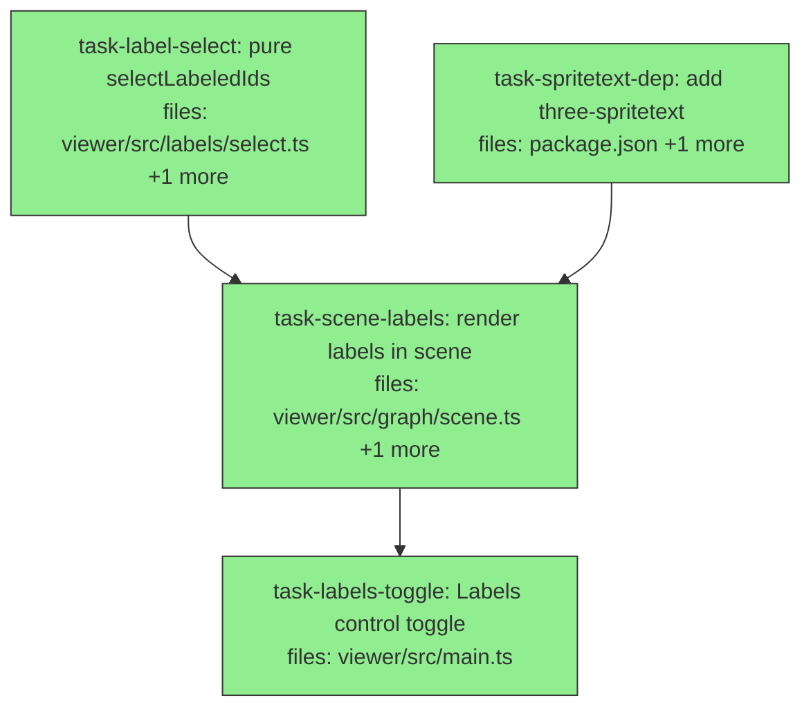

## Context

Implements the node-labels feature specified in
`docs/superpowers/specs/2026-05-26-3d-graph-labels-design.md`: camera-facing text
labels on the 3D graph under a single **Labels** toggle (default on), governed by
a budgeted, layered strategy (region labels always-on, top-degree hub landmarks,
proximity fill, hover override) so the on-screen label count stays bounded
regardless of dataset size.

Decomposition mirrors the spec's pure-core / impure-shell split (the same shape
as `resolveNodeColor`, `computeLegend`, `computeVisibleGraph`):

- **`task-label-select`** — the pure selection function (all logic, all tests).
- **`task-spritetext-dep`** — add the `three-spritetext` rendering dependency.
- **`task-scene-labels`** — wire the pooled `SpriteText` renderer + rAF LOD loop
  + hover into `GraphScene`, driven by the pure selector.
- **`task-labels-toggle`** — add the control-bar toggle and default-on wiring.

The two roots (`task-label-select`, `task-spritetext-dep`) run in parallel; both
feed `task-scene-labels`, which feeds `task-labels-toggle`. File scopes are fully
disjoint — the only edges are logical/contract dependencies.

Verification gate for the whole plan: `tsc -p viewer/tsconfig.json --noEmit`
clean, `npm test` green, `npm run build:viewer` succeeds, and a manual smoke at
http://127.0.0.1:8443/graph (labels readable and bounded across region /
expanded / All / focus; toggle works; hover names the hovered node; flying
changes which notes are named; Trackball↔Orbit keeps labels working).

## Tasks

## Task: pure label selection

```yaml
id: task-label-select
depends_on: []
files:
  - viewer/src/labels/select.ts
  - viewer/src/labels/select.test.ts
status: done
```

Pure function deciding which node ids get a label, given each node's degree,
camera distance, and region flag. All label logic and all unit tests live here;
no three.js. Implements the budgeted, layered priority from spec §"The strategy"
and §"Pure selection".

## Implementation

```typescript
// viewer/src/labels/select.ts
export interface LabelCandidate {
  id: string;
  degree: number;
  distance: number; // camera→node distance (scene units), supplied by the shell
  isRegion: boolean; // node.type === "__wiki__"
}

export interface LabelParams {
  hubCount: number; // always-on top-degree real nodes
  budget: number; // max real-node labels on screen (hubs count toward it)
  maxDistance?: number; // optional proximity cap; default Infinity
  hoveredId?: string | null;
}

/** Ordered list of node ids to label: regions first, then hubs, then nearest. */
export function selectLabeledIds(
  candidates: LabelCandidate[],
  params: LabelParams,
): string[] {
  const { hubCount, budget, maxDistance = Infinity, hoveredId = null } = params;
  const chosen = new Set<string>();
  const out: string[] = [];
  const add = (id: string) => {
    if (!chosen.has(id)) { chosen.add(id); out.push(id); }
  };

  const real = candidates.filter((c) => !c.isRegion);
  // 1. region nodes always (unbudgeted)
  for (const c of candidates) if (c.isRegion) add(c.id);

  // 2. top hubs by degree (count toward budget)
  const byDegree = [...real].sort(
    (a, b) => b.degree - a.degree || a.id.localeCompare(b.id),
  );
  const hubIds = new Set(byDegree.slice(0, Math.max(0, hubCount)).map((c) => c.id));
  let realCount = 0;
  for (const c of byDegree) {
    if (!hubIds.has(c.id)) continue;
    if (realCount >= budget) break;
    add(c.id); realCount++;
  }

  // 3. proximity fill to budget by nearest distance within maxDistance
  const rest = real
    .filter((c) => !hubIds.has(c.id) && c.distance <= maxDistance)
    .sort((a, b) => a.distance - b.distance || b.degree - a.degree || a.id.localeCompare(b.id));
  for (const c of rest) {
    if (realCount >= budget) break;
    add(c.id); realCount++;
  }

  // 4. hover always wins (even beyond budget), if it's a real candidate
  if (hoveredId && candidates.some((c) => c.id === hoveredId)) add(hoveredId);

  return out;
}
```

```typescript
// viewer/src/labels/select.test.ts
import { it, expect } from "vitest";
import { selectLabeledIds } from "./select.js";

it("labels region nodes regardless of budget", () => {
  const ids = selectLabeledIds(
    [{ id: "wiki:a", degree: 1, distance: 999, isRegion: true }],
    { hubCount: 0, budget: 0 },
  );
  expect(ids).toContain("wiki:a");
});
```

## Acceptance criteria

- Region candidates (`isRegion: true`) are always included, regardless of
  `budget` or `distance` (e.g. with `budget: 0` a region id is still returned).
- The top `hubCount` real nodes by `degree` are included (tie-break: higher
  degree, then `id`); they count toward `budget`.
- Total real-node ids (hubs + proximity) never exceeds `budget`; region ids do
  not count against it.
- Proximity fill selects remaining real nodes by ascending `distance`
  (tie-break: higher degree, then `id`).
- `hoveredId` is included even when `budget` is already full; ignored when it is
  not among `candidates`.
- `maxDistance` excludes far nodes from proximity fill but never excludes hubs or
  the hovered node.
- Empty `candidates` → `[]`. Deterministic output for identical input.

Test file: `viewer/src/labels/select.test.ts`.

## Task: add three-spritetext dependency

```yaml
id: task-spritetext-dep
depends_on: []
files:
  - package.json
  - package-lock.json
status: done
is_wiring_task: true
```

Register `three-spritetext` (camera-facing text-sprite labels for
`3d-force-graph`) as a runtime dependency so `task-scene-labels` can import it.
Its `three` peer dependency is satisfied transitively by the existing
`3d-force-graph` dependency — confirm on install.

## Acceptance criteria

- `three-spritetext` appears under `dependencies` in `package.json` at a
  concrete version range.
- `npm install` completes and `npm ls three-spritetext` resolves without a
  missing-peer error for `three`.
- `import SpriteText from "three-spritetext"` resolves under
  `tsc -p viewer/tsconfig.json --noEmit` and `npm run build:viewer`.

Test file: exercised by `viewer/src/graph/scene.test.ts` (the `SpriteText`
import in `task-scene-labels`) and `npm run build:viewer`; no dedicated unit test
(pure dependency registration).

## Task: render labels in the scene

```yaml
id: task-scene-labels
depends_on: [task-label-select, task-spritetext-dep]
files:
  - viewer/src/graph/scene.ts
  - viewer/src/graph/scene.test.ts
status: done
```

Add the label renderer to `GraphScene`: a lazily-grown, reused pool of
`SpriteText` objects (capped at `POOL_CAP`) synced each throttled
`requestAnimationFrame` tick to the ids chosen by `selectLabeledIds`. A rAF loop
(not `onEngineTick`) so LOD reacts to camera orbit after the layout cools. Hover
via `onNodeHover`. State survives the `setControlType` rebuild. Per spec
§"Rendering shell".

## Implementation

```typescript
// viewer/src/graph/scene.ts (additions; existing scene code unchanged)
import SpriteText from "three-spritetext";
import { selectLabeledIds, type LabelCandidate } from "../labels/select.js";
import { endId, WIKI_NODE_TYPE } from "../nav/visible-graph.js";

const HUB_COUNT = 3;
const LABEL_BUDGET = 12;
const POOL_CAP = 50;
const LABEL_INTERVAL_MS = 100; // ~10 fps

// within GraphScene:
//   private labelsEnabled = false;
//   private labelAccessor: (n: GraphNode) => string = (n) => n.id;
//   private hoveredId: string | null = null;
//   private labelPool: SpriteText[] = [];
//   private rafId: number | null = null;

setLabelsEnabled(on: boolean): void {
  this.labelsEnabled = on;
  if (on) this.startLabelLoop();
  else { this.stopLabelLoop(); this.hideLabels(); }
}

setLabelAccessor(fn: (n: GraphNode) => string): void {
  this.labelAccessor = fn;
  this.syncLabels();
}

/** One LOD pass: build candidates from camera distance, select, assign pool. */
syncLabels(): void {
  if (!this.labelsEnabled) return;
  const cam = this.fg.camera();
  const nodes = this.fg.graphData().nodes as Array<GraphNode & { x?: number; y?: number; z?: number }>;
  const candidates: LabelCandidate[] = [];
  for (const n of nodes) {
    if (!Number.isFinite((n.x ?? NaN) + (n.y ?? NaN) + (n.z ?? NaN))) continue;
    candidates.push({
      id: n.id,
      degree: n.degree,
      distance: cam.position.distanceTo({ x: n.x!, y: n.y!, z: n.z! } as any),
      isRegion: n.type === WIKI_NODE_TYPE,
    });
  }
  const ids = selectLabeledIds(candidates, {
    hubCount: HUB_COUNT, budget: LABEL_BUDGET, hoveredId: this.hoveredId,
  });
  this.assignPool(ids, nodes); // grow up to POOL_CAP, position+text+show; hide leftovers
}
```

```typescript
// viewer/src/graph/scene.test.ts (extends the existing faithful mock)
// Mock must expose only real library surface: add camera(), scene(), onNodeHover.
// SpriteText is mocked as a minimal { text, position, visible } object.
it("labels the highest-degree node when enabled, clears them when disabled", () => {
  const s = new GraphScene(fakeEl, {});
  s.setData({ nodes: [hub /* degree 9 */, leaf /* degree 1 */], links: [] });
  s.setLabelsEnabled(true);
  s.syncLabels();
  expect(visibleLabelTexts()).toContain(hub.title);
  s.setLabelsEnabled(false);
  expect(visibleLabelTexts()).toEqual([]);
});
```

## Acceptance criteria

- `setLabelsEnabled(true)` then a `syncLabels()` pass shows labels for the
  selected ids; `setLabelsEnabled(false)` hides every pooled label.
- Labels are pooled and reused: the number of `SpriteText` objects created never
  exceeds `POOL_CAP`, independent of node count (verified with a large node set).
- Region super-nodes (`type === "__wiki__"`) are always labeled when enabled;
  hub + proximity labels respect `LABEL_BUDGET`.
- `onNodeHover(node)` updates the hovered label immediately (its label shows even
  if beyond budget; clears on hover-out).
- A `setControlType` rebuild re-establishes labels: pool re-added to the new
  scene, `onNodeHover` re-bound, loop restarted if enabled — no orphaned sprites
  from the destroyed scene.
- The rAF loop is cancelled on `setLabelsEnabled(false)` (no leaked animation
  frame); enabling re-starts it.
- `tsc` clean; existing scene tests still pass.

Test file: `viewer/src/graph/scene.test.ts`.

## Task: Labels control toggle

```yaml
id: task-labels-toggle
depends_on: [task-scene-labels]
files:
  - viewer/src/main.ts
status: done
is_wiring_task: true
```

Wire a **Labels** toggle button into the control bar (beside Particles) and the
default-on label state, connecting the control-bar UI to the scene's label API
(`setLabelsEnabled` / `setLabelAccessor`). Label text accessor = `n.title || n.id`.
No CSS needed — reuse `.controls button` (mark `.active` when on), matching the
existing toggles.

## Acceptance criteria

- A "Labels" button appears in the theme/control group; clicking it flips
  `scene.setLabelsEnabled(...)` and toggles the button's `.active` state via
  `syncControlsUI()`.
- On boot, `scene.setLabelAccessor((n) => n.title || n.id)` is set and labels
  default to **on** (button starts `.active`); region super-node labels read as
  the wiki name (their `title` is the wiki).
- No new CSS rule is added (reuses `.controls button`).
- `npm run build:viewer` succeeds; manual smoke per the design spec's
  verification list passes.

Test file: no unit harness for `main.ts` (DOM entry point, consistent with the
existing control bar); verified via `npm run build:viewer` and the manual smoke
checklist in `docs/graph-viewer.md`.
