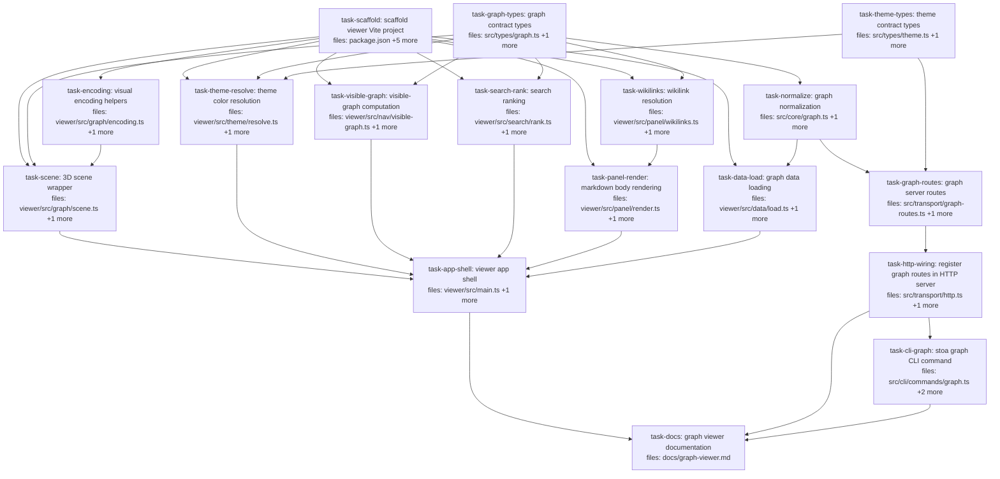

## Context

Drives the spec at `docs/superpowers/specs/2026-05-26-3d-graph-viewer-design.md` (Stoa 3D graph viewer). The viewer is a standalone Vite-built SPA on `3d-force-graph` that renders the vault link graph in 3D, served two ways: as a static file reading `_index/*.json`, and behind stoa's existing Hono HTTP server.

Decomposition shape:
- **Shared contracts** in `src/types/` (zod, matching `src/types/claim.ts`): graph data shape + theme shape. These are the H9 definers most tasks depend on.
- **Shared pure normalization** (`src/core/graph.ts` `buildGraph`) consumed by *both* the server `/graph/data` route and the viewer's static loader — one implementation, no drift.
- **DRY reuse** of the pre-existing pure `extractWikilinks()` in `src/core/wikilinks.ts` for the detail panel.
- **Viewer pure modules** (`viewer/src/**`) — encoding, theme resolution, visible-graph computation, search ranking, wikilink resolution, markdown render, data loading — each a single-file, unit-tested concern, fanning out in parallel off the contracts + scaffold.
- **Cross-project imports** use a `@stoa/*` alias → `src/*`, defined in `viewer/vite.config.ts`, `viewer/tsconfig.json`, AND root `vitest.config.ts` (so vitest resolves it for viewer tests). Established by `task-scaffold`.
- **Integration glue** (3D scene wiring, DOM controls) is concentrated in `task-app-shell` and verified via a manual smoke checklist (per spec §9 — 3D rendering is verified visually, not unit-tested). The deterministic helpers it relies on (size scaling, color resolution, visible-graph computation, ranking) are each independently unit-tested upstream.

Accepted trade-offs surfaced during the decomposition audit:
- `task-graph-routes` reads index JSON and the themes file with direct `node:fs` (no store abstraction exists for this in the codebase). Acceptable for a thin route module; the PUT path uses an atomic temp-write+rename and zod-validates input at the boundary.
- `task-app-shell` is a larger wiring task (S2). Defensible: it is the single app-integration shell, exempt from unit tests by design, with all its logic-bearing dependencies tested in isolation.
- Test fixtures are defined inline per test (small graphs), deliberately avoiding a shared un-owned helper file (S7).

## Tasks

## Task: scaffold viewer Vite project

```yaml
id: task-scaffold
depends_on: []
files:
  - package.json
  - viewer/vite.config.ts
  - viewer/tsconfig.json
  - viewer/index.html
  - viewer/src/main.ts
  - vitest.config.ts
status: pending
is_wiring_task: true
```

Stand up the viewer's Vite project skeleton and the cross-project tooling it needs. Adds runtime deps (`3d-force-graph`, `markdown-it`) and dev deps (`vite`, `@types/markdown-it`) to the root `package.json`, a `build:viewer` script, the Vite config with the `@stoa` → `../src` alias, a viewer tsconfig with matching `paths`, an `index.html` entry, and a trivial `main.ts` that boots an empty `3d-force-graph` canvas to prove the toolchain. Extends root `vitest.config.ts` to include `viewer/src/**/*.test.ts` and to resolve the `@stoa` alias (so vitest can run viewer unit tests that import `@stoa/types/*` and `@stoa/core/*`).

## Implementation

```jsonc
// package.json — additions
{
  "scripts": {
    "build:viewer": "vite build viewer",
    "dev:viewer": "vite viewer"
  },
  "dependencies": {
    "3d-force-graph": "^1.73.0",
    "markdown-it": "^14.1.0"
  },
  "devDependencies": {
    "vite": "^5.4.0",
    "@types/markdown-it": "^14.1.2"
  }
}
```

```typescript
// viewer/vite.config.ts
import { defineConfig } from "vite";
import { resolve } from "node:path";

export default defineConfig({
  root: resolve(__dirname),
  build: { outDir: resolve(__dirname, "../dist/viewer"), emptyOutDir: true },
  resolve: { alias: { "@stoa": resolve(__dirname, "../src") } },
});
```

```typescript
// vitest.config.ts — note the added include glob + alias
import { defineConfig } from "vitest/config";
import { resolve } from "node:path";

export default defineConfig({
  resolve: { alias: { "@stoa": resolve(__dirname, "src") } },
  test: {
    include: ["tests/**/*.test.ts", "src/**/*.test.ts", "viewer/src/**/*.test.ts"],
    environment: "node",
    globals: false,
    testTimeout: 30000,
    pool: "threads",
    setupFiles: ["./tests/setup.ts"],
  },
});
```

## Acceptance criteria

- `npm run build:viewer` exits 0 and emits `dist/viewer/index.html` plus bundled JS (libs inlined, no CDN references).
- `npm test` remains green (existing suite unaffected by the `vitest.config.ts` changes).
- A throwaway viewer test importing `@stoa/types/graph` resolves under vitest (alias works in the test runner, not just the browser build).
- `viewer/index.html` loads `viewer/src/main.ts` as a module and renders a non-erroring empty `3d-force-graph` canvas under `npm run dev:viewer`.

Test: verified via `npm run build:viewer` and `npm test` (config/scaffold task — no dedicated vitest file).

## Task: graph contract types

```yaml
id: task-graph-types
depends_on: []
files:
  - src/types/graph.ts
  - src/types/graph.test.ts
status: pending
```

The shared graph data contract: zod schemas for the raw `_index` shapes (`pages.json`, `links.json`) plus the normalized `GraphNode` / `GraphLink` / `Graph` types the whole viewer and the server route consume. Per spec §3.1.

## Implementation

```typescript
// src/types/graph.ts
import { z } from "zod";

export const RawPage = z.object({
  id: z.string(),
  type: z.string(),
  wiki: z.string(),
  title: z.string().default(""),
  summary: z.string().default(""),
  tags: z.array(z.string()).default([]),
  status: z.string().default("draft"),
  updated: z.string().default(""),
  path: z.string(),
});
export type RawPage = z.infer<typeof RawPage>;

export const PagesIndex = z.object({ pages: z.array(RawPage) });
export type PagesIndex = z.infer<typeof PagesIndex>;

export const LinksEntry = z.object({
  outbound: z.array(z.string()).default([]),
  inbound: z.array(z.string()).default([]),
});
export const LinksIndex = z.record(z.string(), LinksEntry);
export type LinksIndex = z.infer<typeof LinksIndex>;

export interface GraphNode {
  id: string; wiki: string; type: string; title: string; summary: string;
  tags: string[]; status: string; updated: string; path: string; degree: number;
}
export interface GraphLink { source: string; target: string; }
export interface Graph { nodes: GraphNode[]; links: GraphLink[]; }
```

```typescript
// src/types/graph.test.ts
import { describe, it, expect } from "vitest";
import { PagesIndex } from "./graph.js";

it("applies array/string defaults to a minimal page", () => {
  const r = PagesIndex.parse({ pages: [{ id: "a", type: "concept", wiki: "w", path: "wikis/w/concept/a.md" }] });
  expect(r.pages[0].tags).toEqual([]);
  expect(r.pages[0].summary).toBe("");
});
```

## Acceptance criteria

- `PagesIndex.parse` accepts a page missing optional fields and fills defaults (`tags: []`, `summary: ""`, `status: "draft"`).
- `PagesIndex.parse` rejects a page missing required `id` or `path`.
- `LinksIndex.parse` accepts the `{ "<id>": { outbound, inbound } }` shape and defaults missing arrays to `[]`.
- `GraphNode`/`GraphLink`/`Graph` are exported types usable across `src/` and `viewer/`.

Test file: `src/types/graph.test.ts`.

## Task: theme contract types

```yaml
id: task-theme-types
depends_on: []
files:
  - src/types/theme.ts
  - src/types/theme.test.ts
status: pending
```

The shared theming contract: zod schemas for `ColorRule`, `Theme`, and the on-disk `ThemesFile`. Used by the viewer's color resolver and by the server's `PUT /graph/themes` validation. Per spec §6.

## Implementation

```typescript
// src/types/theme.ts
import { z } from "zod";

export const ColorRule = z.object({
  match: z.object({
    wiki: z.string().optional(),
    type: z.string().optional(),
    tag: z.string().optional(),
    status: z.string().optional(),
    idGlob: z.string().optional(),
  }),
  color: z.string().regex(/^#([0-9a-fA-F]{3}|[0-9a-fA-F]{6})$/),
});
export type ColorRule = z.infer<typeof ColorRule>;

export const Theme = z.object({
  name: z.string().min(1),
  palette: z.string().default("default"),
  defaultBy: z.enum(["wiki", "type"]).default("wiki"),
  rules: z.array(ColorRule).default([]),
  perWiki: z.record(z.string(), z.array(ColorRule)).default({}),
});
export type Theme = z.infer<typeof Theme>;

export const ThemesFile = z.object({
  themes: z.array(Theme).default([]),
  active: z.string().optional(),
});
export type ThemesFile = z.infer<typeof ThemesFile>;
```

```typescript
// src/types/theme.test.ts
import { it, expect } from "vitest";
import { Theme } from "./theme.js";

it("rejects a malformed color and defaults defaultBy to wiki", () => {
  expect(() => Theme.parse({ name: "x", rules: [{ match: { tag: "recipe" }, color: "red" }] })).toThrow();
  expect(Theme.parse({ name: "x" }).defaultBy).toBe("wiki");
});
```

## Acceptance criteria

- `Theme.parse` defaults `defaultBy` to `"wiki"`, `palette` to `"default"`, `rules` to `[]`, `perWiki` to `{}`.
- `ColorRule` rejects a `color` that is not a 3- or 6-digit hex (`"red"` throws).
- `ThemesFile.parse` accepts `{ themes: [...] }` and an optional `active` name.

Test file: `src/types/theme.test.ts`.

## Task: graph normalization

```yaml
id: task-normalize
depends_on: [task-graph-types]
files:
  - src/core/graph.ts
  - src/core/graph.test.ts
status: pending
```

Pure normalization from the two raw `_index` shapes into the `Graph` consumed by the viewer and the server route. One `GraphNode` per page (with `degree` = outbound+inbound), one `GraphLink` per outbound edge, dangling edges dropped. Per spec §3.1. Shared by `task-data-load` (static mode) and `task-graph-routes` (served mode) — single source of truth.

## Implementation

```typescript
// src/core/graph.ts
import type { Graph, GraphNode, GraphLink, RawPage, LinksIndex } from "../types/graph.js";

export function buildGraph(pages: RawPage[], links: LinksIndex): Graph {
  const ids = new Set(pages.map((p) => p.id));
  const nodes: GraphNode[] = pages.map((p) => {
    const e = links[p.id];
    const degree = (e?.outbound.length ?? 0) + (e?.inbound.length ?? 0);
    return { ...p, degree };
  });
  const out: GraphLink[] = [];
  for (const [source, e] of Object.entries(links)) {
    if (!ids.has(source)) continue;
    for (const target of e.outbound) {
      if (ids.has(target)) out.push({ source, target });
    }
  }
  return { nodes, links: out };
}
```

```typescript
// src/core/graph.test.ts
import { it, expect } from "vitest";
import { buildGraph } from "./graph.js";

it("computes degree and drops dangling edges", () => {
  const pages = [
    { id: "a", type: "concept", wiki: "w", title: "", summary: "", tags: [], status: "active", updated: "", path: "p/a.md" },
    { id: "b", type: "concept", wiki: "w", title: "", summary: "", tags: [], status: "active", updated: "", path: "p/b.md" },
  ];
  const links = { a: { outbound: ["b", "ghost"], inbound: [] }, b: { outbound: [], inbound: ["a"] } };
  const g = buildGraph(pages, links);
  expect(g.links).toEqual([{ source: "a", target: "b" }]); // ghost dropped
  expect(g.nodes.find((n) => n.id === "a")!.degree).toBe(2); // 2 outbound listed
  expect(g.nodes.find((n) => n.id === "b")!.degree).toBe(1);
});
```

## Acceptance criteria

- One `GraphNode` per input page; `degree` equals `outbound.length + inbound.length` from the links entry (0 if absent).
- One `GraphLink` per outbound edge whose source and target both exist in `pages`.
- Edges to/from ids not present in `pages` are dropped (no throw).
- Pure: no `fs`, `fetch`, or other side effects — accepts already-parsed objects.

Test file: `src/core/graph.test.ts`.

## Task: visual encoding helpers

```yaml
id: task-encoding
depends_on: [task-scaffold]
files:
  - viewer/src/graph/encoding.ts
  - viewer/src/graph/encoding.test.ts
status: pending
```

Pure, deterministic visual-encoding helpers used by the 3D scene: node radius as a function of degree (hubs bigger, bounded), and the control-type cycle for the trackball/orbit toggle. Per spec §4.4, §6.3.

## Implementation

```typescript
// viewer/src/graph/encoding.ts
export type ControlType = "trackball" | "orbit" | "fly";

export function degreeToRadius(degree: number, opts = { min: 2, max: 12, k: 0.7 }): number {
  return Math.min(opts.max, opts.min + opts.k * Math.sqrt(Math.max(0, degree)));
}

// MVP UI toggle cycles trackball <-> orbit only (fly reachable via config, not the toggle).
export function nextControlType(current: ControlType): ControlType {
  return current === "trackball" ? "orbit" : "trackball";
}
```

```typescript
// viewer/src/graph/encoding.test.ts
import { it, expect } from "vitest";
import { degreeToRadius, nextControlType } from "./encoding.js";

it("radius is monotonic non-decreasing and bounded", () => {
  expect(degreeToRadius(0)).toBeLessThan(degreeToRadius(10));
  expect(degreeToRadius(10_000)).toBeLessThanOrEqual(12);
});

it("toggle cycles trackball and orbit", () => {
  expect(nextControlType("trackball")).toBe("orbit");
  expect(nextControlType("orbit")).toBe("trackball");
});
```

## Acceptance criteria

- `degreeToRadius` is non-decreasing in `degree` and never exceeds `opts.max`.
- `degreeToRadius` clamps negative input to the minimum (no NaN).
- `nextControlType("trackball") === "orbit"` and `nextControlType("orbit") === "trackball"`.

Test file: `viewer/src/graph/encoding.test.ts`.

## Task: theme color resolution

```yaml
id: task-theme-resolve
depends_on: [task-scaffold, task-graph-types, task-theme-types]
files:
  - viewer/src/theme/resolve.ts
  - viewer/src/theme/resolve.test.ts
status: pending
```

Pure theme engine: given a node and a theme, resolve its color via per-wiki rules first, then global rules (first match wins), then a stable palette hue keyed on the `defaultBy` dimension. Per spec §6.1. Built-in named palettes live here.

## Implementation

```typescript
// viewer/src/theme/resolve.ts
import type { GraphNode } from "@stoa/types/graph";
import type { Theme, ColorRule } from "@stoa/types/theme";

export const PALETTES: Record<string, string[]> = {
  default: ["#61afef", "#98c379", "#c678dd", "#e5c07b", "#e06c75", "#56b6c2", "#d19a66", "#abb2bf"],
  // additional palettes (warm / high-contrast / colorblind-safe) added by the implementer
};

function globToRe(glob: string): RegExp {
  return new RegExp("^" + glob.replace(/[.+^${}()|[\]\\]/g, "\\$&").replace(/\*/g, ".*") + "$");
}

function matches(node: GraphNode, r: ColorRule): boolean {
  const m = r.match;
  if (m.wiki && m.wiki !== node.wiki) return false;
  if (m.type && m.type !== node.type) return false;
  if (m.status && m.status !== node.status) return false;
  if (m.tag && !node.tags.includes(m.tag)) return false;
  if (m.idGlob && !globToRe(m.idGlob).test(node.id)) return false;
  return true;
}

export function hashHue(key: string, palette: string[]): string {
  let h = 0;
  for (let i = 0; i < key.length; i++) h = (h * 31 + key.charCodeAt(i)) >>> 0;
  return palette[h % palette.length];
}

export function resolveNodeColor(node: GraphNode, theme: Theme): string {
  for (const r of theme.perWiki?.[node.wiki] ?? []) if (matches(node, r)) return r.color;
  for (const r of theme.rules) if (matches(node, r)) return r.color;
  const palette = PALETTES[theme.palette] ?? PALETTES.default;
  return hashHue(theme.defaultBy === "type" ? node.type : node.wiki, palette);
}
```

```typescript
// viewer/src/theme/resolve.test.ts
import { it, expect } from "vitest";
import { resolveNodeColor } from "./resolve.js";

const node = { id: "concept-x", wiki: "meal-planning", type: "concept", title: "", summary: "", tags: ["recipe"], status: "active", updated: "", path: "", degree: 1 };

it("per-wiki tag rule beats the wiki default", () => {
  const theme = { name: "t", palette: "default", defaultBy: "wiki" as const, rules: [], perWiki: { "meal-planning": [{ match: { tag: "recipe" }, color: "#e06c75" }] } };
  expect(resolveNodeColor(node, theme)).toBe("#e06c75");
});
```

## Acceptance criteria

- A matching `perWiki` rule takes precedence over global `rules` and over the `defaultBy` fallback.
- A `tag` match succeeds when `node.tags` contains the value; fails otherwise.
- With no matching rule, color is a stable palette hue keyed on wiki (`defaultBy: "wiki"`) or type (`defaultBy: "type"`) — same key always yields the same color.
- An unknown `palette` name falls back to `PALETTES.default` without throwing.

Test file: `viewer/src/theme/resolve.test.ts`.

## Task: visible-graph computation

```yaml
id: task-visible-graph
depends_on: [task-scaffold, task-graph-types]
files:
  - viewer/src/nav/visible-graph.ts
  - viewer/src/nav/visible-graph.test.ts
status: pending
```

Pure transform from the full `Graph` + a `ViewState` to the sub-graph the scene should render — the logic core behind all three navigation modes (region drill-down, show-all+filters, focus/neighborhood). Per spec §4.1–§4.3. Collapsed wikis collapse to one synthetic super-node; inter-wiki edges to a collapsed wiki retarget onto its super-node.

## Implementation

```typescript
// viewer/src/nav/visible-graph.ts
import type { Graph, GraphNode } from "@stoa/types/graph";

export interface ViewState {
  mode: "region" | "all" | "focus";
  expandedWikis: Set<string>;
  focusId: string | null;
  hops: number;
  filters?: { wikis?: Set<string>; types?: Set<string>; statuses?: Set<string>; tag?: string };
}

const WIKI_NODE = (wiki: string, count: number): GraphNode => ({
  id: `wiki:${wiki}`, wiki, type: "__wiki__", title: wiki, summary: "",
  tags: [], status: "active", updated: "", path: "", degree: count,
});

export function computeVisibleGraph(graph: Graph, view: ViewState): Graph {
  if (view.mode === "focus" && view.focusId) return neighborhood(graph, view.focusId, view.hops);
  if (view.mode === "all") return applyFilters(graph, view.filters);
  return regionView(graph, view.expandedWikis); // default: region
}

// regionView, neighborhood (BFS to `hops`), applyFilters implemented by the
// implementer; signatures above are the load-bearing contract.
function regionView(graph: Graph, expanded: Set<string>): Graph { /* ... */ return graph; }
function neighborhood(graph: Graph, focusId: string, hops: number): Graph { /* ... */ return graph; }
function applyFilters(graph: Graph, f?: ViewState["filters"]): Graph { /* ... */ return graph; }
```

```typescript
// viewer/src/nav/visible-graph.test.ts
import { it, expect } from "vitest";
import { computeVisibleGraph, type ViewState } from "./visible-graph.js";

const g = {
  nodes: [
    { id: "a", wiki: "w1", type: "concept", title: "", summary: "", tags: [], status: "active", updated: "", path: "", degree: 1 },
    { id: "b", wiki: "w2", type: "concept", title: "", summary: "", tags: [], status: "active", updated: "", path: "", degree: 1 },
  ],
  links: [{ source: "a", target: "b" }],
};
const base: ViewState = { mode: "region", expandedWikis: new Set(), focusId: null, hops: 1 };

it("region view with nothing expanded shows one super-node per wiki", () => {
  const v = computeVisibleGraph(g, base);
  expect(v.nodes.map((n) => n.id).sort()).toEqual(["wiki:w1", "wiki:w2"]);
});
```

## Acceptance criteria

- Region mode, no wikis expanded: one `wiki:<name>` super-node per wiki present in the graph; no real page nodes.
- Region mode, a wiki expanded: that wiki's real page nodes appear; other wikis remain super-nodes; an edge crossing into a collapsed wiki retargets onto that wiki's super-node id.
- Focus mode: returns the focus node plus nodes within `hops` BFS distance, and only edges among those nodes.
- All mode: returns every node/edge, minus any excluded by `filters` (wikis/types/statuses/tag).

Test file: `viewer/src/nav/visible-graph.test.ts`.

## Task: search ranking

```yaml
id: task-search-rank
depends_on: [task-scaffold, task-graph-types]
files:
  - viewer/src/search/rank.ts
  - viewer/src/search/rank.test.ts
status: pending
```

Pure client-side metadata search: rank nodes against a query over `title / summary / tags / id`. Per spec §7. Powers both type-to-highlight and type-to-focus in the UI.

## Implementation

```typescript
// viewer/src/search/rank.ts
import type { GraphNode } from "@stoa/types/graph";

export interface SearchHit { id: string; score: number; }

export function rankNodes(query: string, nodes: GraphNode[], limit = 20): SearchHit[] {
  const q = query.trim().toLowerCase();
  if (!q) return [];
  const hits: SearchHit[] = [];
  for (const n of nodes) {
    const title = n.title.toLowerCase();
    let score = 0;
    if (n.id.toLowerCase() === q || title === q) score = 100;
    else if (title.startsWith(q)) score = 70;
    else if (title.includes(q)) score = 50;
    else if (n.tags.some((t) => t.toLowerCase().includes(q))) score = 35;
    else if (n.id.toLowerCase().includes(q)) score = 25;
    else if (n.summary.toLowerCase().includes(q)) score = 15;
    if (score > 0) hits.push({ id: n.id, score });
  }
  return hits.sort((a, b) => b.score - a.score).slice(0, limit);
}
```

```typescript
// viewer/src/search/rank.test.ts
import { it, expect } from "vitest";
import { rankNodes } from "./rank.js";

const mk = (id: string, title: string, summary = "") => ({ id, title, summary, wiki: "w", type: "concept", tags: [] as string[], status: "active", updated: "", path: "", degree: 0 });

it("ranks title match above summary-only match and ignores empty query", () => {
  const nodes = [mk("a", "alpha", "mentions recipe"), mk("b", "recipe book")];
  expect(rankNodes("", nodes)).toEqual([]);
  expect(rankNodes("recipe", nodes)[0].id).toBe("b");
});
```

## Acceptance criteria

- Empty/whitespace query returns `[]`.
- Exact id or title match scores highest; title prefix > title substring > tag > id substring > summary substring.
- Results are sorted by descending score and capped at `limit`.
- Matching is case-insensitive.

Test file: `viewer/src/search/rank.test.ts`.

## Task: wikilink resolution

```yaml
id: task-wikilinks
depends_on: [task-scaffold, task-graph-types]
files:
  - viewer/src/panel/wikilinks.ts
  - viewer/src/panel/wikilinks.test.ts
status: pending
```

Resolve the wikilinks in a note body to target node ids for the detail panel, **reusing** the pre-existing pure `extractWikilinks()` from `src/core/wikilinks.ts` (DRY — no second parser). Maps each extracted ref's `id` to a known node, flagging unresolved links. Per spec §5, §9.

## Implementation

```typescript
// viewer/src/panel/wikilinks.ts
import { extractWikilinks } from "@stoa/core/wikilinks";

export interface ResolvedLink { raw: string; targetId: string | null; alias?: string; }

export function resolveBodyWikilinks(
  body: string,
  related: string[] | undefined,
  knownIds: Set<string>,
): ResolvedLink[] {
  return extractWikilinks(body, related).map((ref) => ({
    raw: ref.raw,
    alias: ref.alias,
    targetId: knownIds.has(ref.id) ? ref.id : null,
  }));
}
```

```typescript
// viewer/src/panel/wikilinks.test.ts
import { it, expect } from "vitest";
import { resolveBodyWikilinks } from "./wikilinks.js";

it("resolves a known id and flags an unknown one", () => {
  const body = "see [[wikis/w/concept/known|Known]] and [[wikis/w/concept/ghost]]";
  const out = resolveBodyWikilinks(body, undefined, new Set(["known"]));
  expect(out.find((l) => l.alias === "Known")!.targetId).toBe("known");
  expect(out.find((l) => l.raw.includes("ghost"))!.targetId).toBeNull();
});
```

## Acceptance criteria

- Uses `extractWikilinks` from `src/core/wikilinks.ts` (no reimplemented `[[...]]` parser).
- A link whose extracted `id` is in `knownIds` resolves to that `targetId`; otherwise `targetId` is `null`.
- Preserves the original `raw` string and optional `alias` for each link.
- `frontmatter related:` entries (the `related` arg) are resolved alongside body links.

Test file: `viewer/src/panel/wikilinks.test.ts`.

## Task: markdown body rendering

```yaml
id: task-panel-render
depends_on: [task-scaffold, task-wikilinks]
files:
  - viewer/src/panel/render.ts
  - viewer/src/panel/render.test.ts
status: pending
```

Render a note's markdown body to HTML with `markdown-it`, then rewrite its wikilinks into clickable anchors (resolved) or dead-link spans (unresolved), using the resolver from `task-wikilinks`. Output HTML is what the detail panel injects. Per spec §5.

## Implementation

```typescript
// viewer/src/panel/render.ts
import MarkdownIt from "markdown-it";
import { resolveBodyWikilinks } from "./wikilinks.js";

const md = new MarkdownIt({ html: false, linkify: true });

export function renderNoteBody(body: string, related: string[] | undefined, knownIds: Set<string>): string {
  let html = md.render(body);
  for (const link of resolveBodyWikilinks(body, related, knownIds)) {
    const label = link.alias ?? link.targetId ?? link.raw;
    const repl = link.targetId
      ? `<a class="wikilink" data-target="${link.targetId}">${label}</a>`
      : `<span class="wikilink-dead">${label}</span>`;
    html = html.split(link.raw).join(repl);
  }
  return html;
}
```

```typescript
// viewer/src/panel/render.test.ts
import { it, expect } from "vitest";
import { renderNoteBody } from "./render.js";

it("turns a resolved wikilink into a clickable anchor and an unresolved one into a dead span", () => {
  const body = "# Title\n\nlink [[wikis/w/concept/known]] and [[wikis/w/concept/ghost]]";
  const html = renderNoteBody(body, undefined, new Set(["known"]));
  expect(html).toContain('<a class="wikilink" data-target="known">');
  expect(html).toContain('<span class="wikilink-dead">');
});
```

## Acceptance criteria

- Standard markdown (headings, lists, emphasis, code) renders via `markdown-it` (`html: false`).
- Each resolved wikilink becomes `<a class="wikilink" data-target="<id>">…</a>`.
- Each unresolved wikilink becomes `<span class="wikilink-dead">…</span>` (non-clickable).
- Repeated occurrences of the same wikilink are all rewritten (not just the first).

Test file: `viewer/src/panel/render.test.ts`.

## Task: graph data loading

```yaml
id: task-data-load
depends_on: [task-scaffold, task-normalize]
files:
  - viewer/src/data/load.ts
  - viewer/src/data/load.test.ts
status: pending
```

The viewer's two data acquisition paths: `loadStatic` fetches `_index/pages.json` + `_index/links.json` and normalizes via shared `buildGraph`; `loadServed` fetches the pre-normalized `/graph/data`. A typed error signals missing/old index for the UI banner. Per spec §3.1, §9.

## Implementation

```typescript
// viewer/src/data/load.ts
import { buildGraph } from "@stoa/core/graph";
import { PagesIndex, LinksIndex, type Graph } from "@stoa/types/graph";

export class IndexUnavailableError extends Error {}

async function getJson(url: string): Promise<unknown> {
  const r = await fetch(url);
  if (!r.ok) throw new IndexUnavailableError(url);
  return r.json();
}

export async function loadStatic(base = "."): Promise<Graph> {
  const [p, l] = await Promise.all([getJson(`${base}/_index/pages.json`), getJson(`${base}/_index/links.json`)]);
  return buildGraph(PagesIndex.parse(p).pages, LinksIndex.parse(l));
}

export async function loadServed(base = ""): Promise<Graph> {
  return (await getJson(`${base}/graph/data`)) as Graph;
}
```

```typescript
// viewer/src/data/load.test.ts
import { it, expect, vi } from "vitest";
import { loadStatic, IndexUnavailableError } from "./load.js";

it("normalizes static index fetches and throws a typed error on 404", async () => {
  const pages = { pages: [{ id: "a", type: "concept", wiki: "w", path: "p/a.md" }] };
  const links = { a: { outbound: [], inbound: [] } };
  vi.stubGlobal("fetch", vi.fn(async (u: string) => ({ ok: true, json: async () => (u.includes("pages") ? pages : links) })));
  expect((await loadStatic()).nodes[0].id).toBe("a");

  vi.stubGlobal("fetch", vi.fn(async () => ({ ok: false })));
  await expect(loadStatic()).rejects.toBeInstanceOf(IndexUnavailableError);
});
```

## Acceptance criteria

- `loadStatic` fetches both index files, validates with the zod schemas, and returns a `Graph` via `buildGraph`.
- `loadServed` fetches `/graph/data` and returns the `Graph` as-is.
- A non-ok response from any fetch throws `IndexUnavailableError` (caught by the UI to show the reindex banner).
- Uses the shared `buildGraph` — does not reimplement normalization.

Test file: `viewer/src/data/load.test.ts`.

## Task: 3D scene wrapper

```yaml
id: task-scene
depends_on: [task-scaffold, task-graph-types, task-encoding]
files:
  - viewer/src/graph/scene.ts
  - viewer/src/graph/scene.test.ts
status: pending
```

Thin wrapper around `3d-force-graph` exposing a typed API the app shell drives: set data, set node color/size accessors, switch control type (trackball/orbit/fly), toggle directional particles, fly camera to a node, and a node-click callback. Per spec §4.4, §6.3. Library interaction is unit-tested by mocking `3d-force-graph` (real WebGL is exercised only in the manual smoke).

## Implementation

```typescript
// viewer/src/graph/scene.ts
import ForceGraph3D from "3d-force-graph";
import type { Graph, GraphNode } from "@stoa/types/graph";
import { degreeToRadius, type ControlType } from "./encoding.js";

export interface SceneCallbacks { onNodeClick?: (id: string) => void; }

export class GraphScene {
  private fg: any;
  constructor(el: HTMLElement, cb: SceneCallbacks = {}) {
    this.fg = (ForceGraph3D as any)()(el)
      .nodeVal((n: any) => degreeToRadius(n.degree))
      .onNodeClick((n: any) => cb.onNodeClick?.(n.id));
  }
  setData(g: Graph) { this.fg.graphData({ nodes: g.nodes, links: g.links }); }
  setNodeColor(fn: (n: GraphNode) => string) { this.fg.nodeColor((n: any) => fn(n)); }
  setControlType(c: ControlType) { this.fg.controlType(c); }
  setDirectionalParticles(on: boolean) { this.fg.linkDirectionalParticles(on ? 2 : 0); }
  flyToNode(id: string) { this.fg.zoomToFit?.(0); /* implementer: animate camera to node coords */ void id; }
}
```

```typescript
// viewer/src/graph/scene.test.ts
import { it, expect, vi } from "vitest";

const calls: Record<string, unknown[]> = {};
const inst: any = new Proxy({}, { get: (_t, prop: string) => (...args: unknown[]) => { calls[prop] = args; return inst; } });
vi.mock("3d-force-graph", () => ({ default: () => () => inst }));

import { GraphScene } from "./scene.js";

it("forwards control type to the underlying graph", () => {
  const s = new GraphScene({} as unknown as HTMLElement);
  s.setControlType("orbit");
  expect(calls.controlType).toEqual(["orbit"]);
});
```

## Acceptance criteria

- Constructing `GraphScene` initializes `3d-force-graph` on the element and registers the node-click callback.
- `setData` forwards `{ nodes, links }` to the library's `graphData`.
- `setControlType("orbit"|"trackball"|"fly")` forwards to the library's `controlType`.
- `setDirectionalParticles(true)` enables particles; `false` sets them to 0.
- Node size uses `degreeToRadius` (from `task-encoding`).

Test file: `viewer/src/graph/scene.test.ts`.

## Task: graph server routes

```yaml
id: task-graph-routes
depends_on: [task-normalize, task-theme-types]
files:
  - src/transport/graph-routes.ts
  - src/transport/graph-routes.test.ts
status: pending
```

A Hono route registrar exposing the served-mode data + theme endpoints: `GET /graph/data` (reads the index, returns normalized `Graph` via shared `buildGraph`), `GET /graph/themes` and `PUT /graph/themes` (read/atomically-write `graph-themes.json`, validating input with the shared `Theme` schema). Per spec §3.2, §6.4.

## Implementation

```typescript
// src/transport/graph-routes.ts
import type { Hono } from "hono";
import { readFileSync, writeFileSync, renameSync, existsSync } from "node:fs";
import { join } from "node:path";
import type { VaultConfig } from "../config.js";
import { buildGraph } from "../core/graph.js";
import { PagesIndex, LinksIndex } from "../types/graph.js";
import { ThemesFile } from "../types/theme.js";

export function registerGraphRoutes(app: Hono, config: VaultConfig): void {
  const idxDir = join(config.vaultPath, "_index");
  const themesPath = join(config.vaultPath, "graph-themes.json");

  app.get("/graph/data", (c) => {
    const pages = PagesIndex.parse(JSON.parse(readFileSync(join(idxDir, "pages.json"), "utf8"))).pages;
    const links = LinksIndex.parse(JSON.parse(readFileSync(join(idxDir, "links.json"), "utf8")));
    return c.json(buildGraph(pages, links));
  });

  app.get("/graph/themes", (c) =>
    c.json(existsSync(themesPath) ? JSON.parse(readFileSync(themesPath, "utf8")) : { themes: [] }));

  app.put("/graph/themes", async (c) => {
    const body = ThemesFile.parse(await c.req.json());
    const tmp = `${themesPath}.tmp`;
    writeFileSync(tmp, JSON.stringify(body, null, 2));
    renameSync(tmp, themesPath); // atomic replace
    return c.json({ ok: true });
  });
}
```

```typescript
// src/transport/graph-routes.test.ts
import { it, expect } from "vitest";
import { mkdtempSync, mkdirSync, writeFileSync } from "node:fs";
import { tmpdir } from "node:os";
import { join } from "node:path";
import { Hono } from "hono";
import { registerGraphRoutes } from "./graph-routes.js";

it("GET /graph/data returns a normalized graph from the index", async () => {
  const vault = mkdtempSync(join(tmpdir(), "stoa-graph-"));
  mkdirSync(join(vault, "_index"));
  writeFileSync(join(vault, "_index/pages.json"), JSON.stringify({ pages: [{ id: "a", type: "concept", wiki: "w", path: "p/a.md" }] }));
  writeFileSync(join(vault, "_index/links.json"), JSON.stringify({ a: { outbound: [], inbound: [] } }));
  const app = new Hono();
  registerGraphRoutes(app, { vaultPath: vault } as any);
  const res = await app.request("/graph/data");
  expect(res.status).toBe(200);
  expect((await res.json()).nodes[0].id).toBe("a");
});
```

## Acceptance criteria

- `GET /graph/data` returns `{ nodes, links }` built from `_index/pages.json` + `_index/links.json` via the shared `buildGraph`.
- `GET /graph/themes` returns the parsed `graph-themes.json`, or `{ themes: [] }` when the file is absent.
- `PUT /graph/themes` validates the body with the `Theme`/`ThemesFile` schema (rejects malformed) and persists via atomic temp-write + rename.
- No change to existing MCP tools or the `/mcp` and `/health` routes.

Test file: `src/transport/graph-routes.test.ts`.

## Task: register graph routes in HTTP server

```yaml
id: task-http-wiring
depends_on: [task-graph-routes]
files:
  - src/transport/http.ts
  - src/transport/graph-mount.test.ts
status: pending
is_wiring_task: true
```

Wire the graph data/theme routes and the built-viewer static assets into the existing Hono app in `startHttp()`. Calls `registerGraphRoutes(app, config)` and mounts `serveStatic` for `dist/viewer` at `GET /graph`. Public (the viewer is read-only and non-sensitive); does not pass through the `/mcp` bearer gate.

## Implementation

```typescript
// src/transport/http.ts — inside startHttp, after the Hono app is created
import { serveStatic } from "@hono/node-server/serve-static";
import { registerGraphRoutes } from "./graph-routes.js";
// ...
registerGraphRoutes(app, config);
app.use("/graph/*", serveStatic({ root: "./dist/viewer" }));
app.get("/graph", serveStatic({ path: "./dist/viewer/index.html" }));
```

## Acceptance criteria

- After `startHttp`, `GET /graph/data` returns 200 with a `{ nodes, links }` body.
- `GET /graph` serves the built viewer `index.html` (200, `text/html`).
- `/health` and `/mcp` behavior is unchanged (existing `http.test.ts` stays green).
- The graph routes are reachable without a bearer token.

Test file: `src/transport/graph-mount.test.ts` (boots `startHttp` on an OS-assigned port via `bindOverride: "127.0.0.1:0"`, asserts `/graph/data` responds).

## Task: stoa graph CLI command

```yaml
id: task-cli-graph
depends_on: [task-http-wiring]
files:
  - src/cli/commands/graph.ts
  - src/cli/commands/graph.test.ts
  - src/cli/index.ts
status: pending
is_wiring_task: true
```

Add a `stoa graph` subcommand that opens the user's browser to the served viewer URL (`http://<bind>/graph`, derived from stoa config), following the existing `register*` command pattern and reusing the already-present `open` dependency. Realizes the "one command" launch path from the design.

## Implementation

```typescript
// src/cli/commands/graph.ts
import type { Command } from "commander";
import open from "open";
import { loadVaultStoaConfig } from "../../config.js";

export function registerGraph(program: Command): void {
  program
    .command("graph")
    .description("Open the 3D vault graph viewer in your browser")
    .action(async () => {
      const cfg = loadVaultStoaConfig(process.cwd());
      const url = `http://${cfg.bind ?? "127.0.0.1:3000"}/graph`;
      console.log(`Opening ${url} (run \`stoa serve\` first if the server is not running)`);
      await open(url);
    });
}
```

```typescript
// src/cli/commands/graph.test.ts
import { it, expect, vi } from "vitest";
vi.mock("open", () => ({ default: vi.fn(async () => undefined) }));
import open from "open";
import { Command } from "commander";
import { registerGraph } from "./graph.js";

it("registers a graph command that opens the viewer URL", async () => {
  const program = new Command();
  registerGraph(program);
  await program.parseAsync(["node", "stoa", "graph"]);
  expect((open as unknown as ReturnType<typeof vi.fn>).mock.calls[0][0]).toMatch(/\/graph$/);
});
```

(`src/cli/index.ts`: add `import { registerGraph } from "./commands/graph.js";` and `registerGraph(program);` alongside the other registrations.)

## Acceptance criteria

- `stoa graph` is listed in `stoa --help`.
- Running it calls `open` with a URL ending in `/graph`, derived from the resolved stoa bind config.
- It prints a hint to run `stoa serve` if the server is not running.
- The `open` dependency is mocked in tests (no real browser launch).

Test file: `src/cli/commands/graph.test.ts`.

## Task: viewer app shell

```yaml
id: task-app-shell
depends_on: [task-scene, task-theme-resolve, task-visible-graph, task-search-rank, task-panel-render, task-data-load]
files:
  - viewer/src/main.ts
  - viewer/src/styles.css
status: pending
is_wiring_task: true
model_hint: opus
```

The integration shell: instantiate `GraphScene`, build the DOM controls (mode B/A/C switch, trackball/orbit toggle, theme switcher + by-wiki/by-type flip + directional-particle toggle, search box, detail panel), and wire them to the pure modules. On load: auto-detect served vs static (`loadServed`, falling back to `loadStatic`), load `graph-themes.json` (fallback to a built-in default theme on missing/malformed), default to mode B + trackball + by-wiki, and show the reindex banner on `IndexUnavailableError`. All logic-bearing pieces it composes are unit-tested upstream; this shell is verified via the manual smoke checklist.

## Implementation

```typescript
// viewer/src/main.ts (composition sketch — wiring only)
import { GraphScene } from "./graph/scene.js";
import { computeVisibleGraph, type ViewState } from "./nav/visible-graph.js";
import { resolveNodeColor } from "./theme/resolve.js";
import { rankNodes } from "./search/rank.js";
import { renderNoteBody } from "./panel/render.js";
import { loadServed, loadStatic, IndexUnavailableError } from "./data/load.js";
// build DOM, hold ViewState + active Theme, re-render scene on state change,
// open detail panel on node click, delegate wikilink clicks to re-select nodes.
```

## Acceptance criteria

- On first load the app shows the region view (mode B): one bubble per wiki, trackball controls, by-wiki colors.
- Clicking a wiki bubble expands that wiki's nodes; clicking again collapses it (drives `computeVisibleGraph`).
- The control toggle switches trackball↔orbit live; the theme switcher flips by-wiki↔by-type and applies `resolveNodeColor`.
- Clicking a node opens the detail panel with `renderNoteBody` output; clicking a resolved wikilink in the panel re-selects that node.
- Typing in the search box highlights matches (via `rankNodes`); selecting a result flies to the node and auto-expands its wiki if collapsed.
- When the index can't be loaded (`IndexUnavailableError`), a banner prompts `/reindex` instead of crashing.

Test: manual smoke checklist in `docs/graph-viewer.md` (added by `task-docs`); integration glue is verified visually per spec §9.

## Task: graph viewer documentation

```yaml
id: task-docs
depends_on: [task-app-shell, task-http-wiring, task-cli-graph]
files:
  - docs/graph-viewer.md
status: pending
is_wiring_task: true
```

User + maintainer documentation for the viewer: how to open it (static file vs `stoa graph`), the `graph-themes.json` format with the meal-planning per-wiki example, the navigation modes and camera controls, and a manual smoke-test checklist (the verification artifact referenced by `task-app-shell`).

## Acceptance criteria

- Documents both delivery paths: opening the built static viewer and `stoa graph` (served).
- Includes a complete `graph-themes.json` example with a `perWiki` rule set (meal-planning recipes → red) and explains rule precedence.
- Describes modes B/A/C and the trackball/orbit toggle.
- Contains a numbered manual smoke checklist covering each `task-app-shell` acceptance bullet.

Test: doc-only task; verified by the section/checklist coverage above.
