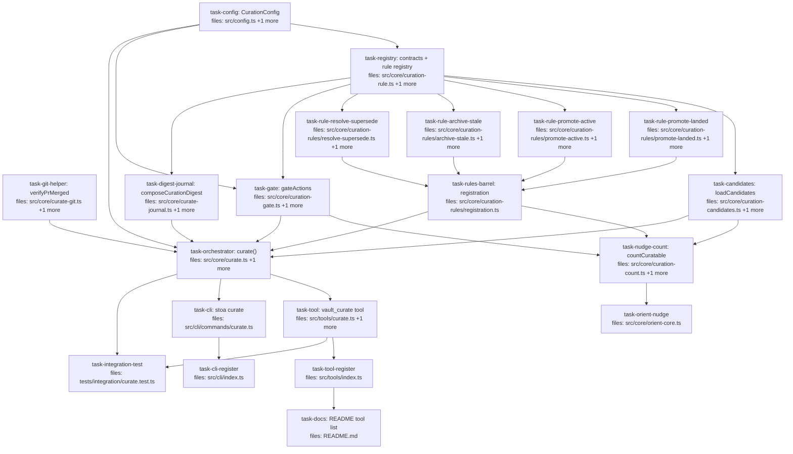

## Context

Implements the `vault_curate` feature designed in
`docs/superpowers/specs/2026-05-27-vault-curate-autonomous-status-curation-design.md`.
A new MCP tool (+ `stoa curate` CLI) advances page status along the lifecycle
(`draft → active → accepted`, archive, resolve/supersede) on checkable
evidence, autonomously, recording every action in one digest journal and
leaving everything git-reversible.

**Decomposition principles applied:**

- **DRY.** Candidate-page loading (disk I/O + inbound-link counting) is hoisted
  into a single `loadCandidates` helper (`task-candidates`) shared by both the
  orchestrator and the session-start count helper — neither re-implements it.
  Rule registration funnels through one barrel (`task-rules-barrel`), mirroring
  `core/lint-checks/registration.ts`.
- **Single Responsibility.** Each curation rule is one file. The gate (policy),
  the digest journal (audit I/O), the PR-merge check (git I/O), and the
  orchestrator (assembly) are each separate units.
- **Separation of Concerns.** Rules are **pure functions over pre-loaded
  `CandidatePage[]`** — they never touch the filesystem or shell out. All I/O
  lives in `task-candidates` (read), `task-git-helper` (git), `task-digest-journal`
  (journal write), and `task-orchestrator` (page writes via `writePage`/`upsertPage`).
  This mirrors the existing lint-check contract (`run(ctx, idx, input)` pure).
- **Contract co-location.** All shared curation types (`CurationAction`,
  `CandidatePage`, `CurationCtx`, `CurationRule`) live in `core/curation-rule.ts`,
  mirroring how `core/lint-check.ts` owns `LintCheck`/`LintCheckCtx`.
  `CurationConfig` lives in `src/config.ts`, mirroring the existing `ClaimsConfig`.

**Out of repo / follow-up (not in this plan):** the Behavioral Contract #5
amendment (spec §5.4) applies to the user's vault `CLAUDE.md`
(`C:\Users\brett\Documents\Knowledge\CLAUDE.md`), which lives in a different
git repo than this stoa package; the user applies it manually. Extending the
nudge to `vault_start` (in addition to `vault_orient`) reuses
`countCuratable` and is a trivial fast-follow — this plan wires the orient
surface only.

**Pre-flight grounding (already verified against the codebase):** lint-check
registry pattern (`core/lint-check.ts`), `writePage`/`upsertPage`
(`core/pages.ts`, `core/index.ts`), `.stoa/config.json` loader + `ClaimsConfig`
convention (`src/config.ts`), per-tool `ToolScope` with `adminOnly`
(`src/tools/reindex.ts`, `src/auth/types.ts`), journal write pattern
(`src/tools/agent-journal.ts`), CLI `register*` pattern (`src/cli/commands/*`),
orient core (`src/core/orient-core.ts`).

## Tasks

## Task: CurationConfig + .stoa/config.json block

```yaml
id: task-config
depends_on: []
files:
  - src/config.ts
  - src/config.test.ts
status: pending
```

Add the optional `curation` block to `.stoa/config.json` handling, mirroring
the existing `ClaimsConfig` zod-schema convention in the same file. Defaults
encode the brainstorm decisions (spec §4.5): `archive_stale_days: 60`,
`promote_active_recent_days: 14`, `confidence_floor: "medium"`,
`auto_archive_human: false`, `auto_commit: true`. Missing block → all defaults.

## Implementation

```typescript
// src/config.ts — add alongside ClaimsConfigSchema
export const CurationConfigSchema = z.object({
  archive_stale_days: z.number().int().positive().default(60),
  promote_active_recent_days: z.number().int().positive().default(14),
  confidence_floor: z.enum(["high", "medium", "low"]).default("medium"),
  auto_archive_human: z.boolean().default(false),
  auto_commit: z.boolean().default(true),
}).default({});

export type CurationConfig = z.infer<typeof CurationConfigSchema>;

// Read from the already-parsed `.stoa/config.json` object. Missing/invalid → defaults.
export function getCurationConfig(rawConfig: unknown): CurationConfig {
  const top = z.object({ curation: CurationConfigSchema })
    .parse(typeof rawConfig === "object" && rawConfig !== null ? rawConfig : {});
  return top.curation;
}
```

```typescript
// src/config.test.ts
import { getCurationConfig } from "./config.js";
it("returns all defaults when curation block absent", () => {
  expect(getCurationConfig({})).toEqual({
    archive_stale_days: 60, promote_active_recent_days: 14,
    confidence_floor: "medium", auto_archive_human: false, auto_commit: true,
  });
});
it("merges partial overrides over defaults", () => {
  expect(getCurationConfig({ curation: { archive_stale_days: 30 } }).archive_stale_days).toBe(30);
});
```

## Acceptance criteria

- `getCurationConfig({})` returns the five documented defaults.
- A partial `curation` block merges per-key over defaults (other keys keep defaults).
- An out-of-range value (e.g. `archive_stale_days: -1`) throws a ZodError.
- `confidence_floor` only accepts `"high" | "medium" | "low"`.

Test file: `src/config.test.ts`.

## Task: verifyPrMerged git/gh helper

```yaml
id: task-git-helper
depends_on: []
files:
  - src/core/curate-git.ts
  - src/core/curate-git.test.ts
status: pending
```

Isolates the only shell-out in the feature so the rules stay pure. Resolves
whether a PR reference is merged, returning a closed three-value result.
Unverifiable (no `gh`, network failure, ambiguous) → `"unknown"`, never a guess
(spec §4.1, §7). The shell command runner is injectable for tests.

## Implementation

```typescript
// src/core/curate-git.ts
export type PrMergeState = "merged" | "open" | "unknown";
export type Runner = (cmd: string, args: string[]) => { code: number; stdout: string };

// ref shape from implementation: frontmatter, e.g. "github.com/owner/name/pull/14"
export function verifyPrMerged(ref: string, run: Runner): PrMergeState {
  const m = ref.match(/\/pull\/(\d+)/);
  if (!m) return "unknown";
  const res = run("gh", ["pr", "view", m[1], "--json", "state", "-q", ".state"]);
  if (res.code !== 0) return "unknown";
  const state = res.stdout.trim().toUpperCase();
  if (state === "MERGED") return "merged";
  if (state === "OPEN" || state === "CLOSED") return "open";
  return "unknown";
}
```

```typescript
// src/core/curate-git.test.ts
import { verifyPrMerged } from "./curate-git.js";
it("returns unknown when gh exits non-zero", () => {
  expect(verifyPrMerged("github.com/o/n/pull/9", () => ({ code: 1, stdout: "" }))).toBe("unknown");
});
it("returns merged when gh reports MERGED", () => {
  expect(verifyPrMerged("github.com/o/n/pull/9", () => ({ code: 0, stdout: "MERGED\n" }))).toBe("merged");
});
```

## Acceptance criteria

- A ref with no `/pull/<n>` segment → `"unknown"` (no shell-out attempted).
- Runner exit code ≠ 0 → `"unknown"`.
- `stdout` `"MERGED"` → `"merged"`; `"OPEN"`/`"CLOSED"` → `"open"`; anything else → `"unknown"`.
- The production runner shells `gh pr view`; tests inject a fake runner (no real `gh` call).

Test file: `src/core/curate-git.test.ts`.

## Task: curation contracts + rule registry

```yaml
id: task-registry
depends_on: [task-config]
files:
  - src/core/curation-rule.ts
  - src/core/curation-rule.test.ts
status: pending
```

The contract home and registry, mirroring `core/lint-check.ts`. Defines every
shared curation type plus the self-registration registry. Rules are pure:
`run(ctx)` reads `ctx.candidates` (pre-loaded) and returns actions; no I/O.

## Implementation

```typescript
// src/core/curation-rule.ts
import type { NoteType } from "./frontmatter.js";
import type { CurationConfig } from "../config.js";

export type Confidence = "high" | "medium" | "low";

export interface CandidatePage {
  page_id: string; wiki: string; type: NoteType; path: string; // vault-relative
  status: string; author_class: "agent" | "human";
  created?: string; updated?: string; inbound_link_count: number;
  frontmatter: Record<string, unknown>; // implementation, related, supersedes, resolved_by, summary, tags, confidence
}

export interface CurationAction {
  code: string; page_id: string; wiki: string;
  from_status: string; to_status: string; // active|accepted|archived|superseded|resolved
  evidence: string; confidence: Confidence;
  author_class: "agent" | "human";
  field_patch?: Record<string, unknown>;
  applies: boolean;          // set by the gate, never the rule
  flag_reason?: string;
}

export interface CurationCtx {
  vaultPath: string; today: Date; config: CurationConfig;
  candidates: CandidatePage[];
  // git I/O injected as a function; the pure contract does not import the I/O
  // module (curate-git.ts), so it carries no dependency on it. The orchestrator
  // supplies curate-git's verifyPrMerged, which is structurally compatible.
  verifyPrMerged: (ref: string) => "merged" | "open" | "unknown";
}

export interface CurationRule { code: string; run(ctx: CurationCtx): CurationAction[]; }

export const curationRuleRegistry: CurationRule[] = [];
export function registerCurationRule(r: CurationRule): void { curationRuleRegistry.push(r); }
export function runRegisteredRules(ctx: CurationCtx): CurationAction[] {
  return curationRuleRegistry.flatMap(r => r.run(ctx));
}
```

```typescript
// src/core/curation-rule.test.ts
import { registerCurationRule, runRegisteredRules, curationRuleRegistry } from "./curation-rule.js";
it("runRegisteredRules flat-maps every registered rule", () => {
  curationRuleRegistry.length = 0;
  registerCurationRule({ code: "X", run: () => [{ code: "X" } as any] });
  registerCurationRule({ code: "Y", run: () => [] });
  expect(runRegisteredRules({} as any).map(a => a.code)).toEqual(["X"]);
});
```

## Acceptance criteria

- `registerCurationRule` appends to `curationRuleRegistry`; `runRegisteredRules` flat-maps all rules' output.
- `CurationCtx.verifyPrMerged` is the injection point for git I/O (rules receive it, never import `curate-git` directly).
- Types compile and are importable by rule/gate/orchestrator modules.

Test file: `src/core/curation-rule.test.ts`.

## Task: loadCandidates page loader

```yaml
id: task-candidates
depends_on: [task-registry]
files:
  - src/core/curation-candidates.ts
  - src/core/curation-candidates.test.ts
status: pending
```

The single shared loader (DRY): walks `idx.pages` for curation-eligible
statuses, reads each page's frontmatter from disk (the index lacks `author`,
`implementation`, etc.), counts inbound links from `_index/links.json`, and
returns `CandidatePage[]`. Consumed by both `task-orchestrator` and
`task-nudge-count` so neither re-implements page loading. Owns the read I/O so
rules can be pure.

## Implementation

```typescript
// src/core/curation-candidates.ts
import { readFileSync, existsSync } from "node:fs";
import { join } from "node:path";
import { parseFrontmatter } from "./frontmatter.js";
import type { VaultIndex } from "./index.js";
import type { CandidatePage } from "./curation-rule.js";

const ELIGIBLE = new Set(["draft", "active", "open"]); // open = question lifecycle

export function loadCandidates(vaultPath: string, idx: VaultIndex, wiki?: string): CandidatePage[] {
  const inbound = loadInboundCounts(vaultPath); // reads _index/links.json
  const out: CandidatePage[] = [];
  for (const p of idx.pages) {
    if (!ELIGIBLE.has(p.status)) continue;
    if (wiki && p.wiki !== wiki) continue;
    const full = join(vaultPath, p.path);
    if (!existsSync(full)) continue;
    let fm: Record<string, unknown>;
    try { fm = parseFrontmatter(readFileSync(full, "utf8")).frontmatter as Record<string, unknown>; }
    catch { continue; } // malformed → lint owns it
    const author = typeof fm.author === "string" ? fm.author : "";
    out.push({
      page_id: p.id, wiki: p.wiki, type: p.type as any, path: p.path,
      status: p.status, author_class: author.startsWith("agent:") ? "agent" : "human",
      created: typeof fm.created === "string" ? fm.created : undefined,
      updated: typeof fm.updated === "string" ? fm.updated : undefined,
      inbound_link_count: inbound[p.id] ?? 0, frontmatter: fm,
    });
  }
  return out;
}
```

```typescript
// src/core/curation-candidates.test.ts
import { loadCandidates } from "./curation-candidates.js";
it("includes only draft/active/open pages and classifies author", () => {
  // fixture vault with one draft agent page + one accepted page
  const cands = loadCandidates(FIXTURE, idxFixture);
  expect(cands.map(c => c.status).every(s => ["draft","active","open"].includes(s))).toBe(true);
});
```

## Acceptance criteria

- Returns only pages whose `status` ∈ {`draft`, `active`, `open`}, optionally wiki-filtered.
- `author_class` is `"agent"` iff frontmatter `author` starts with `agent:`, else `"human"` (absent author → human).
- `inbound_link_count` reflects `_index/links.json` inbound edges for the page id; missing → 0.
- Malformed-frontmatter and missing-file pages are skipped, not thrown on.

Test file: `src/core/curation-candidates.test.ts`.

## Task: PROMOTE_LANDED rule

```yaml
id: task-rule-promote-landed
depends_on: [task-registry]
files:
  - src/core/curation-rules/promote-landed.ts
  - src/core/curation-rules/promote-landed.test.ts
status: pending
```

Pure rule (spec §4.2). `plan`/`spec` candidate whose `implementation:` PR is
merged (`ctx.verifyPrMerged` → `"merged"`) → high-confidence; or whose `related:`
task pages are all done → medium. Targets `accepted` only when the tier is
satisfiable (`tags` + `related` present; `decision` has `confidence`), else
**downgrades to `active`** with `flag_reason` naming the missing fields. Never
fabricates fields; unverifiable PR evidence → flag, never promote.

## Implementation

```typescript
// src/core/curation-rules/promote-landed.ts
import { registerCurationRule } from "../curation-rule.js";
import type { CurationCtx, CurationAction, CandidatePage } from "../curation-rule.js";

function acceptedReady(c: CandidatePage): string[] { // returns missing-field list
  const miss: string[] = [];
  if (!Array.isArray(c.frontmatter.tags) || (c.frontmatter.tags as unknown[]).length === 0) miss.push("tags");
  if (!Array.isArray(c.frontmatter.related) || (c.frontmatter.related as unknown[]).length === 0) miss.push("related");
  if (c.type === "decision" && !c.frontmatter.confidence) miss.push("confidence");
  return miss;
}

registerCurationRule({
  code: "PROMOTE_LANDED",
  run(ctx: CurationCtx): CurationAction[] {
    const out: CurationAction[] = [];
    for (const c of ctx.candidates) {
      if (c.type !== "plan" && c.type !== "spec") continue;
      const prRef = readImplementationPr(c.frontmatter); // parse implementation[].pr
      let confidence: "high" | "medium" | undefined;
      let evidence = "";
      if (prRef && ctx.verifyPrMerged(prRef) === "merged") { confidence = "high"; evidence = `PR ${prRef} merged`; }
      else if (allRelatedTasksDone(c, ctx.candidates)) { confidence = "medium"; evidence = "all related tasks done"; }
      if (!confidence) continue;
      const missing = acceptedReady(c);
      const to = missing.length === 0 ? "accepted" : "active";
      out.push({
        code: "PROMOTE_LANDED", page_id: c.page_id, wiki: c.wiki,
        from_status: c.status, to_status: to, evidence, confidence,
        author_class: c.author_class, applies: false,
        ...(to === "active" && missing.length
          ? { flag_reason: `eligible for accepted — needs ${missing.join(", ")}` } : {}),
      });
    }
    return out;
  },
});
```

```typescript
// src/core/curation-rules/promote-landed.test.ts
it("merged-PR plan with tags+related → accepted, high", () => {
  const a = run1(candidate({ type: "plan", frontmatter: { implementation: [{ pr: "github.com/o/n/pull/1" }], tags: ["x"], related: ["[[y]]"] } }), () => "merged");
  expect(a).toMatchObject({ to_status: "accepted", confidence: "high" });
});
it("merged-PR plan missing tags → active with flag_reason", () => {
  const a = run1(candidate({ type: "plan", frontmatter: { implementation: [{ pr: "github.com/o/n/pull/1" }] } }), () => "merged");
  expect(a.to_status).toBe("active");
  expect(a.flag_reason).toMatch(/needs .*tags/);
});
```

## Acceptance criteria

- Merged PR + `accepted`-tier fields present → action `to_status: "accepted"`, `confidence: "high"`.
- Merged PR + missing `tags`/`related` (or decision `confidence`) → `to_status: "active"`, `flag_reason` lists the missing fields.
- No PR but all `related:` task candidates are `done`/`completed` → `confidence: "medium"`.
- `verifyPrMerged` returning `"open"`/`"unknown"` and no all-tasks-done → no action for that page.
- Only `plan` and `spec` types considered.

Test file: `src/core/curation-rules/promote-landed.test.ts`.

## Task: PROMOTE_ACTIVE rule

```yaml
id: task-rule-promote-active
depends_on: [task-registry]
files:
  - src/core/curation-rules/promote-active.ts
  - src/core/curation-rules/promote-active.test.ts
status: pending
```

Pure rule (spec §4.2). A `draft` with ≥1 inbound link OR edited within
`config.promote_active_recent_days` → `active`. Requires `summary` present for
the `active` tier; missing → flag, no fabrication.

## Implementation

```typescript
// src/core/curation-rules/promote-active.ts
import { registerCurationRule } from "../curation-rule.js";
import type { CurationCtx, CurationAction } from "../curation-rule.js";

registerCurationRule({
  code: "PROMOTE_ACTIVE",
  run(ctx: CurationCtx): CurationAction[] {
    const cutoff = ctx.today.getTime() - ctx.config.promote_active_recent_days * 864e5;
    const out: CurationAction[] = [];
    for (const c of ctx.candidates) {
      if (c.status !== "draft") continue;
      const recent = c.updated ? Date.parse(c.updated) >= cutoff : false;
      if (c.inbound_link_count < 1 && !recent) continue;
      const hasSummary = typeof c.frontmatter.summary === "string" && (c.frontmatter.summary as string).trim().length > 0;
      out.push({
        code: "PROMOTE_ACTIVE", page_id: c.page_id, wiki: c.wiki,
        from_status: "draft", to_status: "active",
        evidence: c.inbound_link_count >= 1 ? `${c.inbound_link_count} inbound link(s)` : "edited recently",
        confidence: "medium", author_class: c.author_class, applies: false,
        ...(hasSummary ? {} : { flag_reason: "draft → active blocked: add summary" }),
      });
    }
    return out;
  },
});
```

```typescript
// src/core/curation-rules/promote-active.test.ts
it("linked draft with summary → active action", () => {
  const a = run1(candidate({ status: "draft", inbound_link_count: 2, frontmatter: { summary: "s" } }));
  expect(a).toMatchObject({ to_status: "active", confidence: "medium" });
});
it("linked draft missing summary → flag_reason set", () => {
  const a = run1(candidate({ status: "draft", inbound_link_count: 2, frontmatter: {} }));
  expect(a.flag_reason).toMatch(/summary/);
});
```

## Acceptance criteria

- `draft` with `inbound_link_count ≥ 1` → action `to_status: "active"`.
- `draft` with `updated` within `promote_active_recent_days` (and no links) → action with evidence `"edited recently"`.
- `draft` with neither signal → no action.
- Missing/empty `summary` → action carries `flag_reason` (gate will hold it back); summary is never fabricated.

Test file: `src/core/curation-rules/promote-active.test.ts`.

## Task: ARCHIVE_STALE rule

```yaml
id: task-rule-archive-stale
depends_on: [task-registry]
files:
  - src/core/curation-rules/archive-stale.ts
  - src/core/curation-rules/archive-stale.test.ts
status: pending
```

Pure rule (spec §4.2). A `draft` untouched ≥ `config.archive_stale_days`, with
zero inbound links → `archived`, `field_patch: { archived_at: <today> }`. The
human-authored scope decision lives in the gate, not here — this rule emits the
action for both author classes and lets `gateActions` hold back human ones.

## Implementation

```typescript
// src/core/curation-rules/archive-stale.ts
import { registerCurationRule } from "../curation-rule.js";
import type { CurationCtx, CurationAction } from "../curation-rule.js";

registerCurationRule({
  code: "ARCHIVE_STALE",
  run(ctx: CurationCtx): CurationAction[] {
    const today = ctx.today.toISOString().slice(0, 10);
    const cutoff = ctx.today.getTime() - ctx.config.archive_stale_days * 864e5;
    const out: CurationAction[] = [];
    for (const c of ctx.candidates) {
      if (c.status !== "draft") continue;
      if (c.inbound_link_count > 0) continue;
      const last = c.updated ?? c.created;
      if (!last || isNaN(Date.parse(last)) || Date.parse(last) > cutoff) continue;
      const ageDays = Math.floor((ctx.today.getTime() - Date.parse(last)) / 864e5);
      out.push({
        code: "ARCHIVE_STALE", page_id: c.page_id, wiki: c.wiki,
        from_status: "draft", to_status: "archived",
        evidence: `untouched ${ageDays}d, 0 inbound links`, confidence: "high",
        author_class: c.author_class, field_patch: { archived_at: today }, applies: false,
      });
    }
    return out;
  },
});
```

```typescript
// src/core/curation-rules/archive-stale.test.ts
it("stale orphan draft → archive action with archived_at", () => {
  const a = run1(candidate({ status: "draft", inbound_link_count: 0, updated: "2020-01-01" }), { archive_stale_days: 60 });
  expect(a).toMatchObject({ to_status: "archived" });
  expect(a.field_patch?.archived_at).toMatch(/^\d{4}-\d{2}-\d{2}$/);
});
it("stale but linked draft → no action", () => {
  expect(run0(candidate({ status: "draft", inbound_link_count: 3, updated: "2020-01-01" }))).toBe(true);
});
```

## Acceptance criteria

- `draft`, 0 inbound links, last-touched older than `archive_stale_days` → action `to_status: "archived"` with `field_patch.archived_at` = today.
- Any inbound link → no action (regardless of age).
- Within the staleness window → no action.
- Action is emitted for human-authored pages too (the gate, not this rule, holds them back).

Test file: `src/core/curation-rules/archive-stale.test.ts`.

## Task: RESOLVE_SUPERSEDE rule

```yaml
id: task-rule-resolve-supersede
depends_on: [task-registry]
files:
  - src/core/curation-rules/resolve-supersede.ts
  - src/core/curation-rules/resolve-supersede.test.ts
status: pending
```

Pure rule (spec §4.2), explicit-link signals only. If some candidate Y carries
`supersedes: [[X]]` and X is not yet `superseded` → mark X `superseded` +
`superseded_by`. If a `question` has an explicit `resolved_by:` link but status
≠ `resolved` → mark `resolved`. No fuzzy inference (deferred to the
resolution-lifecycle spec).

## Implementation

```typescript
// src/core/curation-rules/resolve-supersede.ts
import { registerCurationRule } from "../curation-rule.js";
import type { CurationCtx, CurationAction, CandidatePage } from "../curation-rule.js";

registerCurationRule({
  code: "RESOLVE_SUPERSEDE",
  run(ctx: CurationCtx): CurationAction[] {
    const out: CurationAction[] = [];
    const supersededBy = buildSupersedesMap(ctx.candidates); // X id -> Y id from any page's supersedes:
    for (const c of ctx.candidates) {
      const y = supersededBy.get(c.page_id);
      if (y && c.status !== "superseded") {
        out.push({ code: "RESOLVE_SUPERSEDE", page_id: c.page_id, wiki: c.wiki,
          from_status: c.status, to_status: "superseded", evidence: `superseded by ${y}`,
          confidence: "high", author_class: c.author_class,
          field_patch: { superseded_by: `[[${y}]]` }, applies: false });
        continue;
      }
      if (c.type === "question" && c.status !== "resolved" && c.frontmatter.resolved_by) {
        out.push({ code: "RESOLVE_SUPERSEDE", page_id: c.page_id, wiki: c.wiki,
          from_status: c.status, to_status: "resolved",
          evidence: `resolved_by ${String(c.frontmatter.resolved_by)}`, confidence: "high",
          author_class: c.author_class, applies: false });
      }
    }
    return out;
  },
});
```

```typescript
// src/core/curation-rules/resolve-supersede.test.ts
it("page targeted by a supersedes: link → superseded action", () => {
  const cands = [candidate({ page_id: "decision-old", status: "accepted" }),
                 candidate({ page_id: "decision-new", frontmatter: { supersedes: "[[decision-old]]" } })];
  const a = runAll(cands).find(x => x.page_id === "decision-old");
  expect(a).toMatchObject({ to_status: "superseded" });
  expect(a!.field_patch?.superseded_by).toBe("[[decision-new]]");
});
```

## Acceptance criteria

- A candidate referenced by another's `supersedes:` link and not already `superseded` → action `to_status: "superseded"` with `field_patch.superseded_by`.
- A `question` with `resolved_by:` set and status ≠ `resolved` → action `to_status: "resolved"`.
- Already-`superseded`/`resolved` pages → no action (idempotent).
- No action is produced from mere `related:` adjacency (no fuzzy inference).

Test file: `src/core/curation-rules/resolve-supersede.test.ts`.

## Task: gateActions policy gate

```yaml
id: task-gate
depends_on: [task-registry, task-config]
files:
  - src/core/curation-gate.ts
  - src/core/curation-gate.test.ts
status: pending
```

The single policy chokepoint (spec §4.3). Pure function setting `applies` +
`flag_reason` on each action: confidence floor, the human-archive scope rule,
and held-back actions that already carry a `flag_reason` from a rule. Rules
describe *what could change*; the gate decides *whether it's allowed*.

## Implementation

```typescript
// src/core/curation-gate.ts
import type { CurationAction, Confidence } from "./curation-rule.js";
import type { CurationConfig } from "../config.js";

const RANK: Record<Confidence, number> = { low: 0, medium: 1, high: 2 };

export function gateActions(actions: CurationAction[], config: CurationConfig): CurationAction[] {
  const floor = RANK[config.confidence_floor];
  return actions.map(a => {
    if (a.flag_reason) return { ...a, applies: false };            // rule already held it back
    if (RANK[a.confidence] < floor)
      return { ...a, applies: false, flag_reason: `below confidence floor (${a.confidence})` };
    if (a.to_status === "archived" && a.author_class === "human" && !config.auto_archive_human)
      return { ...a, applies: false, flag_reason: "archive candidate — human-authored, your call" };
    return { ...a, applies: true };
  });
}
```

```typescript
// src/core/curation-gate.test.ts
import { gateActions } from "./curation-gate.js";
const cfg = { confidence_floor: "medium", auto_archive_human: false } as any;
it("holds back human-authored archive", () => {
  const [a] = gateActions([{ to_status: "archived", author_class: "human", confidence: "high" } as any], cfg);
  expect(a.applies).toBe(false);
  expect(a.flag_reason).toMatch(/human-authored/);
});
it("applies agent-authored archive", () => {
  const [a] = gateActions([{ to_status: "archived", author_class: "agent", confidence: "high" } as any], cfg);
  expect(a.applies).toBe(true);
});
```

## Acceptance criteria

- Actions below `confidence_floor` get `applies: false` + a floor `flag_reason`.
- `to_status: "archived"` + `author_class: "human"` + `auto_archive_human: false` → `applies: false`, flagged "your call".
- The same archive with `auto_archive_human: true` → `applies: true`.
- An action arriving with a rule-set `flag_reason` stays `applies: false` (gate never overrides a rule's hold-back).
- Agent-authored promotions/archives clearing the floor → `applies: true`.

Test file: `src/core/curation-gate.test.ts`.

## Task: digest journal composer + writer

```yaml
id: task-digest-journal
depends_on: [task-registry]
files:
  - src/core/curate-journal.ts
  - src/core/curate-journal.test.ts
status: pending
```

The audit surface (spec §4.4 step 5). A pure `composeCurationDigest` builds the
markdown body (applied actions grouped by type with evidence + a "Flagged — not
applied" section), and a thin `writeCurationDigest` persists it as one journal
page using the established `serializeFrontmatter` + `writeFile` + `upsertPage`
pattern from `tools/agent-journal.ts`.

## Implementation

```typescript
// src/core/curate-journal.ts
import { writeFileSync } from "node:fs";
import { join } from "node:path";
import { serializeFrontmatter } from "./frontmatter.js";
import { upsertPage } from "./index.js";
import type { CurationAction } from "./curation-rule.js";

export function composeCurationDigest(applied: CurationAction[], flagged: CurationAction[]): string {
  const group = (as: CurationAction[]) => {
    const by: Record<string, CurationAction[]> = {};
    for (const a of as) (by[a.code] ??= []).push(a);
    return Object.entries(by).map(([code, list]) =>
      `### ${code}\n` + list.map(a => `- [[${a.page_id}]] ${a.from_status} → ${a.to_status} — ${a.evidence}`).join("\n")
    ).join("\n\n");
  };
  return `## Applied\n\n${applied.length ? group(applied) : "_none_"}\n\n` +
         `## Flagged — not applied\n\n` +
         (flagged.length ? flagged.map(a => `- [[${a.page_id}]] → ${a.to_status}: ${a.flag_reason}`).join("\n") : "_none_");
}

export async function writeCurationDigest(
  vaultPath: string, wiki: string, agentId: string, applied: CurationAction[], flagged: CurationAction[]
): Promise<string> {
  const now = new Date();
  const id = `journal-${now.toISOString().slice(0,10)}-${now.toISOString().slice(11,16).replace(":","")}-curation-run`;
  const fm = { id, title: `Curation run — ${id}`, type: "journal", wiki,
    created: now.toISOString(), author: `agent:${agentId}` };
  const path = join(vaultPath, "wikis", wiki, "journal", `${id}.md`);
  writeFileSync(path, serializeFrontmatter(fm, composeCurationDigest(applied, flagged)));
  await upsertPage(vaultPath, path);
  return id;
}
```

```typescript
// src/core/curate-journal.test.ts
import { composeCurationDigest } from "./curate-journal.js";
it("groups applied actions by code and lists flagged with reasons", () => {
  const body = composeCurationDigest(
    [{ code: "PROMOTE_LANDED", page_id: "p", from_status: "draft", to_status: "active", evidence: "PR merged" } as any],
    [{ page_id: "q", to_status: "archived", flag_reason: "human-authored" } as any]);
  expect(body).toContain("### PROMOTE_LANDED");
  expect(body).toContain("[[q]] → archived: human-authored");
});
```

## Acceptance criteria

- `composeCurationDigest` groups applied actions under `### <CODE>` headings with `from → to — evidence` bullets.
- Flagged actions render under "Flagged — not applied" with their `flag_reason`.
- Empty applied/flagged render `_none_` (never throws on empty input).
- `writeCurationDigest` writes one `journal-…-curation-run.md` with `type: journal`, `author: agent:<id>`, and calls `upsertPage`.

Test file: `src/core/curate-journal.test.ts`.

## Task: curation-rules registration barrel

```yaml
id: task-rules-barrel
depends_on: [task-rule-promote-landed, task-rule-promote-active, task-rule-archive-stale, task-rule-resolve-supersede]
files:
  - src/core/curation-rules/registration.ts
status: pending
is_wiring_task: true
```

Side-effect barrel mirroring `core/lint-checks/registration.ts`: one import
populates the rule registry with all four rules. The orchestrator and the count
helper import this single module rather than each rule individually (DRY
registration seam).

```typescript
// src/core/curation-rules/registration.ts
import "./promote-landed.js";
import "./promote-active.js";
import "./archive-stale.js";
import "./resolve-supersede.js";
```

## Acceptance criteria

- A single `import "./curation-rules/registration.js"` registers exactly the four rules (codes `PROMOTE_LANDED`, `PROMOTE_ACTIVE`, `ARCHIVE_STALE`, `RESOLVE_SUPERSEDE`).
- Re-import is a no-op (Node module-cache dedupe) — registry length stable across repeated imports.

Test file: `src/core/curate.test.ts` (asserts registry membership after barrel import).

## Task: countCuratable session-start helper

```yaml
id: task-nudge-count
depends_on: [task-candidates, task-rules-barrel, task-gate]
status: pending
files:
  - src/core/curation-count.ts
  - src/core/curation-count.test.ts
```

Count-only pass (spec §4.7): load candidates, run the registered rules through
the gate, return how many actions would apply — no writes. Reuses
`loadCandidates`, the rule registry, and `gateActions` (no duplicated logic).
Consumed by the orient nudge.

## Implementation

```typescript
// src/core/curation-count.ts
import { loadIndex } from "./index.js";
import { loadCandidates } from "./curation-candidates.js";
import { runRegisteredRules } from "./curation-rule.js";
import { gateActions } from "./curation-gate.js";
import { getCurationConfig, loadVaultStoaConfig } from "../config.js";
import "./curation-rules/registration.js";

export function countCuratable(vaultPath: string, wiki?: string): number {
  const idx = loadIndex(vaultPath);
  const config = getCurationConfig(loadVaultStoaConfig(vaultPath) as unknown);
  const candidates = loadCandidates(vaultPath, idx, wiki);
  const actions = runRegisteredRules({ vaultPath, today: new Date(), config, candidates, verifyPrMerged: () => "unknown" });
  return gateActions(actions, config).filter(a => a.applies).length;
}
```

```typescript
// src/core/curation-count.test.ts
import { countCuratable } from "./curation-count.js";
it("counts only would-apply actions, performs no writes", () => {
  const before = snapshotVault(FIXTURE);
  const n = countCuratable(FIXTURE);
  expect(typeof n).toBe("number");
  expect(snapshotVault(FIXTURE)).toEqual(before); // no mutation
});
```

## Acceptance criteria

- Returns the count of gated `applies: true` actions across all registered rules.
- Performs zero writes (vault byte-identical before/after).
- Uses `verifyPrMerged: () => "unknown"` (count pass never shells out — avoids slow/again-unverifiable git in the hot session-start path).
- Respects the `wiki` filter when provided.

Test file: `src/core/curation-count.test.ts`.

## Task: curate() orchestrator

```yaml
id: task-orchestrator
depends_on: [task-candidates, task-rules-barrel, task-gate, task-digest-journal, task-git-helper, task-config]
status: pending
files:
  - src/core/curate.ts
  - src/core/curate.test.ts
```

The assembly unit (spec §4.4). Loads index + candidates, runs rules through the
gate, applies each `applies: true` action via `readPage`→`writePage`→`upsertPage`
(bumping `updated`, merging `field_patch`), writes one digest journal, and
optionally commits. Idempotent: a page already at its target status yields no
action. `dry_run` skips writes and returns the would-apply set.

## Implementation

```typescript
// src/core/curate.ts
import { loadIndex } from "./index.js";
import { readPage, writePage } from "./pages.js";
import { upsertPage } from "./index.js";
import { loadCandidates } from "./curation-candidates.js";
import { runRegisteredRules } from "./curation-rule.js";
import { gateActions } from "./curation-gate.js";
import { writeCurationDigest } from "./curate-journal.js";
import { verifyPrMerged, type Runner } from "./curate-git.js";
import { getCurationConfig, loadVaultStoaConfig } from "../config.js";
import "./curation-rules/registration.js";
import type { CurationAction } from "./curation-rule.js";

export interface CurateInput { wiki?: string; dry_run?: boolean; confidence_floor?: "high"|"medium"|"low"; httpMode?: boolean; }
export interface CurateResult { applied: CurationAction[]; flagged: CurationAction[]; journal_id?: string; }

export async function curate(vaultPath: string, agentId: string, input: CurateInput = {}, run?: Runner): Promise<CurateResult> {
  const idx = loadIndex(vaultPath);
  const base = getCurationConfig(loadVaultStoaConfig(vaultPath) as unknown);
  const config = { ...base, confidence_floor: input.confidence_floor ?? base.confidence_floor };
  const candidates = loadCandidates(vaultPath, idx, input.wiki);
  const gateInput = runRegisteredRules({
    vaultPath, today: new Date(), config, candidates,
    verifyPrMerged: input.httpMode || !run ? () => "unknown" : (ref) => verifyPrMerged(ref, run),
  });
  const gated = gateActions(gateInput, config);
  const applied = gated.filter(a => a.applies);
  const flagged = gated.filter(a => !a.applies);
  if (input.dry_run) return { applied, flagged };
  for (const a of applied) {
    const page = readPage(vaultPath, a.page_id, a.wiki);
    const fm = { ...page.frontmatter, status: a.to_status, ...(a.field_patch ?? {}) };
    const res = writePage(vaultPath, { id: a.page_id, type: page.frontmatter.type, wiki: a.wiki, frontmatter: fm, body: page.body, expectedUpdated: page.updated });
    await upsertPage(vaultPath, res.path);
  }
  const wiki = input.wiki ?? "_meta";
  const journal_id = await writeCurationDigest(vaultPath, wiki, agentId, applied, flagged);
  return { applied, flagged, journal_id };
}
```

```typescript
// src/core/curate.test.ts
import { curate } from "./curate.js";
it("dry_run reports applied set and writes nothing", async () => {
  const before = snapshotVault(FIXTURE);
  const r = await curate(FIXTURE, "tester", { dry_run: true });
  expect(Array.isArray(r.applied)).toBe(true);
  expect(r.journal_id).toBeUndefined();
  expect(snapshotVault(FIXTURE)).toEqual(before);
});
```

## Acceptance criteria

- Applies every `applies: true` action by patching `status` + `field_patch` and re-indexing via `upsertPage`.
- Writes exactly one digest journal (id ends `-curation-run`) and returns its `journal_id`; in `_meta` when `wiki` omitted.
- `dry_run: true` returns `{ applied, flagged }`, writes no files, no `journal_id`.
- Idempotent: a second immediate run produces an empty `applied` set (pages already at target status emit no action).
- `httpMode: true` (or no runner) forces `verifyPrMerged → "unknown"` so PROMOTE_LANDED degrades to flag.

Test file: `src/core/curate.test.ts`.

## Task: vault_curate MCP tool

```yaml
id: task-tool
depends_on: [task-orchestrator]
status: pending
files:
  - src/tools/curate.ts
  - src/tools/curate.test.ts
```

The MCP tool (spec §4.4, §4.6). Zod input, `ToolScope` with `adminOnly: () => true`
(corpus-wide writes are admin-shaped over HTTP, unrestricted over stdio), and a
handler that stamps `agent_id` from the principal and calls `curate()`. Mirrors
`reindexTool` shape.

## Implementation

```typescript
// src/tools/curate.ts
import { z } from "zod";
import type { ToolScope } from "../auth/types.js";
import { curate } from "../core/curate.js";

const Input = z.object({
  wiki: z.string().optional(),
  dry_run: z.boolean().optional(),
  confidence_floor: z.enum(["high", "medium", "low"]).optional(),
});

const scope: ToolScope = {
  axis: (input: any) => `wikis/${(input as any).wiki ?? "*"}`,
  adminOnly: () => true,
};

export const curateTool = {
  name: "vault_curate",
  description: "Advance page status on checkable evidence (promote landed work, promote referenced drafts, archive stale agent drafts, resolve/supersede). Writes one digest journal; git-reversible. Admin-scoped over HTTP.",
  inputSchema: Input,
  scope,
  handler: async (
    input: z.infer<typeof Input>,
    ctx: { vaultPath: string; defaultWiki?: string; principal?: { agent_id: string }; httpMode?: boolean },
  ) => {
    const agentId = ctx.principal?.agent_id ?? "stoa-local";
    return await curate(ctx.vaultPath, agentId, { ...input, httpMode: ctx.httpMode });
  },
};
```

```typescript
// src/tools/curate.test.ts
import { curateTool } from "./curate.js";
it("declares adminOnly scope", () => {
  expect(curateTool.scope.adminOnly?.({})).toBe(true);
});
it("handler stamps agent_id from principal and returns applied/flagged", async () => {
  const r = await curateTool.handler({ dry_run: true }, { vaultPath: FIXTURE, principal: { agent_id: "p1" } });
  expect(r).toHaveProperty("applied");
});
```

## Acceptance criteria

- `curateTool.scope.adminOnly()` returns `true`; `axis` returns `wikis/<wiki|*>`.
- Input schema accepts `wiki?`, `dry_run?`, `confidence_floor?` and rejects an `agent_id` field (not in schema — server stamps it).
- Handler resolves `agent_id` from `ctx.principal` (falls back to `stoa-local`) and forwards `httpMode`.
- Handler returns the `curate()` result shape (`applied`, `flagged`, `journal_id`).

Test file: `src/tools/curate.test.ts`.

## Task: register curateTool in tools barrel

```yaml
id: task-tool-register
depends_on: [task-tool]
status: pending
files:
  - src/tools/index.ts
is_wiring_task: true
```

Wire `curateTool` into the tool registry barrel (`src/tools/index.ts`) so both
the stdio and HTTP MCP servers expose `vault_curate`. The dispatcher reads
`scope.adminOnly` off the registered tool — no separate admin/forbidden list to
edit (verified against `reindexTool`).

```typescript
// src/tools/index.ts — add import + registry entry alongside reindexTool
import { curateTool } from "./curate.js";
// ...add `curateTool` to the exported tools array/map.
```

## Acceptance criteria

- `vault_curate` appears in the exported tool registry consumed by the MCP server.
- The dispatcher gates `vault_curate` as admin-required over HTTP (via the tool's `scope.adminOnly`) and unrestricted over stdio.

Test file: `tests/integration/curate.test.ts` (asserts the tool is registered and HTTP-admin-gated).

## Task: stoa curate CLI command

```yaml
id: task-cli
depends_on: [task-orchestrator]
status: pending
files:
  - src/cli/commands/curate.ts
is_wiring_task: true
```

Thin CLI shim wiring commander to `curate()`, mirroring the `register*` pattern
in `src/cli/commands/`. Passes a real shell runner so PROMOTE_LANDED can verify
PRs locally; prints a one-line summary.

```typescript
// src/cli/commands/curate.ts
import { Command } from "commander";
import { execFileSync } from "node:child_process";
import { getCtx } from "../_ctx.js";
import { curate } from "../../core/curate.js";

export function registerCurate(p: Command) {
  p.command("curate")
    .description("Auto-advance page status on checkable evidence")
    .option("--wiki <name>").option("--dry-run")
    .option("--confidence-floor <level>")
    .action(async (opts) => {
      const ctx = getCtx();
      const run = (cmd: string, args: string[]) => {
        try { return { code: 0, stdout: execFileSync(cmd, args, { encoding: "utf8" }) }; }
        catch { return { code: 1, stdout: "" }; }
      };
      const r = await curate(ctx.vaultPath, "stoa-cli", { wiki: opts.wiki, dry_run: opts.dryRun, confidence_floor: opts.confidenceFloor }, run);
      console.log(`applied ${r.applied.length}, flagged ${r.flagged.length}${r.journal_id ? ` — ${r.journal_id}` : ""}`);
    });
}
```

## Acceptance criteria

- `stoa curate` runs a curation pass and prints `applied N, flagged M — <journal-id>`.
- `--dry-run` prints counts with no journal id and writes nothing.
- `--wiki` and `--confidence-floor` are forwarded to `curate()`.
- A failing `gh` invocation degrades gracefully (runner returns `{code:1}` → PROMOTE_LANDED flags, command still completes).

Test file: `tests/integration/curate.test.ts` (CLI path exercised via the shared integration suite).

## Task: register curate CLI command

```yaml
id: task-cli-register
depends_on: [task-cli]
status: pending
files:
  - src/cli/index.ts
is_wiring_task: true
```

Call `registerCurate(program)` in the CLI entrypoint alongside the other
`register*` calls.

```typescript
// src/cli/index.ts
import { registerCurate } from "./commands/curate.js";
// ...registerCurate(program);
```

## Acceptance criteria

- `stoa curate --help` lists the command and its options.
- The command is registered exactly once in the program.

Test file: `tests/integration/curate.test.ts`.

## Task: surface curatable count in vault_orient

```yaml
id: task-orient-nudge
depends_on: [task-nudge-count]
status: pending
files:
  - src/core/orient-core.ts
is_wiring_task: true
```

Wire `countCuratable` into the orient brief (spec §4.7): when the count > 0, add
a next-best-action line nudging `vault_curate`. Nudge only — never auto-runs.
(Extending the same call to `vault_start` is a noted fast-follow, out of scope
here.)

## Acceptance criteria

- When `countCuratable(vaultPath) > 0`, `vault_orient` output includes a line naming the count and suggesting `vault_curate`.
- When the count is 0, no curation line appears.
- `orient` performs no writes (the count pass is read-only).

Test file: `src/core/orient-core.test.ts`.

## Task: end-to-end integration test

```yaml
id: task-integration-test
depends_on: [task-tool, task-orchestrator]
status: pending
files:
  - tests/integration/curate.test.ts
```

End-to-end coverage (spec §6) against a seeded fixture vault exercising all four
rules, the scope gate, the digest journal, idempotency, and the admin-scope
gate over HTTP.

## Implementation

```typescript
// tests/integration/curate.test.ts
import { curate } from "../../src/core/curate.js";
it("promotes landed, archives agent-stale, flags human-stale, writes digest", async () => {
  // fixture seeds: merged-PR plan (no tags) → active+flag; agent stale orphan → archived;
  // human stale orphan → flagged not archived; supersedes chain → superseded.
  const r = await curate(VAULT, "tester", {}, fakeMergedRunner);
  expect(r.applied.find(a => a.code === "PROMOTE_LANDED")?.to_status).toBe("active");
  expect(r.applied.some(a => a.code === "ARCHIVE_STALE" && a.author_class === "agent")).toBe(true);
  expect(r.flagged.some(a => a.to_status === "archived" && a.author_class === "human")).toBe(true);
  expect(r.journal_id).toMatch(/-curation-run$/);
});
```

```typescript
it("second run is a no-op (idempotent)", async () => {
  await curate(VAULT, "tester", {}, fakeMergedRunner);
  const second = await curate(VAULT, "tester", {}, fakeMergedRunner);
  expect(second.applied).toHaveLength(0);
});
```

## Acceptance criteria

- A merged-PR plan missing `accepted` fields ends at `status: active` with a flagged gap.
- An agent-authored stale orphan draft ends at `status: archived` with `archived_at`; a human-authored stale orphan is flagged, not archived.
- A page targeted by a `supersedes:` link ends `superseded`.
- Exactly one `…-curation-run` journal is written containing applied + flagged sections.
- A second consecutive run yields an empty `applied` set (idempotency).
- An HTTP-mode call without `admin:*` is rejected by the dispatcher (scope gate test).

Test file: `tests/integration/curate.test.ts`.

## Task: document vault_curate in README

```yaml
id: task-docs
depends_on: [task-tool-register]
status: pending
files:
  - README.md
is_wiring_task: true
```

Add `vault_curate` to the README tool quick-reference (a new "Curation" entry
under Write — system) describing the four actions, the digest-journal audit
surface, and the admin-over-HTTP / stdio-unrestricted scoping.

## Acceptance criteria

- README lists `vault_curate` with a one-line description and notes it is admin-scoped over HTTP.
- The digest-journal audit surface and git-reversibility are mentioned.

Test file: n/a (docs-only; verified by review).
