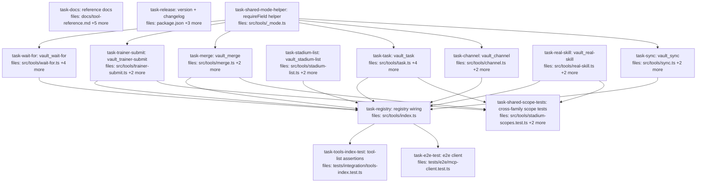

## Context

Implements lever #1 of `decision-2026-06-08-stoa-tool-surface-consolidate-families-first`
per the approved spec `docs/superpowers/specs/2026-06-14-tool-surface-family-consolidation-design.md`.
Collapse eight MCP tool name-families into `mode`-parametrized tools, reducing
the advertised `vault_*` surface from **55 → 43 (−12)**. One server, hard
rename + version bump, no deprecation shims.

**Decomposition shape.** Each family is a task that rewrites its consolidated
tool under `src/tools/` (and deletes the old sibling tool files); the six
multi-mode families gate on `task-shared-mode-helper`, while `stadium-list` and
`real-skill` are true roots. Behavior tests under `tests/` for a family are updated by that family's
implementer and named in prose (per the plan-format convention: `files:` lists
the impl subsystem; the test file is named in the body). Cross-family files are
isolated into convergence tasks:

- `task-shared-mode-helper` creates the shared `src/tools/_mode.ts` `requireField`
  guard first; the six multi-mode families depend on it (audit M4 — DRY).
- `task-registry` (wiring) rewrites `src/tools/index.ts` after all 8 families land.
- `task-shared-scope-tests` updates the co-located tests that import renamed
  exports from more than one family (`stadium-scopes.test.ts` → trainer-submit +
  real-skill; `creator-scopes.test.ts` → merge; `channel-write-through.test.ts` →
  merge + task, audit M3).
- `task-tools-index-test` / `task-e2e-test` update the tool-list assertions after
  the registry is final.
- `task-docs` and `task-release` are content-determined by the spec and run as
  parallel roots.

`read-tools-scope.test.ts` references no renamed tool and is intentionally out
of scope. Only the MCP **tool names** merge; underlying `core/` modules
(`core/eventbus/*`, `core/merge-queue.ts`, `core/merge-record.ts`, `StadiumClient`,
adapters) keep their names and logic, so each family rewrite is behavior-preserving.

**Structural conventions every family task follows.** The MCP SDK rejects
`z.discriminatedUnion`, so every consolidated tool uses a **flat** zod schema
(`mode`/`surface` enum + per-mode optional fields) and validates the
mode↔field combination at runtime, throwing a named error on mismatch. The
required-field guard is the **shared `requireField` helper** from
`src/tools/_mode.ts` (`task-shared-mode-helper`), not a per-file `req` — the
pseudocode below writes `req(...)` as shorthand for `requireField(input.x,
"vault_X mode=Y", "x")` (audit M4 — DRY). Existing domain errors
(`InvalidPicksShapeError`, `UnknownAgentError`, `TaskNotReadyError`) are preserved
per mode. `scope.axis` follows the established `(input: unknown) => string`
defensive-narrowing style (`wait-for.ts:20-31`); the concise `i?.field ?? "*"`
shorthand in the pseudocode is behavior-equivalent (it does NOT emit
`"…/undefined"`), but new files should match the defensive form (audit L1). Each
consolidated tool delegates to its existing `core/` helpers unchanged.

## Tasks

## Task: shared per-mode validation helper

```yaml
id: task-shared-mode-helper
depends_on: []
files:
  - src/tools/_mode.ts
status: pending
```

Create `src/tools/_mode.ts` exporting a single shared `requireField` guard so the
per-mode required-field check is NOT re-implemented in every consolidated tool
(audit M4 — DRY). The six multi-mode families (wait-for, trainer-submit, merge,
task, channel, sync) import it; `stadium-list` and `real-skill` have no per-mode
required fields and do not.

## Implementation

```typescript
// src/tools/_mode.ts
// Shared required-field guard for mode/surface-parametrized tools. `context`
// is the caller-supplied message prefix (e.g. "vault_wait-for mode=any"), so
// each tool keeps its exact error wording while reusing one implementation.
export function requireField<T>(value: T | null | undefined, context: string, field: string): T {
  if (value == null) throw new Error(`${context} requires '${field}'`);
  return value;
}
```

```typescript
// tests/unit/mode-helper.test.ts — failing until the helper lands
it("throws a named error when the field is absent", () => {
  expect(() => requireField(undefined, "vault_wait-for mode=any", "filters")).toThrow(/requires 'filters'/);
});
it("returns the value when present", () => {
  expect(requireField("x", "ctx", "f")).toBe("x");
});
```

## Acceptance criteria

- `src/tools/_mode.ts` exports `requireField(value, context, field)`; throws `Error(`${context} requires '${field}'`)` on null/undefined, returns the value otherwise.
- The six multi-mode consolidated tools import and use it instead of a per-file `req`.
- `tsc` clean.

Test file: `tests/unit/mode-helper.test.ts`.

## Task: consolidate wait-for family

```yaml
id: task-wait-for
depends_on: [task-shared-mode-helper]
files:
  - src/tools/wait-for.ts
  - src/tools/wait-for-any.ts
  - src/tools/wait-for-all.ts
  - src/tools/wait-for-many.ts
  - src/tools/wait-for-scopes.test.ts
status: pending
```

Rewrite `src/tools/wait-for.ts` into a single `mode`-parametrized tool and delete
the three sibling tool files. All four modes delegate to the existing
`handleWait(behavior, filters, since, timeout_ms, ctx)`.

## Implementation

```typescript
// src/tools/wait-for.ts
const Filter = z.object({ source: z.string(), wiki: z.string().optional(), channel: z.string().optional(), id: z.string().optional() });
const Input = z.object({
  mode: z.enum(["next", "any", "all", "many"]),
  filter: Filter.optional(),                       // next, many
  filters: z.array(Filter).min(1).max(32).optional(), // any, all
  max: z.number().int().positive().max(1000).optional(), // many
  since: z.string().optional(),
  timeout_ms: z.number().int().positive().max(120_000).default(25_000),
});

export const waitForTool = {
  name: "vault_wait-for",
  description: "Wait for events. mode: next (single filter) | any (first of filters[]) | all (fan-in) | many (bounded batch of `max`). ...",
  inputSchema: Input,
  scope, // axis derives from filter or filters[0], preferring channel then source, default "*"
  handler: async (input, ctx) => {
    const since = input.since ? Cursor.fromIso(input.since) : undefined;
    switch (input.mode) {
      case "next": req(input.filter, "filter"); return handleWait(singleBehavior, [input.filter], since, input.timeout_ms, ctx);
      case "any":  req(input.filters, "filters"); return handleWait(anyBehavior, input.filters, since, input.timeout_ms, ctx);
      case "all":  req(input.filters, "filters"); return handleWait(allBehavior, input.filters, since, input.timeout_ms, ctx);
      case "many": req(input.filter, "filter"); req(input.max, "max"); return handleWait(makeManyBehavior(input.max), [input.filter], since, input.timeout_ms, ctx);
    }
  },
};
// req(v, name) === requireField(v, `vault_wait-for mode=${mode}`, name) from ./\_mode.js (shared; audit M4)
```

```typescript
// tests/integration/wait-for.test.ts — failing until consolidation lands
it("mode=any waits for first of filters[]", async () => {
  const r = await callTool("vault_wait-for", { mode: "any", filters: [{ source: "task" }], timeout_ms: 50 });
  expect(r).toHaveProperty("cursor");
});
it("mode=any without filters throws a named error", async () => {
  await expect(callTool("vault_wait-for", { mode: "any", timeout_ms: 50 })).rejects.toThrow(/requires 'filters'/);
});
```

## Acceptance criteria

- `vault_wait-for` with `mode: next|any|all|many` reproduces the behavior of the four former tools (delegates to `singleBehavior`/`anyBehavior`/`allBehavior`/`makeManyBehavior(max)` respectively).
- `mode: any|all` without `filters` → error matching `/requires 'filters'/`; `mode: next|many` without `filter` → `/requires 'filter'/`; `mode: many` without `max` → `/requires 'max'/`.
- `vault_wait-for-any`, `vault_wait-for-all`, `vault_wait-for-many` no longer exist as files under `src/tools/`.
- `wait-for-scopes.test.ts` updated to assert scope on the single `vault_wait-for` tool across modes; suite green.

Test file: `tests/integration/wait-for.test.ts` (+ `tests/integration/wait-for-handler.test.ts`, `src/tools/wait-for-scopes.test.ts`).

## Task: consolidate trainer-submit family

```yaml
id: task-trainer-submit
depends_on: [task-shared-mode-helper]
files:
  - src/tools/trainer-submit.ts
  - src/tools/trainer-submit-draft.ts
  - src/tools/trainer-submit-move.ts
status: pending
```

Create `src/tools/trainer-submit.ts` with `mode: draft|move`; delete the two
sibling tool files. Preserve `InvalidPicksShapeError` on draft, the per-mode
`StadiumClient` call, and the `caller_trainer_id` echo.

**Audit H3:** the shared `match_id: z.string().min(1)` below is correct only as
the *outer* schema — draft mode currently enforces `match_id` as a **ULID**
(`z.string().regex(/^[0-9A-Z]{26}$/)`, `trainer-submit-draft.ts:19`), and an
invalid `match_id` on draft is wrapped as `INVALID_PICKS_SHAPE` because the whole
`trainerSubmitDraftInput` parse is wrapped (`trainer-submit-draft.ts:34-46`). A
ULID `.regex` cannot live on the shared field (it would break `move`, which only
needs `min(1)`). So the draft branch must **re-parse against the original
`trainerSubmitDraftInput` schema** (or re-validate `match_id` + `picks` and wrap
`ZodError` as `InvalidPicksShapeError`) to preserve both the validation and the
error-wrapping behavior.

## Implementation

```typescript
// src/tools/trainer-submit.ts
const Input = z.object({
  mode: z.enum(["draft", "move"]),
  match_id: z.string().min(1),
  picks: z.array(z.string().regex(/^[0-9A-Z]{26}$/)).length(6).optional(), // draft
  turn: z.number().int().nonnegative().optional(),   // move
  move_id: z.string().min(1).optional(),             // move
  target: z.string().optional(),                     // move
});
export const trainerSubmitTool = {
  name: "vault_trainer-submit",
  description: "Submit during a match. mode: draft (6 picks) | move (turn+move_id[+target]).",
  inputSchema: Input,
  scope: { axis: (i) => `matches/${i?.match_id ?? "*"}` },
  handler: async (input) => {
    const ctx = resolveTrainerContext({});
    const client = new StadiumClient(resolveStadiumConfig());
    if (input.mode === "draft") { /* validate picks → InvalidPicksShapeError; client.submitDraft */ }
    else { /* require turn+move_id; client.submitMove */ }
    return { ...result, caller_trainer_id: ctx.trainerId };
  },
};
```

```typescript
// tests/unit/trainer-submit-draft.test.ts — failing until consolidation lands
it("mode=draft with non-6 picks throws INVALID_PICKS_SHAPE", async () => {
  await expect(trainerSubmitTool.handler({ mode: "draft", match_id: M, picks: ["A"] }, ctx))
    .rejects.toMatchObject({ code: "INVALID_PICKS_SHAPE" });
});
```

## Acceptance criteria

- `vault_trainer-submit { mode: "draft", match_id, picks[6] }` calls `StadiumClient.submitDraft` and echoes `caller_trainer_id`; bad `picks` shape **or non-ULID `match_id`** → `InvalidPicksShapeError` / `INVALID_PICKS_SHAPE` (draft re-validates against `trainerSubmitDraftInput`).
- `vault_trainer-submit { mode: "move", match_id, turn, move_id, target? }` calls `StadiumClient.submitMove` and echoes `caller_trainer_id`.
- `scope.axis` resolves `matches/${match_id}` for both modes.
- `trainer-submit-draft.ts` and `trainer-submit-move.ts` no longer exist.

Test file: `tests/unit/trainer-submit-draft.test.ts` (+ `tests/unit/trainer-submit-move.test.ts`, `tests/integration/draft-submit-happy-path.test.ts`).

## Task: consolidate merge family

```yaml
id: task-merge
depends_on: [task-shared-mode-helper]
files:
  - src/tools/merge.ts
  - src/tools/merge-queue.ts
  - src/tools/merge-record.ts
status: pending
```

Create `src/tools/merge.ts` with `mode: queue|record`; delete the two sibling
**tool** files (the `core/merge-queue.ts` / `core/merge-record.ts` modules stay).
`queue` is a pure read; `record` writes a journal + conditional task transition.

**Audit M3:** `merge-record.ts` exports the test seam `__setNowFnForTests`
(`merge-record.ts:73`). The consolidated `merge.ts` MUST re-export it (and
`mergeTool`). Two test files import it from `../../src/tools/merge-record.js` and
break on deletion: `tests/integration/merge-record.test.ts` (merge family — listed
below) **and `tests/integration/channel-write-through.test.ts`** — the latter is a
**cross-family** caller. It imports `mergeRecordTool` + `__setNowFnForTests` (merge)
**and** `taskCreateTool` + `taskUpdateTool` (task family — `task-create.js` /
`task-update.js`); it uses `core/channel.js` directly, so it does *not* depend on
`task-channel`. Because it spans two renamed families, it is owned by
`task-shared-scope-tests` (the cross-family-test convergence node), not by
`task-merge` or `task-task` — see that task.

## Implementation

```typescript
// src/tools/merge.ts
const Input = z.object({
  mode: z.enum(["queue", "record"]),
  channel: z.string(),                  // shared
  wiki: z.string().optional(), family: z.string().optional(), since: z.string().optional(), // queue
  pr_number: z.number().int().optional(), agent_id: z.string().optional(),                  // record
  status: z.enum(["merged","failed","halted-conflict","halted-red-ci"]).optional(),
  merge_commit_sha: z.string().optional(), notes: z.string().optional(), task_id: z.string().optional(),
});
export const mergeTool = {
  name: "vault_merge",
  description: "mode: queue (READ — surface the merge queue for a channel) | record (WRITE — journal a merge outcome + transition task on merged). Two distinct operations.",
  inputSchema: Input,
  scope: { axis: (i) => `wikis/${i?.wiki ?? "*"}` },
  handler: async (input, ctx) => {
    if (input.mode === "queue") return runMergeQueue(input, ctx);   // existing merge-queue body
    req(input.pr_number, "pr_number"); req(input.agent_id, "agent_id"); req(input.status, "status");
    return runMergeRecord(input, ctx);                              // existing merge-record body (UnknownAgentError preserved)
  },
};
```

```typescript
// tests/integration/merge-queue.test.ts — failing until consolidation lands
it("mode=queue returns the topo-sorted queue", async () => {
  const r = await callTool("vault_merge", { mode: "queue", channel: "build" });
  expect(r).toHaveProperty("ready_prs");
});
it("mode=record without pr_number throws a named error", async () => {
  await expect(callTool("vault_merge", { mode: "record", channel: "build" })).rejects.toThrow(/requires 'pr_number'/);
});
```

## Acceptance criteria

- `vault_merge { mode: "queue", channel, wiki?, family?, since? }` returns the same output as former `vault_merge-queue` (family resolution, disk-fallback journals, `buildMergeQueue`).
- `vault_merge { mode: "record", pr_number, channel, agent_id, status, ... }` writes the journal + conditional task transition as former `vault_merge-record`; unknown `agent_id` → `UnknownAgentError`, no journal.
- `mode: record` missing any of `pr_number`/`agent_id`/`status` → named error.
- `src/tools/merge-queue.ts` and `src/tools/merge-record.ts` deleted; `core/merge-queue.ts` and `core/merge-record.ts` untouched.

Test file: `tests/integration/merge-queue.test.ts` (+ `tests/integration/merge-record.test.ts`, `tests/unit/merge-queue.test.ts`, `tests/unit/merge-record.test.ts`).

## Task: consolidate stadium list family

```yaml
id: task-stadium-list
depends_on: []
files:
  - src/tools/stadium-list.ts
  - src/tools/list-invites.ts
  - src/tools/list-platform-profiles.ts
status: pending
```

Create `src/tools/stadium-list.ts` with `mode: invites|platform-profiles`; delete
the two sibling tool files. Within-cluster only — `list-wikis` and `list-claims`
stay standalone (cross-cluster, no in-cluster sibling).

## Implementation

```typescript
// src/tools/stadium-list.ts
const Input = z.object({
  mode: z.enum(["invites", "platform-profiles"]),
  wiki: z.string().optional(),
  // M1: platform-profiles carries an owner_trainer_id ULID filter
  // (list-platform-profiles.ts:35-38) — do NOT drop it.
  owner_trainer_id: z.string().regex(/^[0-9A-Z]{26}$/).optional(),
});
// M2: the two source scopes differ — list-invites is unconditional "wikis/*"
// (list-invites.ts:8-10); list-platform-profiles is wiki-aware
// (list-platform-profiles.ts:181). Use the wiki-aware axis for both (invites
// simply never sets `wiki`, so it resolves "wikis/*" anyway).
const scope: ToolScope = { axis: (i: unknown) =>
  (i != null && typeof i === "object" && typeof (i as any).wiki === "string") ? `wikis/${(i as any).wiki}` : "wikis/*" };
export const stadiumListTool = {
  name: "vault_stadium-list",
  description: "List Stadium resources. mode: invites (pending match invites) | platform-profiles (registered draft-pool profiles).",
  inputSchema: Input,
  scope,
  handler: async (input, ctx) =>
    input.mode === "invites" ? runListInvites(input, ctx) : runListPlatformProfiles(input, ctx),
};
```

```typescript
// tests/unit/list-platform-profiles.test.ts — failing until consolidation lands
it("mode=platform-profiles lists registered profiles", async () => {
  const r = await stadiumListTool.handler({ mode: "platform-profiles", wiki: "w" }, ctx);
  expect(Array.isArray(r.profiles ?? r)).toBe(true);
});
```

## Acceptance criteria

- `vault_stadium-list { mode: "invites" }` reproduces former `vault_list-invites`.
- `vault_stadium-list { mode: "platform-profiles", owner_trainer_id? }` reproduces former `vault_list-platform-profiles`, **including the `owner_trainer_id` ULID filter (M1)**.
- **M2:** `scope.axis` is wiki-aware for both modes (`wikis/${wiki}` when set, else `wikis/*`).
- `list-invites.ts` and `list-platform-profiles.ts` deleted; `list-wikis` / `list-claims` tools unchanged.

Test file: `tests/unit/list-platform-profiles.test.ts` (+ `tests/unit/list-invites.test.ts`).

## Task: consolidate task family

```yaml
id: task-task
depends_on: [task-shared-mode-helper]
files:
  - src/tools/task.ts
  - src/tools/task-create.ts
  - src/tools/task-list.ts
  - src/tools/task-update.ts
  - src/tools/task-claim.ts
status: pending
```

Create `src/tools/task.ts` with `mode: create|list|update|claim`; delete the four
sibling tool files. The one structural wrinkle: a **mode-aware `scope.axis`** —
`create`/`list` resolve `wikis/...`, `update`/`claim` resolve `tasks/...`.
`agent_id` is stamped from `ctx.principal` for update/claim (never a tool arg).

## Implementation

```typescript
// src/tools/task.ts
const Input = z.object({
  mode: z.enum(["create", "list", "update", "claim"]),
  // create
  title: z.string().optional(), description: z.string().optional(), segregation: z.array(z.string()).optional(),
  blocking: z.array(z.string()).optional(), channel: z.string().optional(),
  required_pokemon_type: z.string().optional(), estimate_minutes: z.number().int().nonnegative().optional(),
  // list
  status: z.enum(["pending","claimed","in_progress","completed","failed","blocked"]).optional(),
  claimed_by: z.string().optional(), pokemon_type: z.string().optional(), limit: z.number().int().positive().default(50),
  // update / claim
  task_id: z.string().optional(), expected_updated: z.string().optional(), notes: z.string().optional(), force: z.boolean().optional(),
  wiki: z.string().optional(),
});
const scope = { axis: (i) =>
  (i?.mode === "update" || i?.mode === "claim") ? `tasks/${i?.task_id ?? "*"}` : `wikis/${i?.wiki ?? "*"}` };
export const taskTool = {
  name: "vault_task",
  description: "Task queue ops. mode: create | list | update | claim. update/claim use mtime OCC; agent_id is server-stamped.",
  inputSchema: Input, scope,
  handler: async (input, ctx) => { switch (input.mode) { /* create→createTask+upsertPage; list→listTasks (alias-aware claimed_by); update→updateTask; claim→claimTask (TaskNotReadyError→TASK_NOT_READY) */ } },
};
```

```typescript
// tests/integration/tasks.test.ts — failing until consolidation lands
it("mode=create then mode=list surfaces the task", async () => {
  await callTool("vault_task", { mode: "create", title: "t", wiki: "w" });
  const r = await callTool("vault_task", { mode: "list", wiki: "w" });
  expect(r.tasks.some(t => t.title === "t")).toBe(true);
});
it("scope.axis is mode-aware", () => {
  expect(taskTool.scope.axis({ mode: "claim", task_id: "x" })).toBe("tasks/x");
  expect(taskTool.scope.axis({ mode: "create", wiki: "w" })).toBe("wikis/w");
});
```

## Acceptance criteria

- `vault_task { mode: "create" }` requires `title` + `wiki`, delegates to `createTask` + `upsertPage`.
- `vault_task { mode: "list" }` reproduces `vault_task-list` including alias-aware `claimed_by` expansion.
- `vault_task { mode: "update" }` requires `task_id`/`wiki`/`expected_updated`, mtime OCC, `agent_id` from principal.
- `vault_task { mode: "claim" }` preserves `TaskNotReadyError` → `TASK_NOT_READY` mapping; `agent_id` from principal.
- `scope.axis` returns `tasks/${task_id}` for update/claim and `wikis/${wiki}` for create/list.
- `task-create.ts`, `task-list.ts`, `task-update.ts`, `task-claim.ts` deleted.

Test file: `tests/integration/tasks.test.ts`.

## Task: consolidate channel family

```yaml
id: task-channel
depends_on: [task-shared-mode-helper]
files:
  - src/tools/channel.ts
  - src/tools/channel-post.ts
  - src/tools/channel-tail.ts
status: pending
```

Create `src/tools/channel.ts` with `mode: post|tail`; delete the two sibling tool
files. Both modes share `scope.axis = channels/${channel}`.

## Implementation

```typescript
// src/tools/channel.ts
const Input = z.object({
  mode: z.enum(["post", "tail"]),
  channel: z.string().regex(/^[a-z0-9]+(-[a-z0-9]+)*$/),
  content: z.string().min(1).optional(),  // post
  session_id: z.string().optional(),      // post
  since: z.string().optional(),           // tail
  limit: z.number().int().positive().default(50), // tail
  wiki: z.string().optional(),
});
export const channelTool = {
  name: "vault_channel",
  description: "Coordination channel. mode: post (write a channel journal entry) | tail (read recent entries since a cursor).",
  inputSchema: Input,
  scope: { axis: (i) => `channels/${i?.channel ?? "*"}` },
  handler: async (input, ctx) => {
    if (input.mode === "post") { req(input.content, "content"); return postToChannel(ctx.vaultPath, { ...input, wiki: resolveWiki(input.wiki, ctx.defaultWiki, ctx.vaultPath), agent_id: ctx.principal?.agent_id ?? "stoa-local" }); }
    return tailChannel(ctx.vaultPath, input);
  },
};
```

```typescript
// tests/integration/channel.test.ts — failing until consolidation lands
it("mode=post then mode=tail round-trips", async () => {
  await callTool("vault_channel", { mode: "post", channel: "c", content: "hi" });
  const r = await callTool("vault_channel", { mode: "tail", channel: "c" });
  expect(r.entries.some(e => e.body.includes("hi"))).toBe(true);
});
```

## Acceptance criteria

- `vault_channel { mode: "post", channel, content }` writes a channel journal entry with `agent_id` from principal (delegates to `postToChannel`); missing `content` → named error.
- `vault_channel { mode: "tail", channel, since?, limit? }` reproduces `vault_channel-tail`.
- `scope.axis` resolves `channels/${channel}` for both modes.
- `channel-post.ts` and `channel-tail.ts` deleted.

Test file: `tests/integration/channel.test.ts` (+ `tests/integration/channel-tail-alias.test.ts`).

## Task: consolidate real-skill family

```yaml
id: task-real-skill
depends_on: []
files:
  - src/tools/real-skill.ts
  - src/tools/real-skill-register.ts
  - src/tools/real-skill-refresh.ts
status: pending
```

Create `src/tools/real-skill.ts` with `mode: register|refresh`; delete the two
sibling tool files. The two source tools have identical input schemas and scope —
the cleanest merge of the set.

## Implementation

```typescript
// src/tools/real-skill.ts
const Input = z.object({
  mode: z.enum(["register", "refresh"]),
  skill_id: z.string().regex(/^move-/),
  wiki: z.string().optional(),
});
export const realSkillTool = {
  name: "vault_real-skill",
  description: "Stadium real-skill from a move-*/SKILL.md. mode: register (first registration, persists real_skill_id + advisory combat) | refresh (re-derive modifier from current SKILL.md).",
  inputSchema: Input,
  scope: { axis: () => "stadium", adminOnly: () => true },
  handler: async (input, ctx) =>
    input.mode === "register" ? runRegister(input, ctx) : runRefresh(input, ctx), // runRefresh throws "register first" when no real_skill_id
};
```

```typescript
// tests/unit/real-skill.test.ts — failing until consolidation lands
it("mode=refresh without prior real_skill_id throws register-first", async () => {
  await expect(realSkillTool.handler({ mode: "refresh", skill_id: "move-x", wiki: "w" }, ctx))
    .rejects.toThrow(/register first/);
});
```

## Acceptance criteria

- `vault_real-skill { mode: "register", skill_id }` reproduces former `vault_real-skill-register` (reads SKILL.md, `StadiumClient.registerRealSkill`, persists `real_skill_id` + advisory `combat`).
- `vault_real-skill { mode: "refresh", skill_id }` reproduces former `vault_real-skill-refresh`; missing `real_skill_id` → "register first" error.
- Scope `{ axis: "stadium", adminOnly }` preserved.
- `real-skill-register.ts` and `real-skill-refresh.ts` deleted.

Test file: `tests/unit/real-skill.test.ts`.

## Task: consolidate sync family

```yaml
id: task-sync
depends_on: [task-shared-mode-helper]
files:
  - src/tools/sync.ts
  - src/tools/sync-skills.ts
  - src/tools/sync-agents.ts
status: pending
```

Create `src/tools/sync.ts` with a **`surface: skills|agents`** discriminator —
NOT `mode`, because both source tools already carry a `mode: copy|symlink` field.
Heaviest of the eight. **Audit fixes C1/H1/H2 (spec §5.4): `target` is overloaded
across the two source tools** — in `sync-skills` it is the format enum
(`claude-code|openclaw|codex`) while the path is `repo_path`; in `sync-agents` it
is the path while the format is `runtime`. Normalize to the non-colliding names:
**path → `repo_path`, format → `runtime`**. `mode` keeps NO top-level default and
the refines are surface-conditional (they differ between the two tools).

## Implementation

```typescript
// src/tools/sync.ts
const Input = z.object({
  surface: z.enum(["skills", "agents"]),
  repo_path: z.string(),                                          // shared (was skills.repo_path / agents.target)
  runtime: z.enum(["claude-code", "openclaw", "codex"]).default("claude-code"), // shared (was skills.target / agents.runtime)
  mode: z.enum(["copy", "symlink"]),                              // NO default — surface default applied in handler (skills→symlink, agents→copy)
  pokemon: z.union([z.string(), z.array(z.string())]).optional(),
  all: z.boolean().default(false), exclude: z.array(z.string()).default([]), pokemon_type: z.array(z.string()).default([]),
  continue_on_error: z.boolean().default(false), wiki: z.string().optional(),
  reverify: z.boolean().default(false), fix: z.boolean().default(false),       // skills-only
  overwrite: z.boolean().default(true), include_moveset: z.boolean().default(true), // agents-only
});
// NO top-level .refine() — skills has 2 refines, agents has 3 and they differ;
// enforce each surface's refines + the mode default inside the handler.
export const syncTool = {
  name: "vault_sync",
  description: "Deploy a Pokemon's artifacts to a repo. surface: skills (moveset → local skills dir; reverify/fix drift) | agents (subagent defs via runtime adapter). repo_path = target dir; runtime = output format; `mode` stays copy|symlink.",
  inputSchema: Input,
  scope: { axis: () => "*", httpForbidden: true },
  handler: async (input, ctx) => {
    const mode = input.mode ?? (input.surface === "skills" ? "symlink" : "copy"); // H1: surface-dependent default
    if (input.surface === "skills") {
      // H2: skills refines — pokemon⊕all; deploy (reverify=false) requires pokemon|all
      return runSyncSkills({ ...input, repo_path: input.repo_path, target: input.runtime, mode }, ctx);
    }
    // agents: runtime must be a registered adapter (only claude-code today)
    if (input.runtime !== "claude-code") throw new Error(`vault_sync surface=agents supports runtime 'claude-code' only`);
    // H2: agents refines — pokemon⊕all; pokemon|all required; exclude/pokemon_type only with all
    return runSyncAgents({ ...input, target: input.repo_path, runtime: input.runtime, mode }, ctx);
  },
};
```

```typescript
// tests/integration/skills-sync.test.ts — failing until consolidation lands
it("surface=skills deploys a moveset", async () => {
  const r = await syncTool.handler({ surface: "skills", repo_path: repo, pokemon: "profile-x" }, ctx);
  expect(r).toHaveProperty("skills_dir");
});
it("surface=skills preserves the three-value runtime/format enum", () => {
  expect(() => Input.parse({ surface: "skills", repo_path: "/r", pokemon: "p", runtime: "openclaw" })).not.toThrow();
});
it("surface=agents rejects a non-claude-code runtime with a named error", async () => {
  await expect(syncTool.handler({ surface: "agents", repo_path: repo, pokemon: "p", runtime: "openclaw" }, ctx))
    .rejects.toThrow(/runtime 'claude-code' only/);
});
it("mode default is surface-dependent (skills symlink, agents copy)", () => {
  // omitted mode → skills resolves symlink, agents resolves copy (asserted via handler behavior/spy)
});
```

## Acceptance criteria

- `vault_sync { surface: "skills", ... }` reproduces former `vault_sync-skills` (deploy / `reverify` / `fix` / `all` paths), including its two refines.
- `vault_sync { surface: "agents", ... }` reproduces former `vault_sync-agents` (adapter deploy + optional moveset), including its three refines.
- **C1:** `repo_path` is the filesystem path on both surfaces; `runtime` is the output-format enum (`claude-code|openclaw|codex`) — skills accepts all three, agents rejects non-`claude-code` with a named error. No field-name collision; skills' three-value format enum is preserved.
- **H1:** `mode` has no schema default; the handler resolves `symlink` for skills and `copy` for agents when omitted.
- **H2:** the surface-specific refines are enforced (in-handler or via surface-scoped refine helpers), throwing the source tools' messages verbatim.
- `sync-skills.ts` and `sync-agents.ts` deleted; `core/skills.ts`, `core/subagent-intent.ts`, adapters untouched.

Test file: `tests/integration/skills-sync.test.ts`.

## Task: rewire tool registry

```yaml
id: task-registry
depends_on: [task-wait-for, task-trainer-submit, task-merge, task-stadium-list, task-task, task-channel, task-real-skill, task-sync]
files:
  - src/tools/index.ts
status: pending
is_wiring_task: true
```

Rewrite `src/tools/index.ts` to import the eight consolidated tools
(`waitForTool`, `trainerSubmitTool`, `mergeTool`, `stadiumListTool`, `taskTool`,
`channelTool`, `realSkillTool`, `syncTool`) and drop every deleted sibling import.
The `allTools` array and its comments are updated so the advertised surface is 43.

## Acceptance criteria

- `allTools` imports resolve (no reference to any deleted tool module); `tsc` clean.
- `allTools.map(t => t.name)` contains `vault_wait-for`, `vault_trainer-submit`, `vault_merge`, `vault_stadium-list`, `vault_task`, `vault_channel`, `vault_real-skill`, `vault_sync` and none of the 18 old names.
- `allTools.length === 43`.

Test file: `tests/integration/tools-index.test.ts` (assertions authored in `task-tools-index-test`).

## Task: update cross-family scope tests

```yaml
id: task-shared-scope-tests
depends_on: [task-trainer-submit, task-real-skill, task-merge, task-task]
files:
  - src/tools/stadium-scopes.test.ts
  - src/tools/creator-scopes.test.ts
  - tests/integration/channel-write-through.test.ts
status: pending
```

Update the co-located tests that import renamed exports from more than one family:
`stadium-scopes.test.ts` (was `trainerSubmitDraftTool`/`MoveTool` +
`realSkillRegisterTool`/`RefreshTool`), `creator-scopes.test.ts` (was
`mergeRecordTool` / `vault_merge-record`), and **`channel-write-through.test.ts`
(audit M3 — imports `mergeRecordTool`+`__setNowFnForTests` from the merge family
and `taskCreateTool`+`taskUpdateTool` from the task family).** The added
`task-task` dependency is required for that third file. Migrate each import to the
consolidated module + export (`mergeTool`, `taskTool`) and the `mode`/`surface`
call shape.

## Implementation

```typescript
// src/tools/stadium-scopes.test.ts — updated table entries
const cases = [
  { name: "vault_real-skill", tool: realSkillTool },
  { name: "vault_trainer-submit", tool: trainerSubmitTool },
];
```

```typescript
// failing assertion until imports are updated
it("vault_merge record path is admin/creator scoped", () => {
  expect(mergeTool.name).toBe("vault_merge");
  expect(mergeTool.scope.axis({ mode: "record", wiki: "w" })).toBe("wikis/w");
});
```

## Acceptance criteria

- `stadium-scopes.test.ts` references `realSkillTool` and `trainerSubmitTool` (single consolidated exports) and asserts scope across their modes; no reference to the four deleted exports.
- `creator-scopes.test.ts` references `mergeTool` / `vault_merge`; no reference to `vault_merge-record`.
- `channel-write-through.test.ts` imports `mergeTool` (with `__setNowFnForTests`) and `taskTool` from the consolidated modules; no reference to `merge-record.js`, `task-create.js`, or `task-update.js`.
- All three suites green.

Test file: `src/tools/stadium-scopes.test.ts` (+ `src/tools/creator-scopes.test.ts`, `tests/integration/channel-write-through.test.ts`).

## Task: update tool-list assertions

```yaml
id: task-tools-index-test
depends_on: [task-registry]
files:
  - tests/integration/tools-index.test.ts
status: pending
```

Replace the four `vault_wait-for-*` name assertions (and any other old-name
assertions) with assertions on the consolidated names plus absence of the old
names, and assert `allTools.length === 43`.

## Implementation

```typescript
// tests/integration/tools-index.test.ts
const names = allTools.map(t => t.name);
for (const n of ["vault_wait-for","vault_trainer-submit","vault_merge","vault_stadium-list","vault_task","vault_channel","vault_real-skill","vault_sync"])
  it(`registers ${n}`, () => expect(names).toContain(n));
```

```typescript
const OLD = ["vault_wait-for-any","vault_wait-for-all","vault_wait-for-many","vault_trainer-submit-draft","vault_trainer-submit-move","vault_merge-queue","vault_merge-record","vault_list-invites","vault_list-platform-profiles","vault_task-create","vault_task-list","vault_task-update","vault_task-claim","vault_channel-post","vault_channel-tail","vault_real-skill-register","vault_real-skill-refresh","vault_sync-skills","vault_sync-agents"];
it("retires all old names", () => OLD.forEach(n => expect(names).not.toContain(n)));
it("advertises 43 tools", () => expect(allTools.length).toBe(43));
```

## Acceptance criteria

- The 8 consolidated names are asserted present; all 19 old names asserted absent.
- `allTools.length === 43` asserted.
- Suite green against the post-`task-registry` tool list.

Test file: `tests/integration/tools-index.test.ts`.

## Task: update e2e client test

```yaml
id: task-e2e-test
depends_on: [task-registry]
files:
  - tests/e2e/mcp-client.test.ts
status: pending
```

Update the end-to-end MCP client test to call the consolidated tool names (with
`mode`/`surface` args) wherever it previously called a now-deleted name.

## Implementation

```typescript
// tests/e2e/mcp-client.test.ts — updated call sites
const tools = await client.listTools();
expect(tools.map(t => t.name)).toContain("vault_wait-for");
```

```typescript
// failing until call sites are migrated
const res = await client.callTool({ name: "vault_channel", arguments: { mode: "tail", channel: "c" } });
expect(res).toBeDefined();
```

## Acceptance criteria

- The e2e suite lists tools and invokes at least one consolidated tool by its new name + `mode`/`surface`.
- No call site references a deleted tool name.
- Suite green against the live stdio server.

Test file: `tests/e2e/mcp-client.test.ts`.

## Task: update reference docs

```yaml
id: task-docs
depends_on: []
files:
  - docs/tool-reference.md
  - docs/wait-for.md
  - docs/claims.md
  - docs/task-coordination.md
  - docs/training-program.md
  - docs/quickstart.md
status: pending
```

Rewrite the docs that reference any of the 19 retired tool names to document the
consolidated tools and their `mode`/`surface` parameters. Names are fully
determined by the approved spec, so this runs as a parallel root.

## Implementation

```markdown
<!-- docs/tool-reference.md — consolidated entry shape -->
### vault_wait-for
`mode: next | any | all | many`. Replaces the former vault_wait-for-any / -all / -many.
- next: single `filter`. any/all: `filters[]`. many: `filter` + `max`.
```

```bash
# Acceptance probe — currently fails (old names present), passes after rewrite.
! grep -rEn 'vault_(wait-for-(any|all|many)|trainer-submit-(draft|move)|merge-(queue|record)|list-(invites|platform-profiles)|task-(create|list|update|claim)|channel-(post|tail)|real-skill-(register|refresh)|sync-(skills|agents))' docs/tool-reference.md docs/wait-for.md docs/claims.md docs/task-coordination.md docs/training-program.md docs/quickstart.md
```

## Acceptance criteria

- Each listed doc documents the consolidated tool(s) with the correct discriminator (`mode`, or `surface` for sync) and per-mode fields.
- The grep probe above returns no matches across the six docs.

Test file: manual grep probe in the Implementation block (no automated test file for prose docs).

## Task: wire breaking-release metadata

```yaml
id: task-release
depends_on: []
files:
  - package.json
  - CHANGELOG.md
  - README.md
  - src/transport/stdio.ts
status: pending
is_wiring_task: true
```

Wire the breaking release across the manifest, changelog, README, and the
hardcoded server-version string. Bump the minor version (`0.1.0 → 0.2.0`),
add a **BREAKING** CHANGELOG entry enumerating the 8 consolidations, update the
`version:` string in `stdio.ts`, and rewrite README tool-name mentions.

## Acceptance criteria

- `package.json` version bumped one minor; `stdio.ts` server `version` string matches.
- `CHANGELOG.md` has a BREAKING entry listing all 8 family consolidations and the 19→8 name change.
- `README.md` contains no retired tool name (grep clean) and references the consolidated names.

Test file: manual grep over README.md + version-string check (no automated test file).
