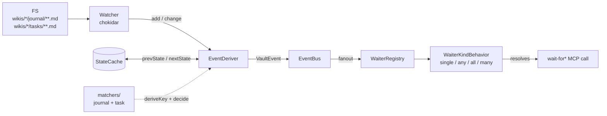

# wait-for: push primitives

Cross-process event coordination over the local filesystem. Four MCP tools — `vault.wait-for`, `vault.wait-for-any`, `vault.wait-for-all`, `vault.wait-for-many` — let an agent register a single bounded wait that resolves on the next matching journal or task event, instead of polling `vault.channel-tail` on a timer.

This doc is for developers integrating with `@stoa-mcp/cli` who need cross-process push coordination. It assumes you already have stoa installed and an MCP client attached.

## What it is

One chokidar watcher per `vault-mcp` process tails `wikis/*/journal/**.md` and `wikis/*/tasks/**.md`. When a file lands or changes, an `EventDeriver` parses frontmatter, classifies the event, and emits a `VaultEvent` onto an in-process `EventBus`. A `WaiterRegistry` routes bus events to any registered waiters whose filter matches; on match, the waiter's `WaiterKindBehavior` decides whether the wait is satisfied and, if so, resolves the MCP call.

Cursors give you atomic catch-up. Pass the cursor returned by the previous call as `since:` and the handler scans the FS for events with `mtime > since` *before* registering for live events — so events that fired between calls are not lost. The handler subscribes to the bus *before* it scans, dedups by `(source, wiki, id, mtime)`, and feeds the merged set into the kind behavior. You don't need to care about any of that, but it's why correctness holds across catch-up + live boundaries.

The watcher is lazy: it boots on the first `wait-for*` call in the process (`stoa/src/transport/stdio.ts:74` constructs the bundle; `stoa/src/core/eventbus/handle-wait.ts:24` calls `watcher.start()`). Most tool calls (`vault.recall`, `vault.read`, etc.) never trigger it.



## When to use

The five flows v1.7.1 was built to collapse (`wikis/_meta/ideas/idea-vault-push-notifications.md:121`):

- **Stadium duel turn-loop.** Polling cost: M `channel-tail` calls per duel, each a tool call + response in context. `wait-for(filter: {source: "journal", channel: "duel-abc"})` collapses M rounds to one bounded call per turn. Token cost goes down, not up.
- **Subagent fan-in.** Polling cost: orchestrator wakes every interval to check 5 subagent channels. `wait-for-all(filters: [...])` registers once and resolves only when the last filter is satisfied. No inter-poll noise.
- **Cross-runtime hand-off.** Polling cost: openclaw daemon burns tokens on a heartbeat to detect new work. With `wait-for-any(filters: [{source: "journal"}, {source: "task"}])` the daemon spends zero tokens while idle and wakes on any vault activity.
- **Conditional dispatch via service surface.** Polling cost: an always-running watcher process. With `wait-for*`, a wrapper script blocks on a wait, dispatches a fresh agent on event match, and exits. Long-running watchers become economically viable.
- **Synthesis auto-trigger.** Polling cost: never actually automatic — runs only when the user invokes `/synthesize`. With `wait-for(filter: {source: "journal", wiki: "X"})` a synthesizer agent can wake when a third hard-knowledge page sharing tags lands.

The non-obvious win: push makes deploy-and-walk-away multi-day async coordination practical.

## When NOT to use

- **Cross-host coordination.** v1.7.1 is same-host only. The watcher tails the local FS; there is no broker, no relay, no remote subscription. Cross-host push is Phase 2 (deferred to v1.8). If your "other side" is on a different machine, `wait-for*` cannot see its writes.
- **Deletes.** `change_kind` is `"add" | "change" | "internal"` (`stoa/src/core/eventbus/types.ts:6`). Deletes are not in the v1.7.1 union — no initial source emits them. If your flow depends on observing a file deletion, this isn't the tool.
- **Body-content matching.** The filter shape is `{source, wiki?, channel?, id?}` (`stoa/src/core/eventbus/types.ts:13`). There is no `body_contains`, no regex, no frontmatter-field predicate beyond `channel`. Wake on the event, then read the page and match the body yourself.

## The four tools

Every tool returns a `WaitResult` with a fresh `cursor` and a `timed_out` boolean. Default `timeout_ms` is `25_000`; max is `120_000` (`stoa/src/tools/wait-for.ts:16`). For longer waits, loop with the returned cursor.

### `vault.wait-for` — single event

`stoa/src/tools/wait-for.ts:19`

```typescript
{
  filter: Filter,
  since?: string,           // opaque cursor or ISO timestamp
  timeout_ms?: number,      // default 25000, max 120000
} → {
  event?: VaultEvent,
  cursor: string,
  timed_out: boolean,
}
```

Resolves on the first matching event. If catch-up returns a hit (the file already exists with `mtime > since`), it returns immediately without registering a live waiter.

```typescript
// Block until a journal lands on channel "push-test".
const result = await callTool("vault.wait-for", {
  filter: { source: "journal", channel: "push-test" },
  timeout_ms: 5000,
});
// result.event.source === "journal"
// result.event.channel === "push-test"
```
(`stoa/tests/integration/wait-for.test.ts:176`)

### `vault.wait-for-any` — first of N

`stoa/src/tools/wait-for-any.ts:19`

```typescript
{
  filters: Filter[],        // 1–32 filters
  since?: string,
  timeout_ms?: number,
} → {
  event?: VaultEvent,
  matched_filter_index?: number,
  cursor: string,
  timed_out: boolean,
}
```

Resolves on the first event that matches any filter. `matched_filter_index` tells you which filter fired (`stoa/src/core/eventbus/kinds/any.ts:6`).

```typescript
const result = await callTool("vault.wait-for-any", {
  filters: [
    { source: "journal", channel: "any-chan-0" },
    { source: "journal", channel: "any-chan-1" },
  ],
  timeout_ms: 5000,
});
// If chan-1 fires first: result.matched_filter_index === 1
```
(`stoa/tests/integration/wait-for.test.ts:404`)

### `vault.wait-for-all` — fan-in

`stoa/src/tools/wait-for-all.ts:19`

```typescript
{
  filters: Filter[],        // 1–32 filters
  since?: string,
  timeout_ms?: number,
} → {
  events: VaultEvent[],     // one per filter, in input order
  missing_filter_indices?: number[],   // present iff timed_out and not all resolved
  cursor: string,
  timed_out: boolean,
}
```

Resolves once every filter has been satisfied at least once, or `timeout_ms` elapses. On partial timeout, `events` contains only the resolved filters' events, and `missing_filter_indices` enumerates the unresolved indices (`stoa/src/core/eventbus/kinds/all.ts:38`).

```typescript
const result = await callTool("vault.wait-for-all", {
  filters: [
    { source: "journal", channel: "feat-X" },
    { source: "journal", channel: "feat-Y" },
  ],
  timeout_ms: 60000,
});
// result.events.length === 2, missing_filter_indices undefined.
```
(`stoa/tests/integration/wait-for.test.ts:473`)

### `vault.wait-for-many` — bounded batch

`stoa/src/tools/wait-for-many.ts:20`

```typescript
{
  filter: Filter,
  max: number,              // 1–1000
  since?: string,
  timeout_ms?: number,
} → {
  events: VaultEvent[],     // up to max
  cursor: string,
  timed_out: boolean,
}
```

Collects up to `max` events matching the filter. Resolves with `timed_out: false` when `max` is reached, or with `timed_out: true` and however many events arrived before the deadline (`stoa/src/core/eventbus/kinds/many.ts:6`).

```typescript
const result = await callTool("vault.wait-for-many", {
  filter: { source: "journal", channel: "many-chan" },
  max: 3,
  timeout_ms: 1000,
});
// If 1 event arrives in 1s: result.events.length === 1, timed_out === true.
```
(`stoa/tests/integration/wait-for.test.ts:553`)

## Filter shape

```typescript
type Filter = {
  source: string;            // required: "journal" | "task"
  wiki?: string;             // narrow to one wiki
  channel?: string;          // journal-only refinement
  id?: string;               // exact page id
};
```
(`stoa/src/core/eventbus/types.ts:13`)

Match logic (`stoa/src/core/eventbus/match.ts:3`):

- `source` must equal `event.source`.
- If `wiki` is set, must equal `event.wiki`.
- If `id` is set, must equal `event.id`.
- If `channel` is set, the event must have `source === "journal"` AND `event.channel === filter.channel`. On any other source, a `channel` filter never matches.
- If `channel` is omitted, journal events are matched regardless of whether they're channel posts.

Channels are not a separate source — they're journal entries with a `channel:` frontmatter field. The journal matcher (`stoa/src/core/eventbus/matchers/journal.ts:13`) lifts that field into `event.channel` as enrichment.

Stadium turn-loop:

```typescript
// Block on the next post in duel-abc, with catch-up since the last seen cursor.
const r = await callTool("vault.wait-for", {
  filter: { source: "journal", channel: "duel-abc" },
  since: lastCursor,
  timeout_ms: 25000,
});
```

For task lifecycle, the task matcher emits enrichment fields `task_status_change` and `task_owner_change` on transitions (`stoa/src/core/eventbus/matchers/task.ts:22`). The filter shape can't predicate on a transition — wake on the source/wiki and inspect `event.task_status_change` after.

## Cursor and catch-up

`cursor` is opaque. Internally it's an ISO timestamp; treat it as a string token. Pass the cursor from the previous call as `since:` to make the next call atomic — events that fired between calls are picked up by the FS scan before the live waiter registers.

```typescript
let cursor: string | undefined = undefined;
while (!done) {
  const r = await callTool("vault.wait-for", {
    filter,
    since: cursor,
    timeout_ms: 25000,
  });
  cursor = r.cursor;
  if (r.event) handle(r.event);
  // timed_out → loop with new cursor; no events lost in the gap.
}
```

The correctness invariant — subscribe-before-scan, then dedup by `(source, wiki, id, mtime)` — lives entirely in the handler (`stoa/src/core/eventbus/handle-wait.ts:23`). The caller does not need to dedup. A `since` cursor in the future or malformed is treated as `since: undefined` (no catch-up); you don't need to validate it (`wikis/_meta/specs/2026-05-08-vault-mcp-v1.7.1-design.md:562`).

## Multi-process model

N `vault-mcp` processes on one host = N independent watchers. They don't coordinate; the filesystem is the single source of truth. Two processes both see the same `add`/`change` events from the kernel and each routes to its own `WaiterRegistry` (`stoa/tests/integration/wait-for-multiprocess.test.ts:135`).

Per-process cost at chokidar's defaults: ~10 MB RSS, sub-100ms cold-start over the two registered globs at current vault size. Realistic ceiling is ~7–9 concurrent processes (5–7 Claude Code instances + openclaw + occasional CLI), aggregate ~70–90 MB. A shared-watcher daemon migration is internally available if process count climbs into the dozens, but not exposed today.

Subagents share the parent process's MCP connection, so multiple in-flight `wait-for*` calls from sibling subagents multiplex via JSON-RPC `request_id`. The `WaiterRegistry` enforces a `maxWaiters` cap of 256 by default (`stoa/src/core/eventbus/registry.ts:31`); over the cap, `register()` throws `WaiterLimitExceededError`.

## Failure modes

| What you see | When |
|---|---|
| `timed_out: true` with no event | No matching event arrived before `timeout_ms`. Loop with `since: result.cursor` to keep waiting. |
| `WaiterLimitExceededError` | More than 256 concurrent waiters in this process. Shouldn't happen under realistic agent concurrency. |
| Promise rejection on the MCP call | Watcher startup error (path missing, permission denied) on the first `wait-for*` call in the process; or transport cancel mid-wait. The watcher will lazy-retry on the next call (`wikis/_meta/specs/2026-05-08-vault-mcp-v1.7.1-design.md:556`). |
| Event missed | Should not happen for FS-derived events given subscribe-before-scan + dedup. If it does, check that the file landed under one of the registered globs (`wikis/<wiki>/journal/**/*.md` or `wikis/<wiki>/tasks/**/*.md`) and that frontmatter parses cleanly — a malformed page is logged and skipped, not retried. |

Validation errors at the MCP edge — `max` zero or negative on `wait-for-many`, `timeout_ms` over 120000, more than 32 filters — surface as zod parse errors before the handler runs.

## As of

stoa HEAD `af62b4d70ff85d531d11ef52bcaedb171643a00c` (2026-05-10).
